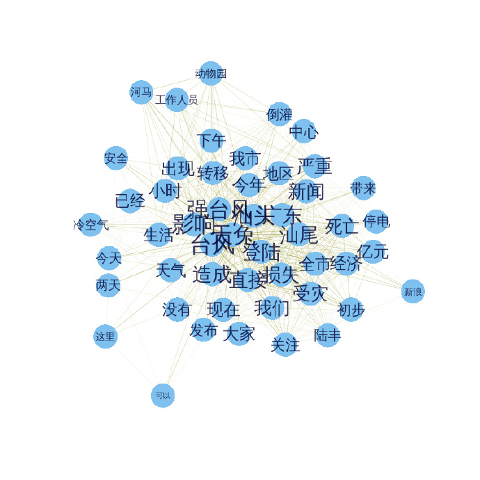

最近做词云，刚好“天兔”过境，就用这个做关键词，试下Rweibo包。先上图


呵呵，沒有专业词云软件做的好看，不过实用啊。
还是可以反映些基本事实的，比如:台风、强台风、汕头、汕尾、影响、 广东等.

图里居然有个词——河马。
来看下，有关天兔和河马相关的微博都是什么：

> [1] "#986 微新闻#【汕头海水倒灌 动物园河马“越狱”被捕回】人工饲养池生活5年，汕头中山公园动物园的河马忍不住想去看看外面的世界…23日下午，受强台风“天兔”影响，中山公园动物园积水严重，一头2吨多重河马随流水出逃至月眉河。经工作人员全力转移，河马在漂流近24小时后被带回家。ljz"                        
 [2] "@TAO何龍 //@潇湘晨报: 【汕头海水倒灌 动物园河马“越狱”被捕回】人工饲养池生活5年，汕头中山公园动物园的河马忍不住想去看看外面的世界受强台风“天兔”影响，中山公园动物园积水严重，一头2吨多重河马随流水出逃至月眉河。经工作人员全力转移，河马在漂流近24小时后被带回家。http://t.cn/z8gTgWk"         
 [3] "【汕头海水倒灌 动物园河马“越狱”被捕回】人工饲养池生活5年，汕头中山公园动物园的河马忍不住想去看看外面的世界…23日下午，受强台风“天兔”影响，中山公园动物园积水严重，一头2吨多重河马随流水出逃至月眉河。经工作人员全力转移，河马在漂流近24小时后被带回家。http://t.cn/z8gTgWk"                    
 [4] "【“天兔”来袭 肥河马乘机牵海狗“越狱”】一只体重2吨多的河马，在台风“天兔”袭来时乘乱游出了广东汕头中山公园动物园。它被找到时，险些游到大海。跟河马一起逃跑的，还有一只海狗、一只海龟。海狗和海龟，在公园内的玉鉴湖，未离开公园。@武进警方"                                                        
 [5] "天兔给了河马24小时的自由" 
 
其实上面的词 中山公园 动物园 和 河马 指的都是同一件事情，如果能够有个关系图，把这几个词聚类在一起，就好了，下次可以尝试下。

先给个简单的关系图吧，效果不是很好，是选用前50个最大的词频做的。字体越大，颜色越深，表示联系越紧密，即在同一天微博中出现的次数越多。



下面是代码，可以实际操练下了，呵呵

```{r}
# 搜索到的数据 
library(Rweibo)
data100 <- web.search.content("天兔", page = 20, combinewith = NULL, 
  since = "2013-09-20", sleepmean=3, sleepsd=1)

# 删除重复的微博
data101 <- data100$Weibo[!duplicated(data100$Weibo)]

# 加载几个要用到的包
library(Rwordseg)
library(tm)
library(wordcloud)

# 将 天兔 这个词加入词库
insertWords(c("天兔"))

# 分词
words <- lapply(X=data101, FUN=segmentCN)

# 生成語料庫
wordcorpus <- Corpus(VectorSource(words))

control <- list(removePunctuation=TRUE, 
  removeNumbers=TRUE,  
  wordLengths=c(2, Inf), weighting=weightBin, stopwords=c("http", "cn"))

# 生成詞頻文檔矩陣
tdm <- TermDocumentMatrix(wordcorpus, control)

# 词频计算
wordFreq <- sort(rowSums(as.matrix(tdm)), decreasing=TRUE)

# 前100个最大的词及对应的词频
wordFreq[1:100]

# 词云
op=par(bg="lightyellow")
rainbowLevels <- rainbow((wordFreq)/(max(wordFreq)))
wordcloud(words=names(wordFreq), freq=wordFreq, 
  min.freq=9, random.order=F, 
  colors=rainbowLevels)
par(op)

# 找出包含 某词 的微博
value <- unlist(lapply(1:length(words), function(x) {"河马"%in%words[[x]]}))
data101[value]

# 轉換成矩陣格式
# 先找出前50个词频最大的词的名字
term_name <- names(wordFreq[1:50])
# 转换为矩阵的词频-文档矩阵
tdm_matrix <- as.matrix(tdm)
# 找出这些词对应的矩阵中的行号
row_number <- unlist(lapply(term_name, function(x) {which(rownames(tdm_matrix)==x)}))
# 仅包含前50个最大词频的词频-文档矩阵
tdm_matrix <- tdm_matrix[row_number,]
# 生成詞-詞矩陣
term_term <- tdm_matrix%*%t(tdm_matrix)
# 词-词矩阵的对角线就是前50个最大的词频，即wordFreq
# diag(term_term)

# 社交网络分析图
library(igraph)
g <- graph.adjacency(term_term, weighted=T, mode = "undirected")
# remove loops
g <- simplify(g)
# set labels and degrees of vertices
V(g)$label <- V(g)$name
V(g)$degree <- degree(g)

# Plot a Graph
# set seed to make the layout reproducible
set.seed(3952)
V(g)$label.cex <- 2.2 * V(g)$degree / max(V(g)$degree)+ .2
V(g)$label.color <- rgb(0, 0, .2, .8)
V(g)$frame.color <- NA
egam <- (log(E(g)$weight)+.4) / max(log(E(g)$weight)+.4)
E(g)$color <- rgb(.5, .5, 0, egam)
E(g)$width <- egam
# plot the graph 
plot(g, layout=layout.fruchterman.reingold(g))
```
备注：转移自新浪博客，截至2021年11月，原阅读数280，评论0个。


