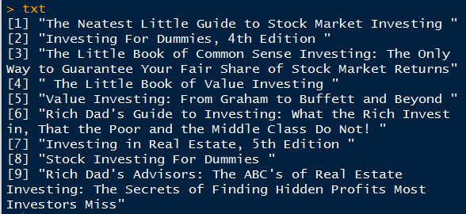
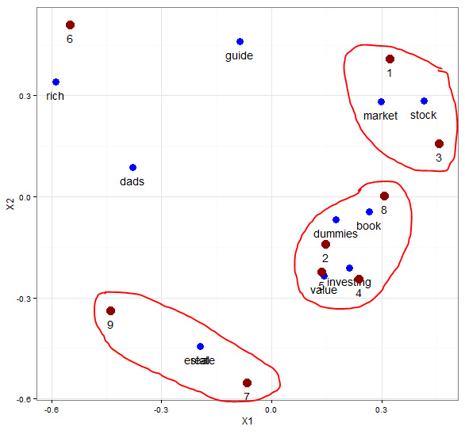
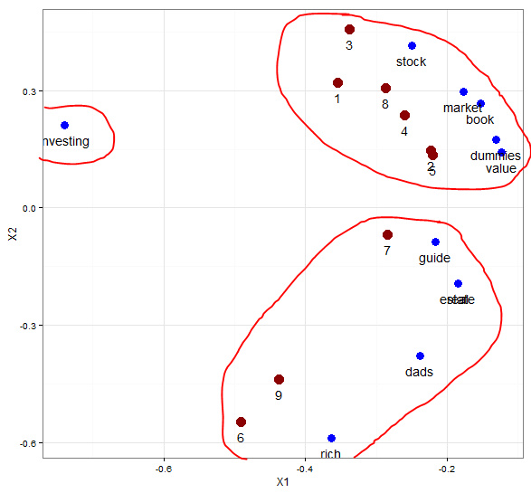

想了解这方面的资料，搜索了下，原来大神都是2009年或更早都开始应用了，落后了呀，现在都开始主题模型，LDA了，先研究LSA，然后再研究LDA，看哪个好用，呵呵

LSA 大致介绍：
请参考网址 http://code.google.com/p/lsa-lda/  里面有篇详细介绍lsa 和lda 模型的文档，非常好。
首先，对文档分词，做出词汇-文档矩阵，进行奇异值分解，选用其中权重较大的维度。
其实，这可以看做是一种降维技术，把词汇和文档用两维图来表示出来。

```{r}
##############################################
###  LSA practice   
模仿了下面网址的文章
http://xccds1977.blogspot.com/2013/10/blog-post.html#more
http://www.puffinwarellc.com/index.php/news-and-articles/articles/33-latent-semantic-analysis-tutorial.html 
############################################
```


```{r}
txt <- readLines('txtdm.txt')

ignore = ",|:|!|'"
stopwords = c('and','edition','for','in','little','of','the','to')
txt <- tolower(txt)

# 文档分词
doc <- strsplit(txt,' ')
# 去除常用词和标点
doc <- lapply(doc,function(x)gsub(ignore,'',x))
doc <- lapply(doc,function(x){
  x[!(x %in% stopwords)]
})

# 取词项集合
words <- unique(unlist(doc))

# 计算词项文档矩阵
DTM <- function(x,y){
  n <- length(x)
  m <- length(y)
  t <- matrix(nrow=n,ncol=m)
  for (i in 1:n){
    for (j in 1:m){
     t[i,j] <- sum(doc[[j]]==words[i])
    }
  }
  rownames(t) <- words
  return(t)
}
t <- DTM(words,doc)

# 只取同时出现在两个以上文档中的词项
DocsPerWord <- rowSums(t>0)
words <- words[DocsPerWord>1]
t <- DTM(words,doc)

# SVD分解
out <- svd(t)
round(out$d, 2)
round(out$u[,1:3], 2)
round(out$v[,1:3], 2)

# 词项语义相关矩阵
datau <- data.frame(out$u[,2:3])
# 文档语义相关矩阵
datav <- data.frame(out$v[,2:3])
# install.packages("ggplot2")

library(ggplot2)
p <- ggplot()+
  geom_point(data=datau,aes(X1,X2), size=4, color="blue")+
  geom_text(data=datau,aes(X1,X2),
           label=words, vjust=2)+
  geom_point(data=datav,aes(X1,X2),
            size=5,color='red4')+
  geom_text(data=datav,aes(X1,X2),
           label=1:9, vjust=2)+
  theme_bw()
print(p)
```


取第二个和第三个维度的数据作图，发现大致分为三个主题，最上方的是文档1和3关于股票市场的，最下方的文档7和9是关于房地产的，中间的文档2、4、5、8是一个类别。

取第一个维度和第二个维度的，分类又稍微有点差别，代码及图见下：
```{r}
# 词项语义相关矩阵
datau <- data.frame(out$u[,1:2])
# 文档语义相关矩阵
datav <- data.frame(out$v[,1:2])

library(ggplot2)
p <- ggplot()+
  geom_point(data=datau,aes(X1,X2), size=4, color="blue")+
  geom_text(data=datau,aes(X1,X2),
           label=words, vjust=2)+
  geom_point(data=datav,aes(X1,X2),
            size=5,color='red4')+
  geom_text(data=datav,aes(X1,X2),
           label=1:9, vjust=2)+
  theme_bw()
print(p)
```


取前两个维度的数据作图，可以清晰的看出这几个文档都是和investing相关的，以它为中心，分为两个大类别的主题。一个是关于股票市场价值，另外一个是关于富爸爸 房地产的。

这两个图虽然一个分为两大类，一个分为三大类，都有一定的意义，关键是侧重点不同，主要还是要看哪个最符合研究需要。

下面是利用R中现有的文本分析包tm，做的分词和构建词汇-文档矩阵，然后进行奇异值分解，求出的奇异值和上面的相同。

```{r}
##############################################
###  LSA practice using tm package
############################################
txt_1 <- readLines('txtdm.txt')
library(tm)

wordcorpus <- Corpus(VectorSource(txt_1))

control <- list(removePunctuation=TRUE, 
               removeNumbers=TRUE, 
               stopwords=c('and','edition','for','in','little','of','the','to', "th"), 
               wordLengths=c(2, Inf))

tdm <- TermDocumentMatrix(wordcorpus, control)

# 只取同时出现在两个以上文档中的词项
tdm_matrix <- as.matrix(tdm)
words_1 <- rownames(tdm_matrix)[rowSums(tdm_matrix)>1]
tdm_matrix <- tdm_matrix[words_1, ]

round(svd(tdm_matrix)$d, 2)
```

备注：转移自新浪博客，截至2021年11月，原阅读数1565，评论0个。


