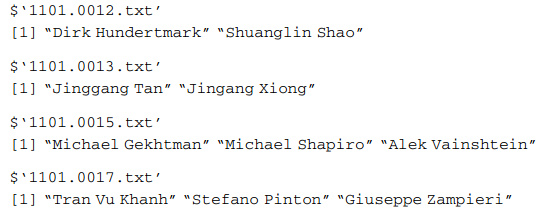

以前看到一篇類似文章，使用學術期刊的論文發表者的數據，分析都有哪些作者通常與多人合作發表文章？與哪些人合作發表文章？最後用一個社交網絡圖展示。

```{r}
##############################################
### 4.6 social network analysis of authors
##############################################
library(igraph)
library(sna)

load("s.authors.RData")
head(s.authors, 4)
```


```{r}
# we construct a graph where the nodes consist of authors, and an edge represents a collaboration event between authors.
# 移除单个作者完成的论文，这里主要分析多个作者发表论文之间的合作关系
# first we remove the papers which were written by only one author.
getJointPapers <- function(x) { if (length(x) > 1) x else c()}
s.authors <- sapply(s.authors, getJointPapers)

# 获取网络图中作者的列表
# the vertices for the igraph object, the list of all distinct authors.
authors <- unique(as.vector(unlist(s.authors)))
head(authors)

# 获取作者的编号
# we will use the indices of the authors list as the vertex identifier.
get_author_id <- function(x) {which(authors == x)}
get_author_id("Dirk Hundertmark")

# 获取网络图中的线
# get the the list of edges for our netword of authors
getEdges <- function(x) {
  if (is.null(x) | length(x) < 2) c() else {
    unlist(lapply(combn(x, 2), get_author_id))
  }
}

# 生成图
g <- graph(as.vector(unlist(lapply(s.authors, getEdges))), directed = FALSE)
g
plot(g)

# 使用中心度测量作者的重要性
# author importance using centrality measure
# the higher the betweenness centrality value, 
# the more central the vertex is 
# below is computation the betweenness in the sna package 
# 图形对象转换为邻接矩阵，计算中心度
b <- betweenness(as.array(get.adjacency(g)))
# if the graph is undirected
b <- betweenness(as.array(get.adjacency(g)), gmode = "graph", cmode = "undirected")
# also could use igraph package to compute betweenness
# b2 <- igraph::betweenness(g2)

# among the list of 2639 authors, only 9 of them have 
# betweenness centrality measures larger than 25
# 查看中心度大于25的作者
authors[which(b > 25)]

# to retrieve the authors' betweenness centrality values and sort it
top <- data.frame(name = authors[which(b > 25)], centrality = b[which(b > 25)])
top[order(top$centrality, decreasing = TRUE), ]
```
因为无法获得书中的示例数据，没有图，不好意思。


**參考書籍**

+ 《Data Mining Applications with R》

备注：转移自新浪博客，截至2021年11月，原阅读数212，评论0个。
