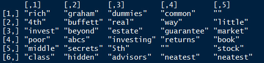
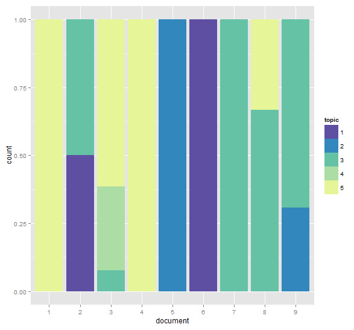
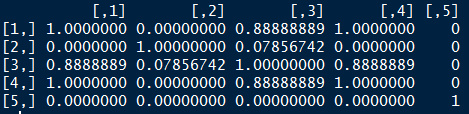
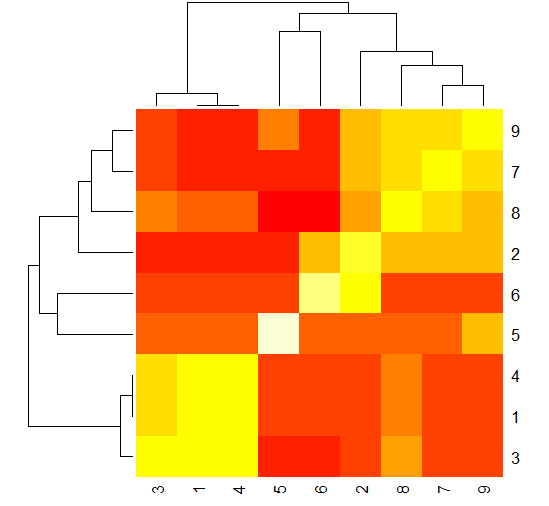

上次的文本分析用的LSA，奇異值分解的方法把語義進行分類，這次看下LDA是怎麼分類的？

```{r}
######################################
### LDA mddel in the text mining
#######################################
library(lda)
library(tm)
library(reshape2)
library(ggplot2)
library(RColorBrewer)

# raw text
txt <- c("The Neatest Little Guide to Stock Market Investing ", 
        "Investing For Dummies, 4th Edition ", 
        "The Little Book of Common Sense Investing: The Only Way to Guarantee Your Fair Share of Stock Market Returns", 
        "The Little Book of Value Investing ", 
        "Value Investing: From Graham to Buffett and Beyond ", 
        "Rich Dad's Guide to Investing: What the Rich Invest in, That the Poor and the Middle Class Do Not! ", 
        "Investing in Real Estate, 5th Edition ", 
        "Stock Investing For Dummies ", 
        "Rich Dad's Advisors: The ABC's of Real Estate Investing: The Secrets of Finding Hidden Profits Most Investors Miss")

# using tm package to clean raw text
s <- Corpus(VectorSource(txt))
s <- tm_map(s, tolower)
s <- tm_map(s, removePunctuation)
s <- tm_map(s, removeWords, stopwords("english"))
s <- tm_map(s, stripWhitespace)

# generate LDA documents from cleaned raw text
clean_corpus <- lexicalize(s, lower = TRUE)

# functions to fit LDA-type models
clean_lda_fit <- lda.collapsed.gibbs.sampler(clean_corpus$documents, K = 5, clean_corpus$vocab, 
                                      num.iterations = 100, alpha = 0.1, eta = 0.1, compute.log.likelihood = TRUE)

# plot the returned log-likelihood values to verify convergence
# by ploting the log-likelihood values, one can determine whether modifying
# the number of iteration can significantly impact the log-likelihood of the
# model, hence improve the final model.
# plot(1:100, clean_lda_fit$log.likelihoods[1, ])
# plot(1:100, clean_lda_fit$log.likelihoods[2, ])

# topic representation
# row represent words, col represent topic
top.topic.words(topics = clean_lda_fit$topics, num.words = 6, by.score = TRUE)
```



```{r}
# plot the topic associations
d <- melt(clean_lda_fit$document_sums)
colnames(d) <- c("topic", "document", "value")
d$topic <- as.factor(d$topic)
d$document <- as.factor(d$document)

ggplot(d, aes(x = document)) + 
  geom_bar(aes(weight = value, fill = topic), position = 'fill') + 
  scale_fill_manual(values = rev(brewer.pal(10, "Spectral")))
```


```{r}
# computing similarities between documents
mat <- t(as.matrix(clean_lda_fit$document_sums)) %*% as.matrix(clean_lda_fit$document_sums)
dia <- diag(mat)
sim <- t(t(mat / sqrt(dia)) / sqrt(dia))
sim[1:5, 1:5]
```



```{r}
# using a heatmap to illustrate clusters of documents
heatmap(sim)
```



黃色的部份代表強相似性，紅色部份代表文檔之間距離很遠，從上圖可以看出，文檔2、7、8、9是一個類別，文檔1、 3、 4是一個類別，5和6分別屬於兩個不同的類別。
   對比上面的個文檔中個主題所占百分比的堆疊條形圖，文檔1、3、4中主題5的比例占比高，文檔2、7、8、9中主題3占比較高，文檔5屬於主題2，文檔6屬於主題1.


**參考書籍**

+ 《Data Mining Applications with R》


备注：转移自新浪博客，截至2021年11月，原阅读数630，评论1个。


