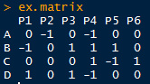
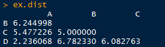
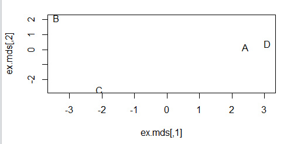
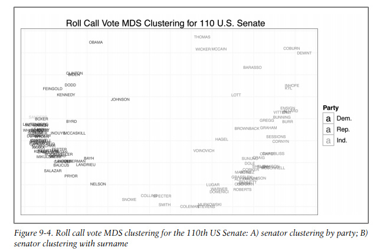
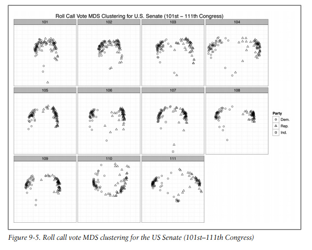

来自《Machine learning for Hackers》第九章

原始数据参考https://github.com/johnmyleswhite/ML_for_Hackers 以及 http://www.voteview.com/downloads.asp 和 http://www.voteview.com/senate111.htm

MDS (Multidimensional scaling) : 多维度标度分析 ，是一种把多维数据降维后可视化的方法。可以参看[这里](http://blog.csdn.net/yang_xian521/article/details/7301121)。

先给个示例吧：
```{r}
###  chapter 9 : MDS
# 生成原始数据，每行数据代表一个用户对六种产品的评价（好为1、坏为-1，没有评价为0）
set.seed(851982)
ex.matrix <- matrix(sample(c(-1, 0, 1), 24, replace = TRUE),
                   nrow = 4, ncol = 6)
row.names(ex.matrix) <- c('A', 'B', 'C', 'D')
colnames(ex.matrix) <- c('P1', 'P2', 'P3', 'P4', 'P5', 'P6')
ex.matrix
```


```{r}
# 得到用户之间的距离矩阵
ex.mult <- ex.matrix %*% t(ex.matrix)
ex.dist <- dist(ex.mult)
ex.dist
```


```{r}
# 从图形中直观观察用户之间的相似性
ex.mds <- cmdscale(ex.dist)
plot(ex.mds, type = "n")
text(ex.mds, c("A", "B", "C", "D"))
```


现在使用真实的数据，不过数据处理等让程序看起来很多、其实思路和上面的示例数据是完全一致的。
```{r}
# analyzing US Senator Roll Call Data (101st-111th Congresses)
library(foreign)
library(ggplot2)

data.dir <- "ml_for_hackers_chapter9_data"
data.files <- list.files(data.dir)
rollcall.data <- lapply(data.files,
                       function(f) read.dta(paste(data.dir, f, sep = "\\"), convert.factors = FALSE))

# head(rollcall.data[[1]])
# dim(rollcall.data[[1]])

# group all yes and no types together
# time cunsuming, could fasten
rollcall.simplified <- function(df) {
  no.pres <- subset(df, state < 99)
  for (i in 10 : ncol(no.pres)) {
    no.pres[, i] <- ifelse(no.pres[, i] > 6, 0, no.pres[, i])
    no.pres[, i] <- ifelse(no.pres[, i] > 0 & no.pres[, i] < 4, 1, no.pres[, i])
    no.pres[, i] <- ifelse(no.pres[, i] > 1, -1, no.pres[, i])
  }
  return(as.matrix(no.pres[, 10:ncol(no.pres)]))
}

library(plyr)

rollcall.simple <- llply(rollcall.data, rollcall.simplified)

rollcall.dist <- llply(rollcall.simple, function(m) dist(m %*% t(m)))

# multiplying all points by -1, this is done for visualization,
# flipping the x-axis positioning of all points, put Democrats on the
# left side and Republicans on the right.
rollcall.mds <- llply(rollcall.dist, function(d) as.data.frame((cmdscale(d, k = 2)) * -1))

congresses <- 101 : 111
for ( i in 1 : length(rollcall.mds)) {
  names(rollcall.mds[[i]]) <- c("x", "y")
  congress <- subset(rollcall.data[[i]], state < 99)
  congress.names <- sapply(as.character(congress$name),
                          function(n) strsplit(n, "[, ]")[[1]][1])
  rollcall.mds[[i]] <- transform(rollcall.mds[[i]],
                                name = congress.names,
                                party = as.factor(congress$party),
                                congress = congresses[i])
}

# head(rollcall.mds[[10]])

cong.110 <- rollcall.mds[[10]]
base.110 <- ggplot(cong.110, aes(x = x, y = y)) +
  scale_size(legend = FALSE) +
  scale_alpha(legend = FALSE) +
  theme_bw() +
  opts(axis.ticks = theme_blank(), axis.text.x = theme_blank(),
      axis.text.y = theme_blank(),
      title = "Roll Call Vote MDS Clustering for 110th U.S. Senate",
      panel.grid.major = theme_blank()) +
  xlab("") +
  ylab("") +
  scale_shape(name = "Party", breaks = c("100", "200", "328"),
             labels = c("Dem.", "Rep.", "Ind."), solid = FALSE) +
  scale_color_manual(name = "Party", values = c("100" = "black", "200" = "dimgray", "328" = "grey"),
                    breaks = c("100", "200", "328"), labels = c("Dem.", "Rep.", "Ind."))

print(base.110 + geom_point(aes(shape = party, alpaha = 0.75, size = 2)))
print(base.110 + geom_text(aes(color = party, alpha = 0.75, label = cong.110$name, size = 2)))
```




备注：转移自新浪博客，截至2021年11月，原阅读数169，评论0个。
