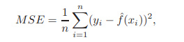
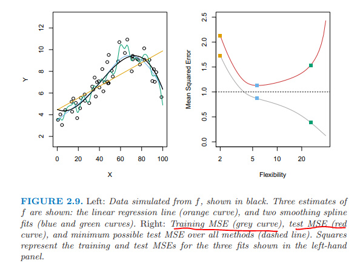
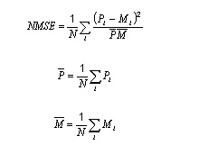
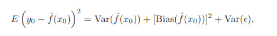
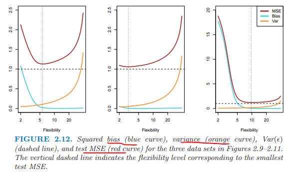

這本書是神作《the elements of statistical learning》的簡易版，而且添加了用R實施算法的部份。

**chapter 1 Introduction**

+ 統計學習分兩種：

有監督的（對連續變量進行回歸分析、對離散變量進行分類分析）、

無監督的（沒有結果可供參考，如聚類分析）。

+ 簡要發展歷史：

19世紀初：針對連續變量的線性回歸。

1936年：fisher針對離散變量的linear discriminant analysis。

1940年：出現了邏輯回歸。

1970年：合併以上模型，出現廣義線性回歸，簡稱glm。

1980年：出現了非線性模型，如分類回歸樹，交叉驗證等。

1986年：廣義線性回歸 + 非線性 = 廣義加法模型gam。

**chapter 2 statistical learning**

+ 構建模型的目的：

推斷（使用簡單的、可解釋的模型）

預測（誤差有兩種：一個是模型本身的誤差，可以通過 

增加模型的複雜度減小誤差，另外一種是隨機誤差，無法縮減的，未知的變動，也可能包含了其他有用的解釋變量）

參數模型：假定函數形式；求參數、擬合模型；如線性模型。

非參模型：不假定函數形式；需要大量數據去估計模型，如樣條模型spline。

+ 魚與熊掌不可兼得。
預測精度   與  模型解釋度  之間需要抉擇。

+ 評估模型的準確性或者擬合質量：
1. 均方誤MSE （mean squared error）

均方誤越小，估計值越接近真值。

訓練集的均方誤隨模型的複雜度加大而降低；
測試集的均方誤隨模型複雜度的加大先下降后上升，呈U形。

標準化的均方誤nmse （normalized mean squared error）
變量正態化后在區間0到1之間，然後計算均方誤。

   
2. 偏差和波動之間的權衡 Bias - Variance

expected test MSE = 

第三項是不可控制的，只能希望low variance and low bias，才能均方誤最小。
當訓練集變動時，複雜度高的模型，方差大、波動大，但是偏差小。

本章重點：均方誤MSE、NMSE。

备注：转移自新浪博客，截至2021年11月，原阅读数242，评论1个。   

