**chapter 3 linear regression**

+ 數學表達式
$$Y\ \approx\ \beta_{0\ }+\beta_1\cdot X$$
$$Y\ =\ \beta_{0\ }+\beta_1\cdot X\ \ +\ e$$
$$\hat{y} = \hat{\beta}_0 + \hat{\beta}_1 \cdot x$$

+ 殘差 residual  
$$e_i =\ y_i -\ \hat{y}_i$$

+ 殘差平方和 RSS residual sum of squares
$$RSS =\ e_1^{2} +\ e_2^{2} +\ ... +\ e_n^{2}$$
$$RSS = (y_1 -\ \hat{\beta}_0 -\ \hat{\beta}_1 x_1)^{2} +\  \\\\ (y_2 -\ \hat{\beta}_0 -\ \hat{\beta}_1 x_2)^{2} +\ ... +\  \\\\ (y_n -\ \hat{\beta}_0 -\ \hat{\beta}_1 x_n)^{2} $$

使用最小平方法least square 確定使RSS最小的參數值。

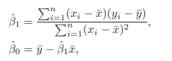

+ 評估參數估計的準確性

$$Var(\hat{\mu}) =\ SE(\hat{\mu})^2 =\ \frac{\sigma^2}{n}$$

SE：standard error 標準誤，用於計算置信區間，評估估計值與真值之間的差距；
隨n即數據量增大，se減小。

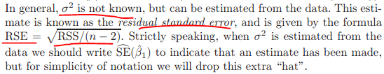

$$\hat{\beta}_0 \pm 2 \cdot SE(\hat{\beta}_0)$$
$$t =\ \frac{\hat{\beta}_1 - 0}{SE(\hat{\beta}_1)}$$

+ 評估模型的準確性
1. 殘差標準誤 RSE residual standard error 

對模型的偏離的度量 a measure of the lack of fit of the model

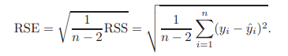

2. R square 表示Y的變動中可以用X解釋的部份的占比，也是線性關係的測量。
$$R^2 = \frac{TSS - RSS}{TSS} = 1 - \frac{RSS}{TSS}$$
$$TSS = \sum(y_i - \bar{y})^2$$

+ 多變量的線性回歸（書中的一個例子）

sales ~ 9.312 + 0.203*radio     顯著

sales ~ 12.351 + 0.055*newspaper     顯著

sales ~ 2.93 + 0.189*radio -0.001*newspaper + 0.046*tv     多變量時newspaper不顯著

cor(newspaper, radio) = 0.35

一元線性回歸中,代表報紙增加1單位后的平均效應

多元線性回歸中,代表黨tv和radio保持不變時，報紙增加1單位后的平均效益

一元模型中,報紙的顯著，因為radio增加所導致的

多元模型中,控制radio不變，就暴露出newspaper其實對sales無影響

類似于,鯊魚襲擊人類 ~ 冰激凌的銷售量,偽相關,與兩者均相關的是,天氣炎熱,氣溫高。

+ 評估多變量線性模型的有效性
$$F = \frac{(TSS - RSS)/p}{RSS/(n-p-1)}$$

當F接近1時，模型失效。

F統計量適用於p（變量個數）<n（觀察值個數）

當p > n 時，不能用最小平方法擬合多變量線性回歸模型，因此，也不能用F統計量。

+ 變量選擇
   + 前進法（貪婪算法）
   + 後退法（不適用於變量個數>觀察值個數）
   + 混合法（以上兩種方法的合併，較好）

+ 模型的擬合質量

主要是R square 和RSE

當添加一個無用變量時，RSE會變大

$$RSE = \sqrt{\frac{1}{n-p-1} RSS}$$

RSE類似與MSE均方誤  

RSE多開了個根號

R方類似與,偏差和方差之間的權衡,可解釋誤差與不可解釋的誤差之間的比值

+ 使用模型預測時的不確定性

1. 參數估計的不準確  可以計算置信區間
2. 模型偏差 假定為線性模型與實際的偏差
3. 隨機誤差，不可縮減的誤差

+ 回歸模型中的離散變量

使用一個0-1離散變量作為解釋變量

$$x_i = \begin{cases}
1 \quad if \ ith \ person\ is \ female \\\\
0 \quad if\ ith\ person\ is \ male
\end{cases}$$

$$y_i = \beta_0 + \beta_1x_i + \epsilon_i = \begin{cases}
\beta_0 + \beta_1 + \epsilon_i \quad if \ ith \ person\ is \ female \\\\
\beta_0 + \epsilon_i \quad if\ ith\ person\ is \ male
\end{cases}$$

參數的解釋跟以前的不同了，需要注意:

截距項代表男性信用卡的平均數；

截距項 + 斜率項 代表女性信用卡的平均數；

斜率項代表男性和女性之間的差值。

$$x_i = \begin{cases}
1 \quad if \ ith \ person\ is \ female \\\\
-1 \quad if\ ith\ person\ is \ male
\end{cases}$$

$$y_i = \beta_0 + \beta_1x_i + \epsilon_i = \begin{cases}
\beta_0 + \beta_1 + \epsilon_i \quad if \ ith \ person\ is \ female \\\\
\beta_0 - \beta_1 + \epsilon_i \quad if\ ith\ person\ is \ male
\end{cases}$$

參數的解釋又不同了。

截距項代表總體信用卡的平均值，無視性別的影響；

斜率項代表女性高於總體水平的數值和男性低於總體水平的數值。

使用兩層以上的離散變量做解釋變量

$$x_{i1} = \begin{cases}
1 \quad if \ ith \ person\ is \ Asian \\\\
0 \quad if\ ith\ person\ is \ not \ Asian
\end{cases}$$

$$x_{i2} = \begin{cases}
1 \quad if \ ith \ person\ is \ Caucasian \\\\
0 \quad if\ ith\ person\ is \ not \ Caucasian
\end{cases}$$

$$y_i = \beta_0 + \beta_1x_{i1} + \beta_2x_{i2} + \epsilon_i = \begin{cases}
\beta_0 + \beta_1 + \epsilon_i \quad if \ ith \ person\ is \ Asian \\\\
\beta_0 + \beta_2 + \epsilon_i \quad if \ ith \ person\ is \ Caucasian \\\\
\beta_0 + \epsilon_i \quad if\ ith\ person\ is \ African \ American
\end{cases}$$

截距項代表african的信用卡數值；

斜率1代表african和asican之間的差值；

斜率2代表african和caucasian之間的差值。

+ 線性模型的2個假設

additive 解釋變量之間互相獨立
$$Y = \beta_0 + \beta_1X_1 + \beta_2X_2 + \epsilon$$

如果違反了該假設，解釋變量之間互相影響，有交互項，模型為：
$$Y = \beta_0 + \beta_1X_1 + \beta_2X_2 + \beta_3X_1X_2 + \epsilon$$

這裡需要注意：如果交互項顯著，組成交互項的變量不顯著，也應該包括這些不顯著的變量在模型中。

交互項不僅僅在連續變量之間，連續變量和離散變量的交互項也很有意義。

解釋變量僅有連續變量和離散變量時，模型如下所示：
$$balance_i  \approx\  \beta_0 + \beta_1 \times income_i + \begin{cases}
\beta_2 \quad if \ ith \ person\ is \ a \ student \\\\
0 \quad if \ ith \ person\ is \ not \ a \ student 
\end{cases} \\\\
 =  \beta_1 \times income_i + \begin{cases}
\beta_0 + \beta_2 \quad if \ ith \ person\ is \ a \ student \\\\
\beta_0 \quad if \ ith \ person\ is \ not \ a \ student 
\end{cases}$$

兩個平行的直線，因為斜率項（連續變量的參數）相同，截距項（離散變量的取值決定是否是學生）不同；

解釋變量含有交互項時，模型如下：
$$balance_i  \approx\  \beta_0 + \beta_1 \times income_i + \begin{cases}
\beta_2 + \beta_3 \times income_i \quad if \ student \\\\
0 \quad if \ not \ student 
\end{cases} \\\\
 =  \beta_1 \times income_i + \begin{cases}
(\beta_0 + \beta_2) + (\beta_1 + \beta_3) \times income_i \quad if \ student \\\\
\beta_0 + \beta_1 \times income_i \quad if \ not \ student 
\end{cases}$$

兩根直線，截距不同、斜率不同。

linear 某解釋變量改變一個單位，對預測變量的影響是個常數，即參數值。

如果違反了該假設，可以使用多項式回歸，即添加解釋變量的平方項、三次方等，擬合非線性方程。

仍然是個線性模型，可以把平方項當做第二個解釋變量。
$$mpg = \beta_0 + \beta_1 \times horsepower + \beta_2 \times horsepower^2 + \epsilon$$

+ 潛在的問題
1. 解釋變量和響應變量之間的非線性關係
2. 殘差項之間相關
3. 殘差項的方差不是一個常數
4. 極值
5. high-leverage points
6. 共線性

**第一個：使用"殘差圖"確定解釋變量和響應變量之間的"非線性"關係。**

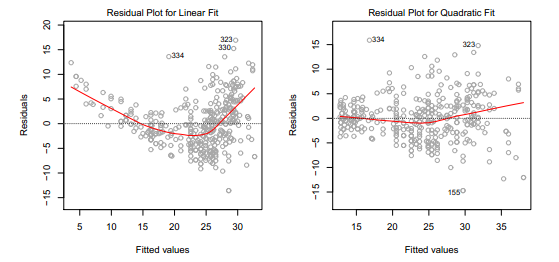

如果殘差圖中有可識別的模式，暗示了線性模型的問題。

如上面的左圖，圖中的U型暗示非線性的關係存在。

最簡單的方法是添加解釋變量的非線性的轉變，如**取對數、開根號、平方**。

**第二個：如果殘差項之間相關，估計的標準誤會低于真實標準誤，置信區間和預測區間會變窄，模型的P值也會偏低，導致我們錯誤的推斷一個參數是顯著的。**

殘差項相關通常發生在時間序列數據中，可以畫殘差圖根據時間順序，
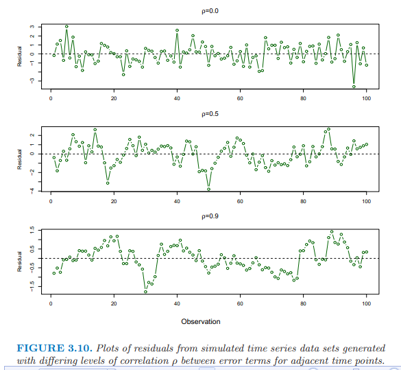

殘差項相關也會發生在其他數據中，如根據體重預測身高，一些數據來自同一個家庭中，或同樣的飲食或同樣的環境因素。

**第三個：殘差項的方差不是一個常數。**

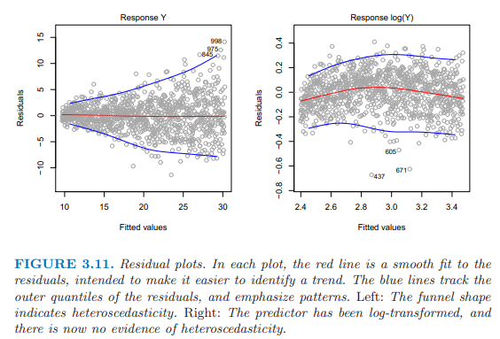

上面的左圖殘差圖就是異方差，圖形呈漏斗形。

可以對Y變量**取對數或者開根號，減小異方差**，如上面的右圖所示。

**第四個：極值**

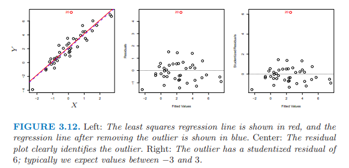

極值會影響RSE，RSE用於計算所有的置信區間和P值。

殘差圖用於發現極值點。

studentized residuals, 殘差除以估計的標準誤，其絕對值大於3，幾乎可以確定為極值點。

**第五個：高杠杆點**

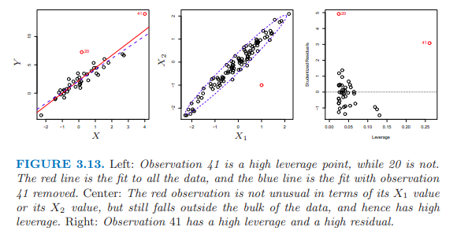

高杠杆點的移除與否對回歸線的擬合有影響，由於高杠杆點的存在，可能導致整個擬合失效。

為了確定觀察值的杠杆性，計算leverage statistic，這個值很大，意味著是個高杠杆值，平均值為（p+1）/ n。

**第六點：共線性。**

兩個以上的解釋變量之間高度相關。很難區別單一的共線變量對Y的影響。

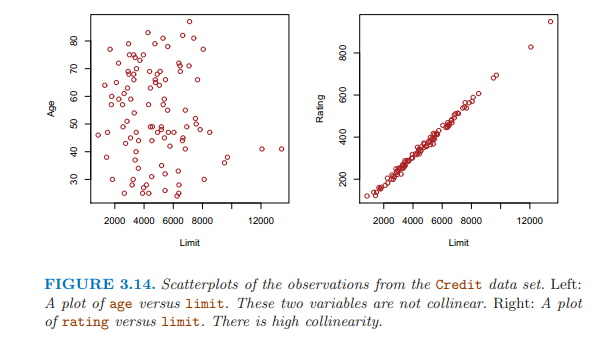

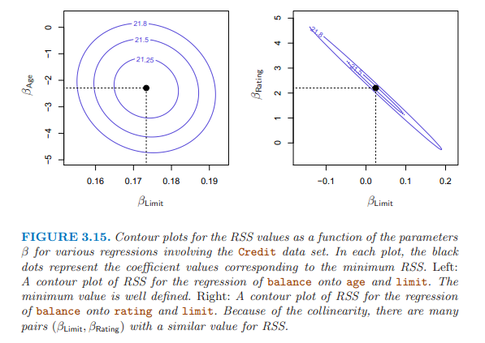

共線性降低了回歸係數估計的準確性，導致標準誤增加，拒絕參數為0 的原假設的能力降低。
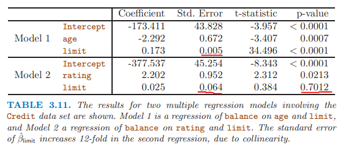

檢查解釋變量的相關矩陣發現共線性問題；

但有時共線性問題存在三個以上的變量中，為多重共線性，計算variance inflation factor (VIF)，VIF大於5或者10，暗示有共線性問題。

解決：從模型中，刪除一個共線變量；把共線變量組合為一個解釋變量。

+ 對比線性回歸和K個最近鄰回歸

參數方法 VS 非參數方法

給出鄰居的個數K和起始點x0，確定最接近x0的K個值，用N0表示。

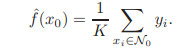

一般來說，最優值K的確定依賴于偏差和方差之間的權衡。

K值小，提供了複雜的擬合，有低偏差，高方差；這裡的高方差因為某個地方的預測僅依賴于一個觀察值。

K值大，提供了一個平滑和少變動的擬合，預測是幾個值的平均值，單個觀察值的影響小，平滑會導致偏差，因為掩蓋了模型中的某些結構。

當參數模型選擇的方程接近真實形式，參數模型優於非參模型。

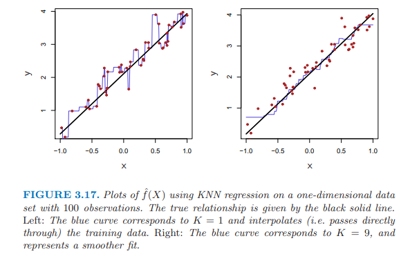

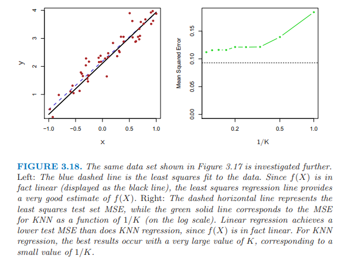

3.17兩個圖表示，K大的KNN更平滑。

3.18圖中的真實形式是線性，線性模型優於KNN，當Ｋ很大時，表現最好，和線性模型的差距最小。

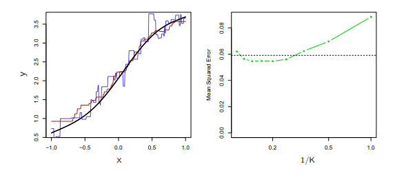

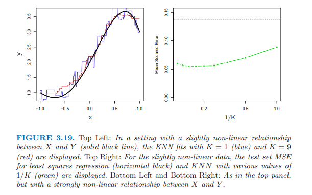

3.19上面的圖真實形式：稍微非線性，knn的擬合圖，knn與線性的MSE的比較；

3.19下面的圖真實形式：明顯非線性，KNN的擬合明顯優於線性模型。

3.18和3.19圖都是基於只有1個解釋變量，當解釋變量多時，維度增高時，KNN效果差與線性模型。

3.20 真實形式：明顯非線性，添加了一個噪音解釋變量。

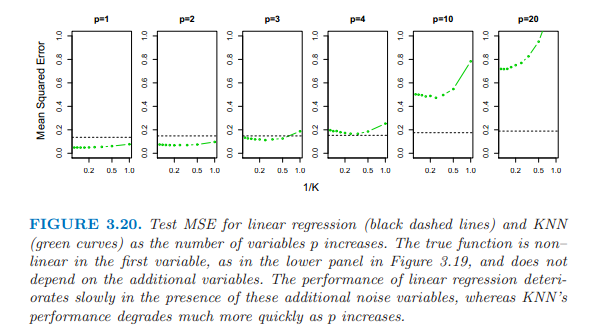

當P=1 或者P= 2 ，KNN優於線性模型；

P=3，結果是混合的；

P>= 4 線性優於KNN。

維度增加，線性模型的MSE增加了少許；

但是，KNN的MSE增加了10倍以上；

因為，維度的增加導致KNN中抽樣量的大幅減少。

如100個觀測值，1個變量，提供了足夠的信息去估計模型；

當100個觀測值，有20個變量時，一個特定的觀察值沒有鄰居，所謂的維度的詛咒（1維空間變成了20維的空間）；因此KNN擬合效果很差。

一般來說，當每個解釋變量有少量觀測值時，參數方法優於非參數方法。

具體的R在線性回歸上的操作，參見原書120頁。

**本章重點：**

+ 殘差平方和RSS、殘差標準誤RSE、R平方；
+ 多元模型和一元模型的衝突，有偽相關存在；
+ 使用離散變量做解釋變量時，係數的解釋；
+ 違反線性回歸模型假設的識別及處理。
+ 線性回歸于knn比較，線性優。

备注：转移自新浪博客，截至2021年11月，原阅读数206，评论0个。 
