**chapter 4 Classification**

+ 3 methods :
1. logistic regression
2. linear discriminant analysis
3. K - nearest neighbors

+ other computer-intensive methods
   + generalized additive models
   + trees
   + random forests
   + boosting
   + support vector machine

+ logistic regression

邏輯回歸對Y屬於某個分類的概率進行建模。

下面是示例用數據集，Y變量：是否拖欠債務；解釋變量是income和balance。

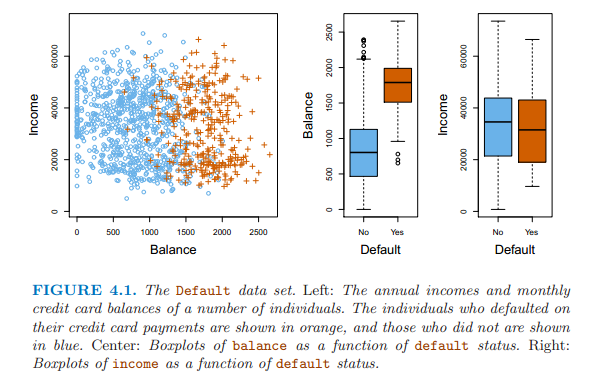

下圖左邊是使用線性回歸對Y變量分析，概率有負值，右邊是邏輯回歸進行建模，概率在0和1之間。

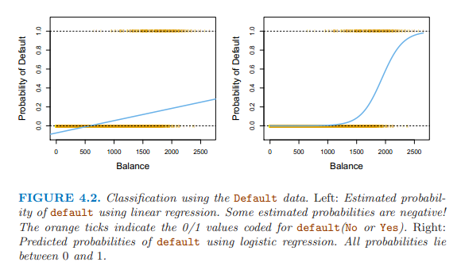

線性回歸的形式對Ｙ屬於某類別的概率進行建模
$$p(X) = \beta_0 + \beta_1X$$

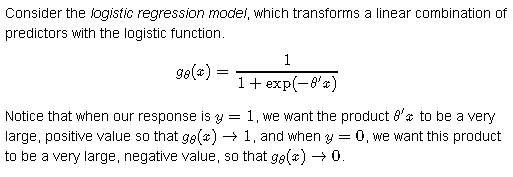

使用邏輯斯形式，把概率值規範在0和1之間
$$p(X) = \frac{e^{\beta_0 + \beta_1X}}{1+e^{\beta_0 + \beta_1X}}$$

方程變換后的模型：
$$\frac{p(X)}{1 - p(X)} = e^{\beta_0 + \beta_1X}$$

方程左邊是個比值，數值偏向兩端。

優勢比，出現正面的概率比上出現反面的概率的比值,

如0.2/（1-0.2）=0.25

0.9/（1-0.9）=9

爲了讓比值平穩，對方程兩邊同時取對數，得到：
$$log(\frac{p(X)}{1-p(X)}) = \beta_0 + \beta_1X$$

估計回歸係數：最大似然法 maximum likelihood選擇能夠最大化下面的似然方程的係數值。

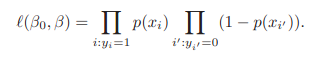

最小平方法是最大似然法的特例。

最大似然法常用於擬合非線性模型。

邏輯斯回歸中也可以使用離散變量做解釋變量，使用虛擬變量的形式。

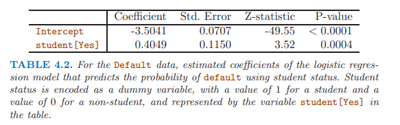

在單變量邏輯回歸中，離散變量學生顯著，而且係數為正，表明學生容易拖欠信用卡。

**多變量邏輯回歸**
$$log(\frac{p(X)}{1-p(X)}) = \beta_0 + \beta_1X_1 + ... + \beta_pX_p$$

$$p(X) = \frac{e^{\beta_0 + \beta_1X_1 + ... + \beta_pX_p}}{1+e^{\beta_0 + \beta_1X_1 + ... + \beta_pX_p}}$$

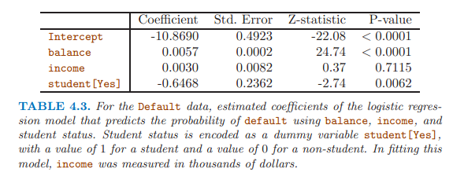

在多變量邏輯回歸中，離散變量學生顯著，係數為負，表明學生不易拖欠信用卡，與單變量邏輯回歸的結果剛好相反。

單變量回歸時考慮的是下圖左圖中的虛線，學生和非學生的整體拖欠水平，學生較高；

多變量中考慮的是下圖左圖中的實線，同樣的balance值，非學生的拖欠更高。

原因在于：學生因素和變量balance相關。

**因此，單變量回歸很危險，當單變量可能與其他變量相關時。**

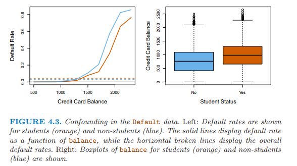

+ linear discriminant analysis

使用于當Y變量有三個以上類別

使用貝葉斯理論分類
$$Pr(Y=k|X =x) = \frac{\pi_kf_k(x)}{\sum_{l=1}^K\pi_lf_l(x)}$$

lda for p = 1

假定對於某個觀察值屬於第k個類別的解釋變量的密度函數是正態分佈或高斯分佈，分佈如下所示：
$$f_k(x) = \frac{1}{\sqrt{2\pi}\sigma_k}exp(-\frac{1}{2\sigma_k^2}(x-\mu_k)^2)$$

插入計算后驗概率的公式得到：
$$p_k(x) = \frac{\pi_k\frac{1}{\sqrt{2\pi}\sigma}exp(-\frac{1}{2\sigma^2}(x-\mu_k)^2)}{\sum_{l=1}^K\pi_l\frac{1}{\sqrt{2\pi}\sigma}exp(-\frac{1}{2\sigma^2}(x-\mu_l)^2)}$$

`$\pi_k$`代表一個隨機選擇的觀察值屬於第k類別的先驗概率。

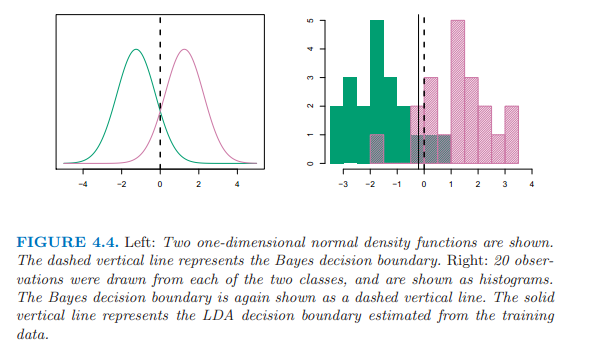

LDA近似貝葉斯分類器，通過插入一些係數估計值，
$$\hat{\mu_k} = \frac{1}{n_k}\sum_{i:y_i=k}x_i$$

$$\hat{\sigma}^2 = \frac{1}{n-K}\sum_{k=1}^K\sum_{i:y_i=k}(x_i - \hat{\mu}_k)^2$$

$$\hat{\pi}_k = n_k/n$$


加入計算后驗概率的公式，兩遍取對數，適當變換，得到discriminant functions， 他是x的線性方程。

$$\hat{\delta}_k(x) = x \cdot \frac{\hat{\mu}_k}{\hat{\sigma}^2} - \frac{\hat{\mu}_k^2}{2\hat{\sigma}^2} + log(\hat{\pi}_k)$$

lda for p > 1

假定解釋變量服從多變量高斯分佈，有均值和共同的協方差矩陣。

$$f(x) = \frac{1}{(2\pi)^{p/2}|\Sigma|^{1/2}}exp(-\frac{1}{2}(x-\mu)^T\Sigma^{-1}(x-\mu))$$

求和符號代表協方差矩陣。

$$\delta_k(x) = x^T\Sigma^{-1}\mu_k-\frac{1}{2}\mu_k^T\Sigma^{-1}\mu_k + log\pi_k$$

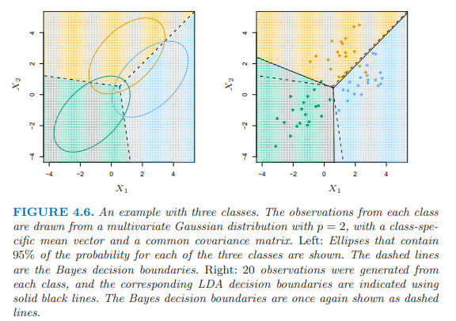

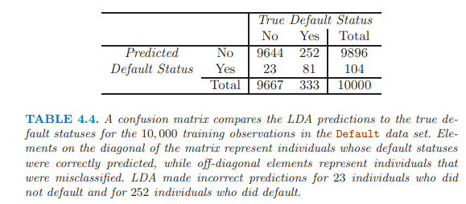

LDA嘗試近似貝葉斯分類器，取得最小的總體錯誤率。

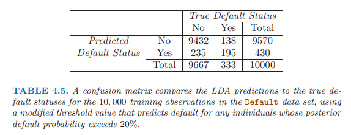

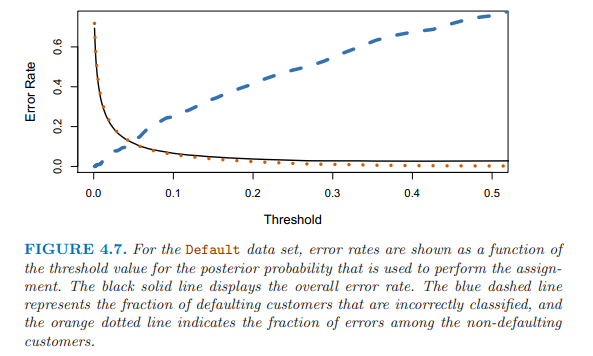

貝葉斯分類器使用臨界值0.5，有最小的總體錯誤率。

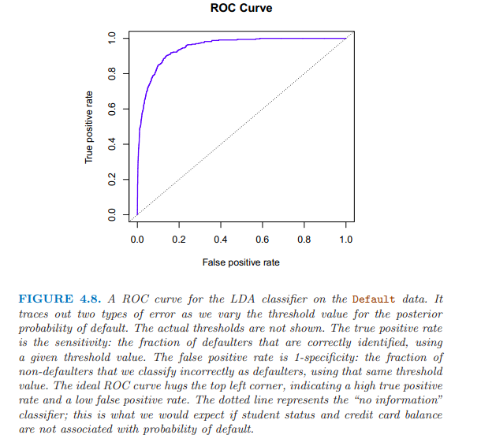

Y軸 **TPR(true positive rate) sensitivity recall power 1-type 2 error:某臨界點處，被正確識別的拖欠者的比例；**

X軸 **FPR(false prositive rate) 1-specificity  type1 error:在同一臨界點處，非拖欠者被誤判為拖欠者的比例。**

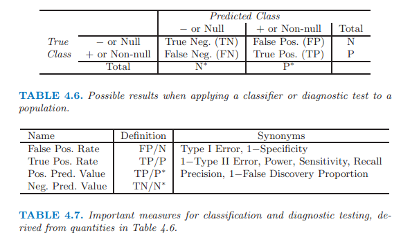

+ QDA (quadratic discriminant analysis)

假定Y變量的每個類別有各自的協方差矩陣。

$$\delta_k(x) = -\frac{1}{2}(x-\mu_k)^T\Sigma_k^{-1}(x-\mu_k) + log\pi_k \\\\ 
= -\frac{1}{2}x^T\Sigma_k^{-1}x + x^T\Sigma_k^{-1}\mu_k - \frac{1}{2}\mu_k^T\Sigma_k^{-1}\mu_k + log\pi_k$$

選擇LDA還是QDA，基於偏差和方差之間的權衡。

如果有p個解釋變量，LDA需要估計p(p+1)/2個係數，QDA需要估計kp(p+1)/2個係數。

如果有相對少的訓練數據，使用LDA，因為降低方差是關鍵。

如果有大量的訓練數據，或者K個類別屬於共同的協方差矩陣站不住腳的時候，使用QDA。

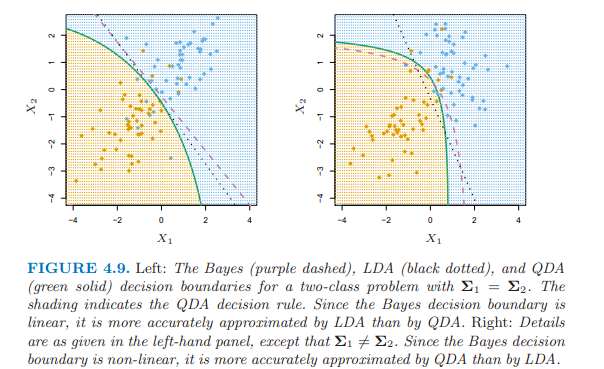

+ 分類模型比較
   + logistic regression
   + LDA
   + QDA
   + KNN

logistic regression和LDA比較近似；

都產生線性決策邊界；

不同在於擬合過程不同，前者使用最大似然，後者使用正態分佈估計的均值和方差來擬合模型。

KNN是完全非參數的，適用於決策邊界高度非線性。

QDA介於上述兩者之間。

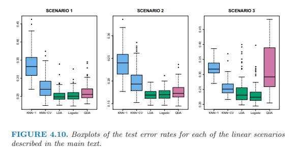

上邊的左圖：兩個解釋變量服從正態分佈，相互獨立。LDA運行的最好。

上邊的中圖：兩個解釋變量屬於正態分佈，相關係數-0.5。

上邊的右圖：兩個解釋變量服從t分佈，t分佈更偏向兩端，logistic regression 運行最好。

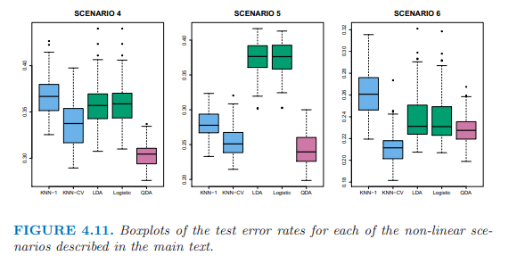

上邊的左圖：服從正態分佈，在第一個類別中的解釋變量之間的相關性為0.5，第二個類別間為-0.5。QDA運行最好。

上邊的中圖：正態分佈，相互獨立，使用解釋變量的平方項和交互項做解釋變量，QDA運行最好，然後是KNN-CV。

上邊的右圖：複雜的非線性，KNN-CV運行最好。

+ 具體的R中的函數

logistic regression 

`glm(, , family = binomial)`  詳見167頁

lda  詳見172頁
```{r}
library(MASS)
lda()
```

qda  詳見174頁
```{r}
library(MASS)
qda()
```

knn  詳見175頁
```{r}
library(class)
knn()
```
knn建模之前的數據需要預處理，**數據標準化**，統一單位，使所有變量都均值為0，標準差為1。使用`scale()`。

**本章重點：**
+ 邏輯回歸適用於Y有兩個類別，使用最大似然，產生線性決策邊界；
+ 而且，單變量邏輯回歸很危險，當單變量可能與其他變量相關時；
+ LDA適用於Y有三個以上類別時，使用正態分佈估計的均值和方差來擬合模型，產生線性決策邊界；
+ QDA，Y變量的每個類別有各自的協方差矩陣；
+ KNN是完全非參數的，適用於決策邊界高度非線性；
+ KNN建模之前的數據需要預處理，數據標準化。

备注：转移自新浪博客，截至2021年11月，原阅读数135，评论0个。 
