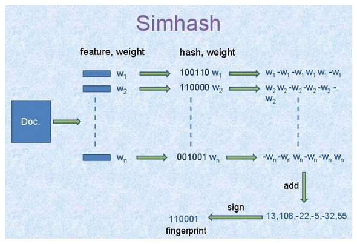

最出名的推荐系统估计要非“协同过滤”莫属，经典的示例就是网站上的各种推荐，根据客户对美食或书籍或电影的评分，来推荐给爱好相似的客户类似商品。

但是，如果你没有任何客户对商品的评分，怎么办呢？评分也是需要积累的呀。有人会说打标签，好听点就是用户画像。打标签也不错，不过是个纯粹的体力活、苦活、累活。我们又不想太累，用上点简单的文本挖掘吧。当然，也许这些方法都是为了打标签，哈哈

**1. 最简单的推荐系统（搜索——匹配某字段中的关键词）**

直接在字段“关键字段”中使用正则表达式搜索关键字，返回大量包含该关键字的数据。

<u>R代码：</u>
```{r}
#  读入数据
data <- read.csv("your_file.csv", stringsAsFactors = F)

#  找出合适的变量
data2 <- data[, c(13, 14, 16, 22, 26,
                29, 30, 41, 42, 43, 45, 47)]
                
# 正则表达式找出匹配的行号
id <- grepl("某关键词", data2$key)

# 返回所有匹配的数据
out <- data2[id, ]

# 返回前15行及个别列
out[1:15, c(5, 6, 12)]
```

<u>python代码：</u>
```{python}
# 导入pandas 
import pandas as pd
# 读入数据
data = pd.read_csv("your_file.csv", encoding = "utf-8")
# 匹配关键词，返回true或false
rain_type = data.key.str.contains(u'某关键词')
# 返回所有包含关键词的数据
rain_d = data[rain_type == 1]
```

**2. 优先级筛选的推荐方法：**

首先，把字段“关键字段”中信息整理成一个字段“类型”，查找与目标数据的“类型”相同的数据。

然后，在同类型的数据中继续筛选出发生在同一个地点，甚至同一个人员。

<u>R代码：</u>
```{r}
data_s <- read.csv("your_file.csv", stringsAsFactors = F)
temp1 <- data_s[grepl("关键词1", data_s$key), ]
temp1$type <- "关键词1"
temp2 <- data_s[grepl(“关键词2", data_s$key), ]
temp2$type <- "关键词2"
data_new <- rbind(temp1, temp2)
obj_id <- 2
obj <- data_new[obj_id, ]
train <- data_new[-obj_id, ]

#  找出同种类别的
train2 <- train[train$type == obj$type, ]

#  找出同类别发生在同一个站点的
if (sum(train2$PLACE_NAME == obj$PLACE_NAME) == 0) {
  train3 <- train2
} else {
  train3 <- train2[train2$PLACE_NAME == obj$PLACE_NAME, ]
}

#  找出同类别发生在同一个站点的同一个人的
if (sum(train3$FINDER == obj$FINDER) == 0) {
  train4 <- train3
} else {
  train4 <- train3[train3$FINDER == obj$FINDER, ]
}
train4[11:14, ]
obj[, c(1:5)]
```


<u>python代码：</u>

```{python}
import pandas as pd
data = pd.read_csv("your_file.csv", encoding = "utf-8")
#  找出包含某种关键词的数据
temp1 = data[data.key.str.contains(u'关键词1') == 1]
temp1['type'] = "关键词1"
temp2 = data[data.key.str.contains(u'关键词2') == 1]
temp2['type'] = "关键词2"
# 合并两种关键词的数据
data_new = pd.concat([temp1, temp2])
# 给出目标观察值的位置，第几个数值
obj_id = 4
# 返回目标观察值
obj = data_new.iloc[obj_id, ]

# 从数据集中排除目标观察值的标签，不是位置，留下待推荐的数据
# obj.name返回目标观察值的index，即标签，是46
# obj_id是目标观察值的位置，是4
train = data_new.drop(obj.name)
# 找出同类别
train2 = train[train.type == obj.type]
# 对同类别数据，继续筛选，找发生在同一个地点的数据
#  这里不知道是什么原因，选列变量要根据位置，根据名字则失败
if (sum(train2.iloc[:, 0] == obj[0]) == 0):
    train3 = train2
else:
    train3 = train2[train2.iloc[:, 0] == obj[0]] 
# 继续根据优先级筛选，在上面的基础上，筛选是否有同一个人的数据
if (sum(train3.iloc[:, 1] == obj[1]) == 0):
    train4 = train3
else:
    train4 = train3[train3.iloc[:, 1] == obj[1]]

obj
train4.head()
``` 

**3. 基于Simhash和海明距离算法的推荐：**

首先，把字段“关键字段”的文字进行分词，提取关键字，计算simhash值。

然后，根据每行数据的simhash值，计算目标数据与其他所有数据之间的海明距离，推荐距离目标数据最近的前2个数据。

<u>R代码：</u>
```{r}
library(jiebaR)

data_s <- read.csv("your_file.csv", stringsAsFactors = F)

sim <- function(data, obj) {
  #  初始化分词引擎
  simhasher = worker("simhash")

  #  计算需要匹配的语句与其他所有语句之间的距离
  out <- lapply(data$key, FUN = function(x) {
   as.numeric(distance(data$key[obj], x, simhasher)$distance)
  })

  # 距离以行号为名字
  names(out) <- 1 : length(data$key)

  # 删除需要匹配的语句与自身的距离
  out <- out[-obj]

  # 找到与需要匹配的语句距离从小到大的行号
  id <- as.numeric(names(sort(unlist(out))))

  # 返回与需要匹配的语句距离从小到大的推荐
  list("obj" = data[obj, c(1, 2, 3, 4, 5)],
      "degree" = paste(100 - unname(sort(unlist(out))[1:2]), "%", sep = ""),
      "similar" = data[id[1:2], c(1:9)])
}

sim(data = data_s, obj = 1)
```


<u>python代码：</u>
```{python}
import pandas as pd
import jieba
import jieba.analyse
#  jiebaR中直接有计算simhash值和海明距离的函数
# jieba中貌似没有
# 同一个项目不同语言的接口，功能上居然有差异，有点吃惊
# 幸好找到有人实现了simhash在python中
http://blog.sina.com.cn/s/blog_62b8329101017vv3.html  
###  simhash算法的python实现
class simhash:
    # 构造函数
    def __init__(self, tokens = '', hashbits = 128):
       self.hashbits = hashbits
       self.hash = self.simhash(tokens);
       
    # toString函数
    def __str__(self):
       return str(self.hash)
   
    # 生成simhash值
    def simhash(self, tokens):
       v = [0] * self.hashbits
       for t in [self._string_hash(x) for x in tokens]:
           # t为token的普通hash值
           for i in range(self.hashbits):
               bitmask = 1 << i
               if t & bitmask :
                   v[i] += 1 # 查看当前bit位是否为1， 是的话将该位+1
               else:
                   v[i] -= 1 # 否则的话，该位-1
       fingerprint = 0
       for i in range(self.hashbits):
           if v[i] >= 0:
               fingerprint += 1 << i
       return fingerprint # 整个文档的fingerprint为最终各个位 >=0的和
   
    # 求海明距离
    def hamming_distance(self, other):
       x = (self.hash ^ other.hash) & ((1 << self.hashbits) - 1)
       tot = 0;
       while x:
           tot += 1
           x &= x - 1
       return tot
   
    # 求相似度
    def similarity (self, other):
       a = float(self.hash)
       b = float(other.hash)
       if a > b : return b / a
       else: return a / b
       
    # 针对source生成hash值 （一个可变长度版本的python的内置散列）
    def _string_hash(self, source):
       if source == "":
           return 0
       else:
           x = ord(source[0]) << 7
           m = 1000003
           mask = 2 ** self.hashbits - 1
           for c in source:
               x = ((x * m) ^ ord(c)) & mask
           x ^= len(source)
           if x == -1:
               x = -2
           return x 
########################################################
# 通过计算目标数据和其他数据的simhash值，得到相似度
def sim (data, obj):
    obj_data = data.iloc[obj, ]
    # 计算目标数据的simhash值
    word_obj = jieba.analyse.extract_tags(data.DEFECT_PHENOMENON.iloc[obj])
    hash_obj = simhash(word_obj)
    # 计算其他数据的simhash值并计算相似度
    sim_value = []
    for i in range(data.DEFECT_PHENOMENON.size):
       word_other = jieba.analyse.extract_tags(data.DEFECT_PHENOMENON.iloc[i])
       hash_other = simhash(word_other)
       sim_value.append(hash_obj.similarity(hash_other))
    # 把列表转换为pandas中的序列，因为有index记录每一个相似度对应的data中的行号，即位置
    # 删除目标变量与自身的相似度数值
    sim_series = pd.Series(sim_value).drop(obj_data.name)
    return sim_series 
###############################
# 读入数据
data = pd.read_csv("your_file.csv", encoding = "utf-8")
# 数据清洗
# 关键字段的数据类型，应该都为unicode，因为部分数据缺失为nan，类型为float，提取文本关键词报错
# 提取出关键字段非空的数据
data_new = data[data.key.isnull() == 0]
# 得到目标数据与所有其他数据之间的相似度
out = sim(data = data_new, obj = 9)
# 按照从大到小的顺序把相似度排序
sorted_out = out.sort(ascending = False, inplace= False)
# 目标关键词
print data_new.key.iloc[9]
# 推荐的最相似的前五个关键词
data_new.key.iloc[sorted_out.index[0:5]]
```

经人工测试了几个数据，python版的效果没有R版的好，不知道是因为python版的simhash算法和jiebaR内置的simhash算法的区别，还是python版的提取关键词和jiebaR的提取关键词有区别。
后来经检查，还是python版的simhash算法的jiebaR中内置的算法不同，前者只考虑了关键词，后者还考虑了关键词的权重，显然，后者的权重不是白加的，效果不是一般的好。
改进了python版的simhash算法，添加了权重部分，效果好多了，但还是没有jiebaR的效果好，应该是关键词对应的权重的差别，jieba和jiebaR输出的关键词的权重不同，对同样的数据。

更好点，其实可以先用simhash和海明距离找到类似的文本，然后使用优先级过滤再对类似的文本进行排序，更精细的确定相似性。


ps:<u>python代码：</u>
```{python}
###  添加了权重的simhash算法#######################
###  simhash算法的python实现
class simhash:
    # 构造函数
    def __init__(self, tokens = '', hashbits = 128):
       self.hashbits = hashbits
       self.hash = self.simhash(tokens);
       
    # toString函数
    def __str__(self):
       return str(self.hash)
   
    # 生成simhash值
    def simhash(self, tokens):
       v = [0] * self.hashbits
       
       # tokens 代表关键词和对应的权重
       # only_token 代表关键词
       only_token = [x[0] for x in tokens]
       # 得到关键词对应的hash值
       only_hash = [self._string_hash(x) for x in only_token]
       # only_weight 代表关键词对应的权重
       only_weight = [x[1] for x in tokens]
       # 把hash值和对应的权重组合在一起
       hash_weight = zip(only_hash, only_weight)
       
       for t in hash_weight:
           # t为token的普通hash值权重对
           for i in range(self.hashbits):
               bitmask = 1 << i
               if t[0] & bitmask :
                   v[i] += t[1] # 查看当前bit位是否为1， 是的话将该位+weight
               else:
                   v[i] -= t[1] # 否则的话，该位-weight
       fingerprint = 0
       for i in range(self.hashbits):
           if v[i] >= 0:
               fingerprint += 1 << i
       return fingerprint # 整个文档的fingerprint为最终各个位 >=0的和
   
    # 求海明距离
    def hamming_distance(self, other):
       x = (self.hash ^ other.hash) & ((1 << self.hashbits) - 1)
       tot = 0;
       while x:
           tot += 1
           x &= x - 1
       return tot
   
    # 求相似度
    def similarity (self, other):
       a = float(self.hash)
       b = float(other.hash)
       if a > b : return b / a
       else: return a / b
       
    # 针对source生成hash值 （一个可变长度版本的python的内置散列）
    def _string_hash(self, source):
       if source == "":
           return 0
       else:
           x = ord(source[0]) << 7
           m = 1000003
           mask = 2 ** self.hashbits - 1
           for c in source:
               x = ((x * m) ^ ord(c)) & mask
           x ^= len(source)
           if x == -1:
               x = -2
           return x 
 
#  更新后的函数，限制关键词数量为5个，因为这里的测试文本就是几个句子，过多的关键词反而掩盖了重点

# 因为前面的数据结构发生了变化，下面的函数也有少许变动。
# 通过计算目标数据和其他数据的simhash值，得到相似度
def sim (data, obj):
    obj_data = data.iloc[obj, ]
    # 计算目标数据的simhash值
    word_obj = jieba.analyse.extract_tags(data.key.iloc[obj], topK = 5, withWeight= True)
    hash_obj = simhash(word_obj)
    # 计算其他数据的simhash值并计算相似度
    sim_value = []
    for i in range(data.key.size):
       word_other = jieba.analyse.extract_tags(data.key.iloc[i], topK = 5, withWeight= True)
       hash_other = simhash(word_other)
       sim_value.append(hash_obj.similarity(hash_other))
    # 把列表转换为pandas中的序列，因为有index记录每一个相似度对应的data中的行号，即位置
    # 删除目标变量与自身的相似度数值
    sim_series = pd.Series(sim_value).drop(obj_data.name)
    return sim_series

# 得到目标数据与所有其他数据之间的相似度
out = sim(data = data_new, obj = 9)
# 按照从大到小的顺序把相似度排序
sorted_out = out.sort(ascending = False, inplace= False)

# 目标关键词
print data_new.DEFECT_PHENOMENON.iloc[9]

# 推荐的最相似的前五个关键词
data_new.DEFECT_PHENOMENON.iloc[sorted_out.index[0:5]]
```

最后附上一个图，这个图清楚明了的解释了simhash算法的原理，这张图的原始出处不知道来自哪里，但几乎所有讲解simhash的文章都使用了这个图。



**参考网址：**
+ http://yanyiwu.com/work/2014/01/30/simhash-shi-xian-xiang-jie.html  
+ http://blog.sina.com.cn/s/blog_62b8329101017vv3.html  


备注：转移自新浪博客，截至2021年11月，原阅读数144，评论0个。 
