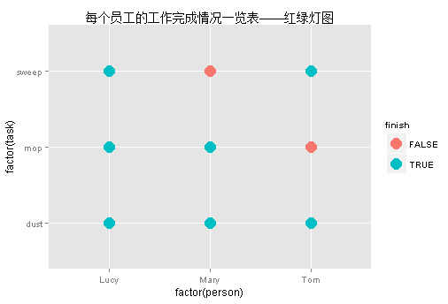
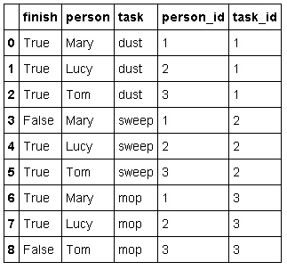
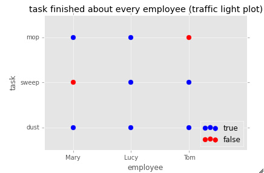

**问题：**

> 3个员工，每人都要做3个打扫任务，用一张图展示3个员工3项任务的完成情况。


**一、R中的实现方法**

+ 代码
```{r}
df <- data.frame(person = c("Mary", "Lucy", "Tom", "Mary", "Lucy", "Tom", "Mary", "Lucy", "Tom"),
                      task = c("dust", "dust", "dust", "sweep", "sweep", "sweep", "mop", "mop", "mop"),
                      finish = c(TRUE, TRUE, TRUE, FALSE, TRUE, TRUE, TRUE, TRUE, FALSE))

library(ggplot2)
ggplot(df, aes(x = factor(person), y = factor(task), colour = finish)) +
        geom_point(size = 6) +
       ggtitle("每个员工的工作完成情况一览表——红绿灯图")
```
+ 截图





+ 总结

注意：这里散点图的x轴和y轴均为因子型。

R中的因子型可以直接用作散点图，因为factor实质存储的是数值型，虽然看到的是字符型的。

**二、python的解决方法**

+ 代码
```{python}
## python中没有因子型，散点图要求x轴和y轴必须是数值型的，这里就需要一个小小的转换。

import pandas as pd
import numpy as np

df = pd.DataFrame({'person': ['Mary', 'Lucy', 'Tom'] * 3,
                  'task': ['dust']*3 + ['sweep']*3 + ['mop']*3,
                  'finish': ['True', 'True', 'True', 'False', 'True', 'True', 'True', 'True', 'False']})

# 方法1
df['person_id1'] = df.person.map({'Mary':1, 'Lucy':2, 'Tom':3})
# 方法2
df['person_id2'] = df.person.replace({'Mary':1, 'Lucy':2, 'Tom':3})
# 方法3，如果数据量比较大
df2 = pd.DataFrame({'person': df.person.unique(),
                   'person_id': np.arange(1, len(df.person.unique()) + 1)})
df.merge(df2, on = 'person', how = 'left')
# 在这里，统一使用方法3

## 设置每一个员工对应的编号
df_person = pd.DataFrame({'person': df.person.unique(),
                   'person_id': np.arange(1, len(df.person.unique()) + 1)})
## 设置每一个任务对应的编号
df_task = pd.DataFrame({'task': df.task.unique(),
                   'task_id': np.arange(1, len(df.task.unique()) + 1)})
## 得到新的数据集
df_new = df.merge(df_person, on = 'person', how = 'left')
df_new = df_new.merge(df_task, on = 'task', how = 'left')

# get a traffic light plot
%matplotlib inline
import matplotlib
matplotlib.style.use('ggplot')

ax = df_new[df_new.finish == 'True'].plot(kind = 'scatter', x = 'person_id', y = 'task_id', color = 'blue', label = 'true', s = 60)
df_new[df_new.finish == 'False'].plot(kind = 'scatter', x = 'person_id', y = 'task_id', color = 'red', label = 'false', s = 60, ax = ax)
# set the title
ax.set_title('task finished about every employee (traffic light plot)')
# set x axis tick labels
ax.xaxis.set_major_locator(matplotlib.ticker.FixedLocator(np.arange(1, len(df_person.person) + 1)))
ax.xaxis.set_major_formatter(matplotlib.ticker.FixedFormatter(df_person.person))
# set y axis tick labels
ax.yaxis.set_major_locator(matplotlib.ticker.FixedLocator(np.arange(1, len(df_task.task) + 1)))
ax.yaxis.set_major_formatter(matplotlib.ticker.FixedFormatter(df_task.task))
# set labels to each axis
ax.set_xlabel('employee')
ax.set_ylabel('task')
# set legend location
ax.legend(loc = 4)
# set x axis range
ax.set_xlim(right = 4);
```
+ 截图






+ 总结

从这个图的实现看来，R更胜一筹，因子型就搞定一切。

python则需要转换数据，画图时也要专门设置x轴和y轴的标签，代码冗长，不过，也许由于本人了解的太少，希望将来能够改善。

备注：转移自新浪博客，截至2021年11月，原阅读数584，评论0个。 
