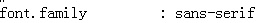
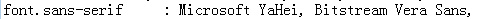
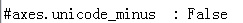

**一、seaborn的中文字体显示（针对windows系统,，使用ipython notebook）**

****
更新：2017年6月16日

这次的seaborn版本是0.7.1，中文显示有时不能正确显示。

经测试发现，必须先导入seaborn包，然后再设置字体为微软雅黑，按照下面的代码运行后，即可成功显示中文字体。

但是如果之后设置了sns.set_context("talk")之类的，中文又变成了方块，设置sns.set_context("notebook")，中文就又正确显示，真的有些奇怪，要多试。

** the order of code is important!**
```{python}
### we should import seaborn package first, then configurate the font of sans-serif.

import pandas as pd
import seaborn as sns # first import this package

import sys
# print sys.getdefaultencoding()
# ipython notebook中默认是ascii编码 
stdout = sys.stdout
reload(sys)
sys.stdout = stdout
sys.setdefaultencoding('utf8')

import matplotlib as mpl
import matplotlib.pyplot as plt
mpl.rcParams['font.sans-serif'] = ['Microsoft YaHei'] #指定默认字体  
mpl.rcParams['axes.unicode_minus'] = False # 解决保存图像是负号'-'显示为方块的问题
# sns.axes_style()

%matplotlib inline
```
*****

+ 首先：解决seaborn画图有中文时的编码异常错误
```{python}
import seaborn as sns

import sys
# print sys.getdefaultencoding()
# ipython notebook中默认是ascii编码 
reload(sys)
sys.setdefaultencoding('utf8') 
```
+ 其次：修改matplotlibrc配置文件中的字体名称
```{python}
import matplotlib as mpl
mpl.rcParams['font.sans-serif'] = ['Microsoft YaHei'] #指定默认字体  
mpl.rcParams['axes.unicode_minus'] = False # 解决保存图像是负号'-'显示为方块的问题
# sns.axes_style()，可以看到是否成功设定字体为微软雅黑。
```
+ 最后：修改seaborn中的一些设置（这里可以先不设置，或四个选项都试下）
`sns.set_context("talk")`或者`sns.set_context("poster")`均可，该函数的其他的两个属性"notebook"和"paper"却不能正常显示中文。


**二、matplotlib的中文字体显示（针对windows系统,，使用ipython notebook）**

+ 方法一：临时方法
   + 优点：直接在代码中指定中文字体文件，在每个出现中文的地方指定`fontproperties`为刚才设置的字体；
   + 缺点：每个出现中文的地方如title都要指定字体，并不是每个地方如legend都提供指定字体的参数。
   + 适用场合：偶尔使用中文显示，出现中文的地方较少。
   
```{python}
myfont = matplotlib.font_manager.FontProperties(fname=r"c:\windows\fonts\simsun.ttc", size=14)

# 直接设置为中文时
ax.set_title(u'中文', fontproperties = myfont)

# 设置x轴标签所对应的刻度的位置
ax.xaxis.set_major_locator(matplotlib.ticker.FixedLocator(np.arange(1, len(temp_name.name) + 1)))
# 某一列数据中均为中文，用该列作为x轴刻度标签时
ax.set_xticklabels(labels = temp_name.name, fontproperties = myfont, rotation = 'vertical')
```
+ 方法二：永久方法
   + 优点：一劳永逸，以后再不用担忧中文问题了，和英文一样如鱼得水。
   + 缺点：比较复杂，虽然我试验成功，可是原理我也没弄明白。
   + 适用场合：经常使用中文显示，各种地方都有出现中文的可能，如坐标轴刻度标签，图标等等。

1. 首先：网络上的方法：修改matplotlibrc配置文件（）。

**进入Python安装目录下的Lib\site-packages\matplotlib\mpl-data目录，打开matplotlibrc文件**，删除font.family和font.sans-serif两行前的#（后来试验，这步可省略），**并在font.sans-serif后添加微软雅黑字体（Microsoft YaHei），修改axes.unicode_minus为False**，示例如下：







这个方法有时有效，有时失效，估计是ipython notebook开启后未必自动去读这个配置文件。

2. 其次：多次试验发现，当解决seaborn中的中文显示问题时，matplotlib的中文显示也解决了。
由于seaborn本身就建立在matplotlib的基础上，因此seaborn的一些设置可能也修改了matploblib的设置。

```{python}
# 解决seaborn画图有中文时的编码异常错误
import sys
reload(sys)
#sys.setdefaultencoding('utf-8')
sys.setdefaultencoding('utf8')

# 修改matplotlibrc配置文件中的字体名称
mpl.rcParams['font.sans-serif'] = ['Microsoft YaHei'] #指定默认字体  
mpl.rcParams['axes.unicode_minus'] = False # 解决保存图像是负号'-'显示为方块的问题 
sns.set_context("talk")
#sns.set_context("poster")
```

备注：转移自新浪博客，截至2021年11月，原阅读数11999，评论4个。 