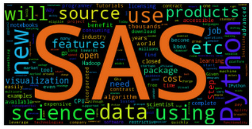
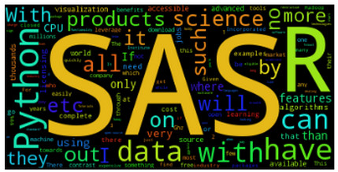
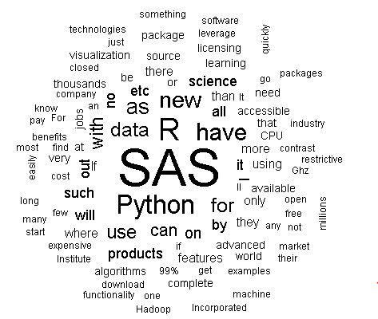

Today I want to try to make a word cloud.

I use a text of debate the data science software SAS, R and Python.

+ First of all, I use the module *word cloud* in Python directly, because this module will automatic clean a text such as split the sentence and delete some stop-words and etc. But I find R this letter is deleted as stop-words or useless words.

+ Secondly, I begin to split documents to words, delete some stop-words, get word frequency, then use the module word cloud to make the plot in Python. This time, the single letter R is appear on the graph.

+ The lastly, I repeat my above steps in R to get a word cloud.

Below is Python code.

```{python}
# load some modules
%matplotlib inline
import matplotlib.pyplot as plt
from wordcloud import WordCloud
import re

# my test text
text = '''I am in a senior role in the Data Science group at a company where SAS is considered the 'gold standard'. Given I personally already know and use R, Python and other languages, learning SAS could be very rewarding career-wise. Yet, despite all the benefits of learning and using SAS I have avoided it as a rule and on principle.
1) Open Source vs Closed System
With R/Python, there is complete transparency of the types of functionalities and algorithms that you can leverage as a data scientist. If you are stuck on something new, all you need is a Google Search to find the relevant R/Python package. For R, The Comprehensive R Archive Network has all the tools you need to complete 99% of data science projects. By contrast, to use any new functionality in a closed system such as SAS you have to go through a long and painstaking process of signing new contracts, dealing with Sales Agents, etc before you can even use the said functionality. It is time-consuming and counter-productive. You'll get more done much faster using R/Python than with SAS.
2) Cost
While R and Python are open source and anyone anywhere can use it at no charge, SAS by contrast is one of the most expensive software (in the world)! A mid-large size company will have to invest millions of dollars on SAS licensing. However, for most startups this is out of question. If you are working at a place where they have the budget, well and good. If you change jobs and go someplace where they don't have SAS you are out of luck. You will be forever restricted to data science jobs where they are using SAS and there's not many of them around.
3) Accessibility of advanced features required for data science
With R and Python you can quickly and easily leverage advanced features like parallel processing, multicore packages, etc that are essential for machine learning which involves iterative operations. With SAS you have to buy new SAS products to use such features. There is no way to just download a 'package' and and start using it within minutes as you can do with R/Python. Even after you get these SAS products, they will have strict limitations. SAS licensing costs vary by the speed of the CPU (3.1 Ghz CPU cost greater than 2.4 Ghz CPU machine license cost). No vendor I have worked with in the last 17 years ever had a more restrictive licensing model than this.
4) Support for Visualization
As you know, visualization is an integral part of data science. Although some commercial visualization products have SAS connectivity through ODBC, the primary visualization platform is SAS Visual Analytics. This too is a very expensive tool. With R/Python there are countless ways to visualize data (ggplot2 in R, matplotlib in Python, etc). For free, without having to sign a new (SAS) contract and pay $$ for everything.
5) Industry Trends
The industry, and by extension the job market, is shifting more and more towards open-source technologies. Hadoop, NoSQL, etc are all prime examples. SAS exists in the midst as one of the only paid products while offering little to no extra functional benefits over the available free technologies. SAS programmer demography typically tends to be veteran programmers who started out with SAS many years back. Today, very few data scientists start out with SAS for obvious reasons. It is just way easier to download R or Python or Hadoop and use it right away.
6) Agility
Given R and Python are supported by thousands of contributors world wide, any new development in the industry (eg., a new algorithm) becomes quickly available as a package. Since SAS is accessible only to the SAS Institute Incorporated, only their developers can produce new packages. This is time consuming and you'd have completed your project by the time SAS releases an update with the new algorithms.
7) Tutorials and Step-by-Step examples
With R and Python you have thousands of detailed worked-out examples and tutorials on the web. IPython Notebooks and R exercises are available across numerous sites such as github, etc. There is no such equivalent in SAS and as a result, if you are looking for a step-by-step guidance on a new topic which you will need when you are starting out, there is no better source than reproducible notebooks such as iPython. If you wanted to learn something new in SAS, you'll have to pay a SAS consultant (again from or affiliated with SAS Institute Incorporated) to train you on the subject.
Overall, while SAS may deliver all the present needs for data science, I find it unsustainable in the long run. Especially, when everyone in the world is moving towards collaborative open source software that is easily and widely accessible, SAS is the complete opposite being restrictive, closed and accessible to only the few who can spends hundreds of thousands if not millions to use their products. Using R, Python and similar tools will increase your breadth of knowledge, ability to practice and use newer algorithms and advanced features and as a consequential benefit also become automatically eligible for 99% of data science jobs in the market.'''

# get the word cloud
wordcloud = WordCloud().generate(text)

# Open a plot of the generated image.
plt.imshow(wordcloud)
plt.axis("off");
```


Then my second trial in Python.

```{python}
# split a document to words
text_1 = re.split(r'[\n.()!, ""/]', text)

# delete some empty string
text_2 = [x for x in text_1 if len(x) > 0]

# get word frequency and delete some stopwords
wg = text_2
wd = {}
stopwords = [u'and', u'the', u'of', u'to', u'a',u'you', u'is', u'are', u'in', u'as', u'new', u'for', u'use']
for w in wg:
    if w in stopwords:
        continue
    else:
        str(w)
        if w not in wd:
            wd[w] = 1
        else:
            wd[w] += 1
            
# get the wordcloudwordcloud = WordCloud().generate_from_frequencies(wd.items())
# Open a plot of the generated image.
plt.imshow(wordcloud)
plt.axis("off");
```


At last, my R code.
```{r}
# load the package
library(tm)
library(wordcloud)

# read the raw text
text <- readLines("word_cloud_example.txt")

# split the text to words
words <- strsplit(text, "[.!(),'/ ]")[[1]]

# delete some empty strings
words <- words[words != ""]

# delete some stop words
words <- words[!(words %in% c("and", "the", "you", "to", "a", "is", "of", "in", "are"))]

# get word frequency
word_freq <- sort(table(words), decreasing = TRUE)[1:100]

# get word cloud
wordcloud(words=names(word_freq), freq=word_freq,
          min.freq=1, random.order=F)
```



By the way, the test text is from [here](https://www.quora.com/Why-is-SAS-insufficient-for-me-to-become-a-data-scientist-Why-do-I-need-to-learn-Python-or-R), and reference [here](http://amueller.github.io/word_cloud/index.html).

Just record, this article was posted at linkedin, and have 5927 views to November 2021.

