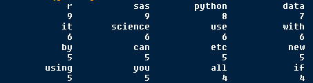
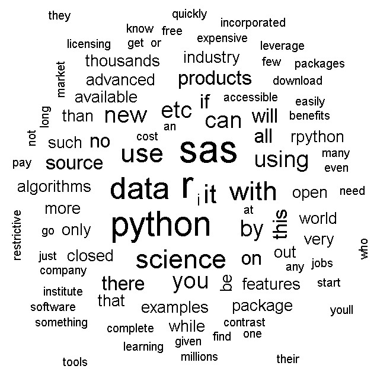
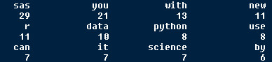
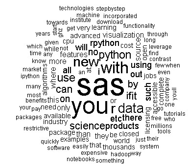
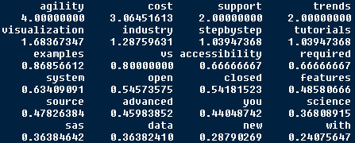
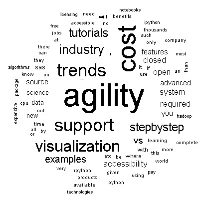

Do you want to do some text analysis or text mining?

First of all, you should transform your unstructured text to structured data, that is, split your text to word and make a term document matrix.

For example, you have two documents.

> Document 1: I have some text.

> Document 2: do you have any books?

Then, your term document matrix is like this:

term | document_1 | document_2
 ----|------------|-----------
I | 1 |0
have |1 |1
some |1 |0
text |1 |0
you |0 |1
book|0 |1

Of course, you must delete some stop-words (such as "is are" which is useless to analysis text meaning) some numbers and stemming your words and etc.

**Here, my thing is:  how do you make your term document matrix by weight?**

**My first method is: bin**

In your document, if a word appear, then the number is 1, no matter how many times this word appears.If a word does not appear, then the number is 0. All your term document is only have 0 or 1, this two types of number. Let us look at an example.

> Document 1: I have some text and some number.

> Document 2: do you have any books?

term | document_1 | document_2
 ----|------------|-----------
I    | 1          |0
have |1           |1
some |1           |0
text |1           |0
number |1         |0
you  |0            |1
book |0            |1

Here, in my document 1, "some" appears 2 times, but the number is 1.

**My second method is: tf (term frequency)**

In your document, if a word appear 2 times, then the number is 2, if a word does not appear, then the number is 0. The term document matrix will like this:

term | document_1 | document_2
 ----|------------|-----------
I    | 1          |0
have |1           |1
some |2           |0
text |1           |0
number |1         |0
you  |0            |1
book |0            |1

**My third method is: tf-idf (term frequency - inverse document frequency)**

This method is used to filter keyword, information retrieve.

Term frequency is just how many times a word appear in one document.

Inverse document frequency is somewhat hard, compute word frequency in all your documents, if a word such as "the" is high frequency, then give it a low weight, if a word such as "computer" is low frequency, then give it a high weight, this method could find some valuable words even them appear just few times. Then, multiply term frequency by inverse document frequency, this is the number in our term document matrix. If you want more information, please reference [here](https://en.wikipedia.org/wiki/Tf%E2%80%93idf).   

**Let us compare this three weight methods on the same text by word cloud in R.**

```{r}
# load the package
library(tm)
library(wordcloud)

# read the raw text
text <- readLines("word_cloud_example.txt")
```
My raw text is:
> I am in a senior role in the Data Science group at a company where SAS is considered the 'gold standard'. Given I personally already know and use R, Python and other languages, learning SAS could be very rewarding career-wise. Yet, despite all the benefits of learning and using SAS I have avoided it as a rule and on principle.
1) Open Source vs Closed System 
> With R/Python, there is complete transparency of the types of functionalities and algorithms that you can leverage as a data scientist. If you are stuck on something new, all you need is a Google Search to find the relevant R/Python package. For R, The Comprehensive R Archive Network has all the tools you need to complete 99% of data science projects. By contrast, to use any new functionality in a closed system such as SAS you have to go through a long and painstaking process of signing new contracts, dealing with Sales Agents, etc before you can even use the said functionality. It is time-consuming and counter-productive. You'll get more done much faster using R/Python than with SAS.
2) Cost
> While R and Python are open source and anyone anywhere can use it at no charge, SAS by contrast is one of the most expensive software (in the world)! A mid-large size company will have to invest millions of dollars on SAS licensing. However, for most startups this is out of question. If you are working at a place where they have the budget, well and good. If you change jobs and go someplace where they don't have SAS you are out of luck. You will be forever restricted to data science jobs where they are using SAS and there's not many of them around.
3) Accessibility of advanced features required for data science
> With R and Python you can quickly and easily leverage advanced features like parallel processing, multicore packages, etc that are essential for machine learning which involves iterative operations. With SAS you have to buy new SAS products to use such features. There is no way to just download a 'package' and and start using it within minutes as you can do with R/Python. Even after you get these SAS products, they will have strict limitations. SAS licensing costs vary by the speed of the CPU (3.1 Ghz CPU cost greater than 2.4 Ghz CPU machine license cost). No vendor I have worked with in the last 17 years ever had a more restrictive licensing model than this.
4) Support for Visualization
> As you know, visualization is an integral part of data science. Although some commercial visualization products have SAS connectivity through ODBC, the primary visualization platform is SAS Visual Analytics. This too is a very expensive tool. With R/Python there are countless ways to visualize data (ggplot2 in R, matplotlib in Python, etc). For free, without having to sign a new (SAS) contract and pay $$ for everything.
5) Industry Trends
> The industry, and by extension the job market, is shifting more and more towards open-source technologies. Hadoop, NoSQL, etc are all prime examples. SAS exists in the midst as one of the only paid products while offering little to no extra functional benefits over the available free technologies. SAS programmer demography typically tends to be veteran programmers who started out with SAS many years back. Today, very few data scientists start out with SAS for obvious reasons. It is just way easier to download R or Python or Hadoop and use it right away.
6) Agility
> Given R and Python are supported by thousands of contributors world wide, any new development in the industry (eg., a new algorithm) becomes quickly available as a package. Since SAS is accessible only to the SAS Institute Incorporated, only their developers can produce new packages. This is time consuming and you'd have completed your project by the time SAS releases an update with the new algorithms.
7) Tutorials and Step-by-Step examples
> With R and Python you have thousands of detailed worked-out examples and tutorials on the web. IPython Notebooks and R exercises are available across numerous sites such as github, etc. There is no such equivalent in SAS and as a result, if you are looking for a step-by-step guidance on a new topic which you will need when you are starting out, there is no better source than reproducible notebooks such as iPython. If you wanted to learn something new in SAS, you'll have to pay a SAS consultant (again from or affiliated with SAS Institute Incorporated) to train you on the subject.
Overall, while SAS may deliver all the present needs for data science, I find it unsustainable in the long run. Especially, when everyone in the world is moving towards collaborative open source software that is easily and widely accessible, SAS is the complete opposite being restrictive, closed and accessible to only the few who can spends hundreds of thousands if not millions to use their products. Using R, Python and similar tools will increase your breadth of knowledge, ability to practice and use newer algorithms and advanced features and as a consequential benefit also become automatically eligible for 99% of data science jobs in the market. 

```{r}
# split the text to  paragraph
para <- strsplit(text, "\\n", fixed = TRUE)

# make a corpus
wordcorpus <- Corpus(VectorSource(para))

# three weight methods
control <- list(removePunctuation = TRUE,
                removeNumbers = TRUE, 
                wordLengths = c(1, Inf), weighting = weightBin,
                stopwords = c("and", "of", "for", "in", "a", "is", "the", "as", "to", "are", "have"))

control2 <- list(removePunctuation = TRUE,
                 removeNumbers = TRUE, 
                 wordLengths = c(1, Inf), weighting = weightTfIdf,
                 stopwords = c("and", "of", "for", "in", "a", "is", "the", "as", "to", "are", "have"))

control3 <- list(removePunctuation = TRUE,
                 removeNumbers = TRUE, 
                 wordLengths = c(1, Inf), weighting = weightTf,
                 stopwords = c("and", "of", "for", "in", "a", "is", "the", "as", "to", "are", "have"))

# make term document matrix
tdm <- TermDocumentMatrix(wordcorpus, control)

# make word frequency
wordFreq <- sort(rowSums(as.matrix(tdm)), decreasing = TRUE)

# make word cloud
wordcloud(words = names(wordFreq), freq = wordFreq,
          min.freq = 2, random.order = F)
```


**To Weight: bin**

We could see this text is about:  sas r python data science.

High word frequency is:


Word cloud is:


**TO Weight: tf (term frequency)**

We could see this text is about: sas.

Because the highest word frequency is sas which is nagged. 

In fact, this text is compare three statistic software, so, I think weight bin is better than tf(term frequency), more information.

High word frequency is: 


Word cloud is:


**To Weight: tf-idf (term frequency - inverse document frequency)**

Amazing! this weight method tell us more specify information, that is, which aspects in three software is talked, agility, cost, industry trends, support visualization, tutorials, step-by-step examples.

High word frequency is:


Word cloud is:


By the way, my test text is from [here](https://www.quora.com/Why-is-SAS-insufficient-for-me-to-become-a-data-scientist-Why-do-I-need-to-learn-Python-or-R).

Just record, this article was posted at linkedin, and have 2742 views to November 2021.


