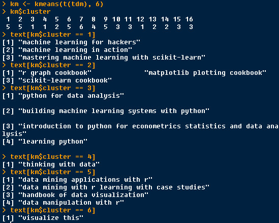

Nowadays, we have many short sentences such as twitter to analysis.

Here, we choose some book titles as my  example texts.

We try to do some analysis, such as word cloud, social network's word relation graph, latent semantic analysis model,  k-means model,  cos similarity method.

And we also try to compare cluster effects of two different weight methods of term document matrix.

**My title of books:**
> 1  data mining applications with r

> 2  data mining with r learning with case studies

> 3  machine learning for hackers

> 4  machine learning in action

> 5  r graph cookbook

> 6  handbook of data visualization

> 7  visualize this

> 8  thinking with data

> 9  data manipulation with r

> 10 python for data analysis

> 11 building machine learning systems with python

> 12 mastering machine learning with scikit-learn

> 13 matplotlib plotting cookbook

> 14 scikit-learn cookbook

> 15 introduction to python for econometrics statistics and data analysis

> 16 learning python

**Social network's word relation graph**

Learning is matched more than other words, such as machine learning, learning python, learning r, learning system, learning sicikit-learn, and etc.

Then data is matched such as data mining, data analysis, data applications, data python and etc.

Note:  No matter which weight methods are used, this graph is not changed. Because this graph only concerts weather the word appears with some words, not  pay attention to what weight number with this word is.


**Word Cloud (Weight: Bin)**

This word cloud displays some common words in our titles such as: data machine learning python cookbook.


**Latent Semantic Analysis Model (Weight: Bin)**

From this model we could see two clear clusters, one is make up by document 3, 4, 11, 12, contains keywords "machine learning", the other is comprised by document 1, 2, 5, 9, include the letter "r".


**k-means model  (Weight: Bin)**

**k-means = 2**

cluster 2 : texts which contains "r"


 
 
**k-means = 3**

cluster 1 : texts which contains "machine learning"

cluster 2: texts which contains "cookbook"

cluster 3: texts which contains "data"


 

**k-means = 4**

cluster 1 : texts which contains "python data analysis"

cluster 2: texts which contains "machine learning"

cluster 3: texts which contains "cookbook"

cluster 4: texts which contains "data"


 

**k-means = 5**

It seems like this process should be end.

This classification is somewhat confused.

We should try other models.


 

**Cos similarity method (Weight: Bin)**

The bigger the circle is, the stronger similar between two documents.

Document 1 is similar with 2, 9.

1  **data mining** applications with r

2  **data mining** with r learning with case studies

9  **data** manipulation with r

Document 3 is similar with 4, 11, 12, 16.

3  **machine learning** for hackers

4  **machine learning** in action

11 building **machine learning** systems with python

12 mastering **machine learning** with scikit-learn

16 **learning** python

Document 10 is similar with 15.

10 **python** for **data analysis**

15 introduction to **python** for econometric statistics and **data analysis**


 

**Word Cloud (Weight: Tf-Idf)**

This word cloud displays some few special words in our titles such as: visualize.


 

**Latent Semantic Analysis Model (Weight: Tf-Idf)**

This outcome of cluster is bad!


 

**k-means model  (Weight: Tf-Idf)**

**k-means = 2**

cluster 1 : texts which contains "visualize"

The few seen word "visualize" is separated get as a cluster.


 
**k-means = 3**

cluster 1 : texts which contains "visualize"

cluster 3: texts which contains "cookbook"

The first important is "visualize", the second important is "cookbook".


 
**k-means = 4**

cluster 4 : texts which contains "visualize"

cluster 3: texts which contains "cookbook"

cluster 1 : texts which contains "machine learning"

cluster 2: texts which contains "data"

"data" cluster is include more meanings, such as data mining, data analysis, data visualization, data manipulate and etc.


 
**k-means = 5**

cluster 1: texts which contains "cookbook"

cluster 2: texts which contains "thinking with data"

cluster 3 : texts which contains "visualize"

cluster 4 : texts which contains "machine learning"

cluster 5 : texts which contains "data"

This cluster separate "thinking with data" from "data", is good.

This weight tf-ifd is good at filter out words which has special meanings.

The other weight bin only good at find out the common words, when k-means = 5, the clusters are bad.


 
**k-means = 6**

cluster 1 : texts which contains "machine learning"

cluster 2: texts which contains "cookbook"

cluster 3 : texts which contains "python"

cluster 4: texts which contains "thinking with data"

cluster 5 : texts which contains "data"

cluster 6 : texts which contains "visualize"

This cluster separate "python" from "data", still is good.


 
**k-means = 7**

This clusters are more, except "machine learning", "visualize", "cookbook", "data mining", "data", increase clusters "handbook of data visualization" (if we stem the word, then visualization and visualize would be one word), "matplotlib plotting cookbook" plot be separated as one cluster, good.

I will not try more, if you have interest, you could try it.


 
**Cos similarity method (Weight: Tf-Idf)**

The bigger the circle is, the stronger similar between two documents.

Document 1 is similar with 2.

1  **data mining** applications with r

2  **data mining** with r learning with case studies

Document 3 is similar with 4.

3  **machine learning** for hackers

4  **machine learning** in action

Document 10 is similar with 15, 16.

10 **python** for **data analysis**

15 introduction to **python** for econometrics statistics and data analysis

16 learning **python**


 
Below is R code.
 
```{r}
# load some packages
library(tm)
library(igraph)
library(wordcloud)
library(ggplot2)
library(corrplot)

# using title of books to do text analysis 
text <- c("data mining applications with r",
          "data mining with r learning with case studies",
          "machine learning for hackers",
          "machine learning in action",
          "r graph cookbook",
          "handbook of data visualization",
          "visualize this", "thinking with data",
          "data manipulation with r",
          "python for data analysis",
          "building machine learning systems with python",
          "mastering machine learning with scikit-learn",
          "matplotlib plotting cookbook",
          "scikit-learn cookbook",
          "introduction to python for econometrics statistics and data analysis",
          "learning python")

# make a corpus
wordcorpus <- Corpus(VectorSource(text))

control <- list(removePunctuation = TRUE,
                removeNumbers = TRUE, 
                wordLengths = c(1, Inf), weighting = weightBin,
                stopwords = TRUE)

# if you want to use the other weight method, you could replace the above code with below one:

control <- list(removePunctuation = TRUE,
                removeNumbers = TRUE, 
                wordLengths = c(1, Inf), weighting = weightTfIdf,
                stopwords = TRUE)

# Note: here we do not deal with the problem of stemming of the word, because here I failed to install the dependence package Snowball, if you want to do some stem work, you could use the function tm_map(wordcorpus, stemDocument) to do it.

# make a term document matrix
tdm <- TermDocumentMatrix(wordcorpus, control)

# compute the word frequency
wordFreq <- sort(rowSums(as.matrix(tdm)), decreasing = TRUE)

####################  word cloud ################
wordcloud(words = names(wordFreq), freq = wordFreq,


############## social network's word relation graph#########
# make a term term matrix
tdm <- as.matrix(tdm)
term_term <- tdm %*% t(tdm)

# remove loops
g <- simplify(g)
# set labels and degrees of vertex
V(g)$label <- V(g)$name
V(g)$degree <- degree(g)

# set seed to make the layout reproducible
set.seed(3952)
V(g)$label.cex <- 2.2 * V(g)$degree / max(V(g)$degree)+ .2
V(g)$label.color <- rgb(0, 0, .2, .8)
V(g)$frame.color <- NA
egam <- (log(E(g)$weight)+.4) / max(log(E(g)$weight)+.4)
E(g)$width <- egam
# plot the graph
plot(g, layout=layout.fruchterman.reingold(g))

###########  latent semantic analysis model ###########
t <- tdm
out <- svd(t)
rownames(out$v) <- dimnames(t)$Docs
rownames(out$u) <- dimnames(t)$Terms

# term semantic matrix
datau <- data.frame(out$u[,2:3])
# document semantic matrix
datav <- data.frame(out$v[,2:3])

ggplot()+
  geom_point(data = datau, aes(X1, X2), size = 4, color = "blue") +
  geom_text(data = datau, aes(X1, X2), label = rownames(datau), vjust = 2) +
  geom_point(data = datav, aes(X1, X2), size = 5, color = 'red4') +
  geom_text(data = datav, aes(X1, X2), label = rownames(datav), vjust = 2) +
  theme_bw()
  
############### k-means model #################
km <- kmeans(t(tdm), 3)
km$cluster

################ cos similarity method ###########
doc_doc <- t(tdm) %*% tdm
abs_n <- apply(t(tdm), 1, function(x) sqrt(sum(x^2)))
abs_m <- abs_n %*% t(abs_n)
cos <- doc_doc / abs_m
corrplot(cos, type = "lower", diag = FALSE)

```

That's all.

Hoping I will get your feedback.

Welcome your advises and suggestion!

Just record, this article was posted at linkedin, and have 820 views to November 2021.
