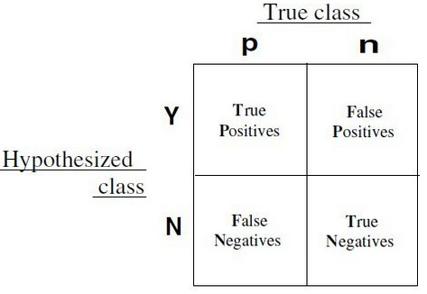
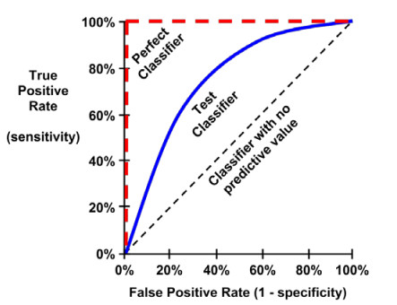

In my above article --- do some classification models by iris data set , I used a metric of **accuracy**, that divided the proportion of correct predictions by the total number of predictions, to measure classification performance in kinds of models .

There are also many other metrics such as **precision**, **recall**, they are often used to evaluated the learner.

These metrics all are computed by **confusion matrix**, if two models have the same confusion matrix, then they will have the same metrics.



Classification often involves a balance between being overly conservative and overly aggressive in decision making.

For example, an e-mail filter could guarantee to eliminate every spam message by aggressively eliminating nearly every ham message at the same time.

On the other hand, a guarantee that no ham messages will be inadvertently filtered might allow an unacceptable amount of spam to pass through the filter.

This trade-off is captured by metrics: sensitivity and specificity.

The **sensitivity** of a model (also called the **true positive rate**), measures the proportion of positive examples that were correctly classified.

$$sensitivity\ =\ \frac{TP}{TP\ +\ FN}$$

The **specificity** of a model (also called the **true negative rate**), measures the proportion of negative examples that were correctly classified.

$$specificity\ =\ \frac{TN}{TN\ +\ FP}$$

Closely related to sensitivity and specificity are two other performance metrics: precision and recall.

The **precision** (also known as the **positive predictive value**) is defined as the proportion of positive examples that are truly positive, in other words, when a model predicts the positive class, how often is it correct?

A precise model will only predict the positive class in cases very likely to be positive.

It will be very trustworthy.

$$precision\ =\ \frac{TP}{TP\ +\ FP}$$

On the other hand, **recall** is a metric of how complete the results are.

This is defined as the number of true positives over the total number of positives.

You may recognize that this is the same as sensitivity, only the interpretation differs.

A model with high recall captures a large portion of the positive examples, meaning that it has wide breadth.

$$recall\ =\ \frac{TP}{TP\ +\ FN}$$

A metric of model performance that combines precision and recall into a single number is known as the **F-measure** (also sometimes called the F1 score or the F-score).

$$F-measure\ =\ \frac{2\ \cdot\ precision \cdot\ recall}{recall\ +\ precision}=\frac{2\cdot TP}{2\cdot TP\ +\ FP\ +\ FN}$$

The **ROC curve (Receive Operating Characteristic)** is commonly used to examine the trade-off between the detection of true positives, while avoiding the false positives.



The closer the curve is to the perfect classifier, the better it is at identifying positive values.

This can measured using a metric known as the **area under the ROC curve (abbreviated AUC)**.

AUC ranges from 0.5 (for a classifier with no predictive value), to 1.0 (for a perfect classifier).

Here, we will use field.goals dataset in nutshell package as an example, try some classifier to do some metrics of model performance.

```{r setup, include=FALSE} 
knitr::opts_chunk$set(warning = FALSE, message = FALSE) 
```

```{r}
#######################################################
### use field.goals dataset to test classifier performance
#######################################################

# load the data set
library(nutshell)
data(field.goals)

# create a new binary variable for dataset
data <- transform(field.goals,
                 play.type = factor(ifelse(play.type == "FG good", "good", "bad")))
head(data)
summary(data)
```

We split iris dataset to train-set and test-set.

```{r}
#########################################
##  split the data set to train and test
#########################################

n <-  length(data[,1])
index1  <-  1 : n
# divide to 5 part of data
index2 <- rep(1 : 5, ceiling(n / 5))[1 : n]
set.seed(100)
# melt the order of the data
index2 <-  sample(index2, n)
# get the one part of the data
m <- index1[index2 == 1]
trainset <- data[-m, ]
testset <- data[m, ]
summary(trainset)
summary(testset)
```

Here, our aim is to detective "bad" play type.

Because the number of "bad" is small, if all play types are predicted to "good", then accuracy is 636/(636 + 149) = 0.81, about 81% predict is right in train set, but there is useless to detective "bad" in above predict method.

So only accuracy rate in unbalance data set (such as bad : good is 149 : 636 ) to compare the performance of classifier will lead to misunderstand and meaningless.

So, we do some classification models and compute their confusion matrix in train-set and test-set and then we compute some metrics by confusion matrix.

Logistic regression model in train set.

```{r}
## logistic regression
logic_model<- glm(play.type ~ ., data = trainset, family = binomial)
#summary(logic_model)

logic_model2<-step(logic_model)
#summary(logic_model2)

# confusion matrix in trainset
logic_model2_pred_train <- predict(logic_model2, trainset, type = "response")
table(ifelse(logic_model2_pred_train > 0.5, "good", "bad"), trainset$play.type)

library(caret)
confusionMatrix(factor(ifelse(logic_model2_pred_train > 0.5, "good", "bad")), trainset$play.type)
```

Logistic regression model in test set.
```{r}
# confusion matrix in testset
logic_model2_pred_test <- predict(logic_model2, testset, type = "response")
table(ifelse(logic_model2_pred_test > 0.5, "good", "bad"), testset$play.type)
confusionMatrix(factor(ifelse(logic_model2_pred_test > 0.5, "good", "bad")), testset$play.type)
```

Knn in train set.
```{r}
## k-nearest neighbor
library(class)
train_x <- as.matrix(trainset[, c(2, 3, 9)])
test_x <- as.matrix(testset[, c(2, 3, 9)])
train_y <- trainset[, 7]

set.seed(1)
knn_pred_train <- knn(train_x, train_x, train_y, k = 4)
table(knn_pred_train, trainset$play.type)
confusionMatrix(knn_pred_train, trainset$play.type)
```

Knn in test set.
```{r}
knn_pred_test <- knn(train_x, test_x, train_y, k = 4)
table(knn_pred_test, testset$play.type)
confusionMatrix(knn_pred_test, testset$play.type)
```

Decision tree in train set.
```{r}
## decision tree
library(tree)
tree_model <- tree(play.type ~ week + qtr + yards + stadium.type, trainset)
summary(tree_model)
plot(tree_model)
text(tree_model, pretty = 0)

tree_pred_train <- predict(tree_model, trainset, type = "class")
table(tree_pred_train, trainset$play.type)
confusionMatrix(tree_pred_train, trainset$play.type)
```

Decision tree in test set.
```{r}
tree_pred_test <- predict(tree_model, testset, type = "class")
table(tree_pred_test, testset$play.type)
confusionMatrix(tree_pred_test, testset$play.type)
```

Bagging in train set.
```{r}
## bagging
library(randomForest)
bag_model <- randomForest(play.type ~ week + qtr + yards + stadium.type, data = trainset,
                         mtry = 4,
                         importance = TRUE)
bag_model

bag_pred_train <- predict(bag_model, newdata = trainset)
table(bag_pred_train, trainset$play.type)
confusionMatrix(bag_pred_train, trainset$play.type)
```

Bagging in test set.
```{r}
bag_pred_test <- predict(bag_model, newdata = testset)
table(bag_pred_test, testset$play.type)
confusionMatrix(bag_pred_test, testset$play.type)
```

Random forest in train set.
```{r}
##  random forest
rf_model <- randomForest(play.type ~ week + qtr + yards + stadium.type, data = trainset, 
                        importance = TRUE)
rf_model

rf_pred_train <- predict(rf_model, newdata = trainset)
table(rf_pred_train, trainset$play.type)
confusionMatrix(rf_pred_train, trainset$play.type)
```

Random forest in test set.
```{r}
rf_pred_test <- predict(rf_model, newdata = testset)
table(rf_pred_test, testset$play.type)
confusionMatrix(rf_pred_test, testset$play.type)
```

Boosting in train set.
```{r}
## boosting
library(gbm)
boost_model <- gbm(as.numeric(play.type) - 1 ~ week + qtr + yards + stadium.type, data = trainset)
summary(boost_model)

boost_pred_train <- predict(boost_model, newdata = trainset, n.trees = 100,
                           type = "response")
table(ifelse(boost_pred_train > 0.8, "good", "bad"), trainset$play.type)
confusionMatrix(factor(ifelse(boost_pred_train > 0.8, "good", "bad")), trainset$play.type)
```

Boosting in test set.
```{r}
boost_pred_test <- predict(boost_model, newdata = testset, n.trees = 100,
                          type = "response")
table(ifelse(boost_pred_test > 0.8, "good", "bad"), testset$play.type)
confusionMatrix(factor(ifelse(boost_pred_test > 0.8, "good", "bad")), testset$play.type)
```

Support vector machine in train set.
```{r}
##  support vector machine
library(e1071)
svm_model <- svm(play.type ~ week + qtr + yards + stadium.type, data = trainset,
                kernel = "linear", scale = FALSE)
summary(svm_model)

svm_pred_train <- predict(svm_model, trainset)
table(svm_pred_train, trainset$play.type)
confusionMatrix(svm_pred_train, trainset$play.type)
```

Support vector machine in test set.
```{r}
svm_pred_test <- predict(svm_model, testset)
table(svm_pred_test, testset$play.type)
confusionMatrix(svm_pred_test, testset$play.type)
```

Naive bayes in train set.
```{r}
## naive bayes
library(e1071)
bayes_model <- naiveBayes(trainset$yards, trainset$play.type)
summary(bayes_model)

bayes_pred_train <- predict(bayes_model, trainset$yards, type = "class")
table(bayes_pred_train, trainset$play.type)
confusionMatrix(bayes_pred_train, trainset$play.type)
```

Naive bayes in test set.
```{r}
bayes_pred_test <- predict(bayes_model, testset$yards, type = "class")
table(bayes_pred_test, testset$play.type)
confusionMatrix(bayes_pred_test, testset$play.type)
```

Artificial neural networks in train set.
```{r}
## artificial neural networks
library(nnet)
ann_model <- nnet(play.type ~ week + qtr + yards + stadium.type, data = trainset, size = 3)

ann_pred_train <- predict(ann_model, newdata = trainset, type = "class")
table(ann_pred_train, trainset$play.type)
confusionMatrix(factor(ann_pred_train), trainset$play.type)
```

Artificial neural networks in test set.
```{r}
ann_pred_test <- predict(ann_model, newdata = testset, type = "class")
table(ann_pred_test, testset$play.type)
confusionMatrix(factor(ann_pred_test), testset$play.type)
```

We summary above confusion matrix and then find out: decision tree, support vector machine and artificial networks confusion matrix in test set are same, predict all play type as "good".

We display metrics of all above models in a table and compare kinds of measures between train set and test set, we will see some classifier do better in train set, but worse in test set, so split the data set to train set and test set is important.

Our aim is detect more "bad" play type, at the same time we want to achieve higher accuracy as possible.

Firstly,  we choose high recall in test set, secondly, we take account of better accuracy in test set.

**So, we choose boosting, knn and logistic regression .**

In fact, classifier is not only return a predict value "good" or "bad", it will return a probability value about "good" or "bad".

Such as logistic regression, in above model, I simply choose 0.5 as threshold value, then get confusion matrix, recall and precision, etc.

If I do not chose a threshold value, to every probability, we will get a confusion matrix, recall and so on, eventually, we will get a series confusion matrix, recall, precision, we could plot series measures in an plot, such as ROC curve.

Logistic regression model in train set.

When cut-off: 0.5, TPR (true positive rate, recall, sensitivity) : 0.04, now best cut-off: 0.8326, TPR: 0.58, better.

```{r}
############################################################
### make roc curve
############################################################

# make single roc plot method 1
library(ROCR)
pred <- prediction(logic_model2_pred_train, trainset$play.type)
perf <- performance(pred,"tpr","fpr")
plot(perf,colorize=TRUE)
grid(5, 5, lwd = 1)
points(c(0,1), c(0,1), type="l", lty=2, lwd=2, col="grey")
auc.tmp <- performance(pred,"auc")
auc <- as.numeric(auc.tmp@y.values)
auc <- round(auc, 4)
```
We could compare roc curve of  some models in train set at one graph.

The more near left top corner roc curve is, the better the model is.

From prediction in train set, bagging and random forest is best.

```{r}
#############################################
# make multiply roc plot in train set
#############################################
fpr_tpr <- function(p, dataset) {
  
  TPR <- rep(0, length(p))
  FPR <- rep(0, length(p))
  for(i in 1 : length(p)){
    p0 <- p[order(p)[i]]
    label_true <- ifelse(dataset$play.type == "good", 1, 0)
    label_pred <- 1 * (p > p0)
    TPR[i] <- sum(label_pred * label_true) / sum(label_true)
    FPR[i] <- sum(label_pred * (1 - label_true)) / sum(1 - label_true)
  }
  list(fpr = FPR, tpr = TPR)
}

# plot logistic regression roc
logic_train_measures <- fpr_tpr(p = logic_model2_pred_train, dataset = trainset)

plot(logic_train_measures$fpr, logic_train_measures$tpr, type = "l", col = 2,
     ylab = "TPR", xlab = "FPR")
title("ROC curve in train set")
points(c(0, 1), c(0, 1), type = "l", lty = 2)

# plot knn roc
knn_pred_train2 <- knn(train_x, train_x, train_y, k = 4, prob = TRUE)
knn_train_measures <- fpr_tpr(p = attr(knn_pred_train2, "prob"), dataset = trainset)
points(knn_train_measures$fpr, knn_train_measures$tpr, type = "l", col = 3)

# plot tree roc
tree_pred_train2 <- predict(tree_model, trainset, type = "vector")
tree_train_measures <- fpr_tpr(p = tree_pred_train2[, 2], dataset = trainset)
points(tree_train_measures$fpr, tree_train_measures$tpr, type = "l", col = 4)

# plot bagging roc
bag_pred_train2 <- predict(bag_model, newdata = trainset, type = "prob")
bag_train_measures <- fpr_tpr(p = bag_pred_train2[, 2], dataset = trainset)
points(bag_train_measures$fpr, bag_train_measures$tpr, type = "l", col = 5)

# plot random forest roc
rf_pred_train2 <- predict(rf_model, newdata = trainset, type = "prob")
rf_train_measures <- fpr_tpr(p = rf_pred_train2[, 2], dataset = trainset)
points(rf_train_measures$fpr, rf_train_measures$tpr, type = "l", col = 6)

# plot boosting roc
boost_train_measures <- fpr_tpr(p = boost_pred_train, dataset = trainset)
points(boost_train_measures$fpr, boost_train_measures$tpr, type = "l", col = 7)

# plot support vector machine roc
svm_pred_train2 <- predict(svm_model, trainset, decision.values = TRUE)
svm_train_measures <- fpr_tpr(p = attr(svm_pred_train2, "decision.values"), dataset = trainset)
points(svm_train_measures$fpr, svm_train_measures$tpr, type = "l", col = 8)

# plot naive bayes roc
bayes_pred_train2 <- predict(bayes_model, trainset$yards, type = "raw")
bayes_train_measures <- fpr_tpr(p = bayes_pred_train2[, 2], dataset = trainset)
points(bayes_train_measures$fpr, bayes_train_measures$tpr, type = "l", col = 9)

# plot artificial neural networks
ann_pred_train2 <- predict(ann_model, newdata = trainset, type = "raw")
ann_train_measures <- fpr_tpr(p = ann_pred_train2[, 1], dataset = trainset)
points(ann_train_measures$fpr, ann_train_measures$tpr, type = "l", col = 10)

legend("bottomright", c("logis", "knn", "tree", "bag", "rf", "boost",
                        "svm", "bayes", "ann"),
       lwd = c(2, 2, 2),
       lty = rep(1, 9), col = 2:10, cex = .8)
```
We see roc curve of kinds of model in test set.

```{r}
################################################
# make multiply roc plot in test set
################################################

# plot logistic regression roc
logic_test_measures <- fpr_tpr(p = logic_model2_pred_test, dataset = testset)

plot(logic_test_measures$fpr, logic_test_measures$tpr, type = "l", col = 2,
     ylab = "TPR", xlab = "FPR")
title("ROC curve in test set")
points(c(0, 1), c(0, 1), type = "l", lty = 2)

# plot knn roc
knn_pred_test2 <- knn(train_x, test_x, train_y, k = 4, prob = TRUE)
knn_test_measures <- fpr_tpr(p = attr(knn_pred_test2, "prob"), dataset = testset)
points(knn_test_measures$fpr, knn_test_measures$tpr, type = "l", col = 3)

# plot tree roc
tree_pred_test2 <- predict(tree_model, testset, type = "vector")
tree_test_measures <- fpr_tpr(p = tree_pred_test2[, 2], dataset = testset)
points(tree_test_measures$fpr, tree_test_measures$tpr, type = "l", col = 4)

# plot bagging roc
bag_pred_test2 <- predict(bag_model, newdata = testset, type = "prob")
bag_test_measures <- fpr_tpr(p = bag_pred_test2[, 2], dataset = testset)
points(bag_test_measures$fpr, bag_test_measures$tpr, type = "l", col = 5)

# plot random forest roc
rf_pred_test2 <- predict(rf_model, newdata = testset, type = "prob")
rf_test_measures <- fpr_tpr(p = rf_pred_test2[, 2], dataset = testset)
points(rf_test_measures$fpr, rf_test_measures$tpr, type = "l", col = 6)

# plot boosting roc
boost_test_measures <- fpr_tpr(p = boost_pred_test, dataset = testset)
points(boost_test_measures$fpr, boost_test_measures$tpr, type = "l", col = 7)

# plot support vector machine roc
svm_pred_test2 <- predict(svm_model, testset, decision.values = TRUE)
svm_test_measures <- fpr_tpr(p = attr(svm_pred_test2, "decision.values"), dataset = testset)
points(svm_test_measures$fpr, svm_test_measures$tpr, type = "l", col = 8)

# plot naive bayes roc
bayes_pred_test2 <- predict(bayes_model, testset$yards, type = "raw")
bayes_test_measures <- fpr_tpr(p = bayes_pred_test2[, 2], dataset = testset)
points(bayes_test_measures$fpr, bayes_test_measures$tpr, type = "l", col = 9)

# plot artificial neural networks
ann_pred_test2 <- predict(ann_model, newdata = testset, type = "raw")
ann_test_measures <- fpr_tpr(p = ann_pred_test2[, 1], dataset = testset)
points(ann_test_measures$fpr, ann_test_measures$tpr, type = "l", col = 10)

legend("bottomright", c("logis", "knn", "tree", "bag", "rf", "boost",
                        "svm", "bayes", "ann"),
       lwd = c(2, 2, 2),
       lty = rep(1, 9), col = 2:10, cex = .8)

# plot better model in roc
plot(logic_test_measures$fpr, logic_test_measures$tpr, type = "l", col = 2,
     ylab = "TPR", xlab = "FPR")
title("ROC curve in test set")
points(c(0, 1), c(0, 1), type = "l", lty = 2)
points(boost_test_measures$fpr, boost_test_measures$tpr, type = "l", col = 3)
points(ann_test_measures$fpr, ann_test_measures$tpr, type = "l", col = 4)

legend("bottomright", c("logis", "boost", "ann"),
       lwd = c(2, 2, 2),
       lty = rep(1, 3), col = 2:4, cex = .8)
```

**Here, the better model are logistic regression, artificial neural networks, boosting.**


**Referenced books:**

1. Machine Learning with R

2. R in a nutshell

3. Applied Predictive Modeling

4. An Introduction to Statistical Learning with Applications in R

Just record, this article was posted at linkedin, and have 97 views to November 2021.


