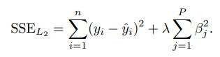
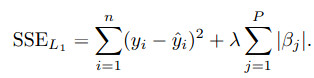

This data set have been taken from the UCI Repository Of Machine Learning Databases at [here](http://www.ics.uci.edu/~mlearn/MLRepository.html).


We could directly load this data set by **mlbench** package.

Using this data set, we could predict Boston housing price by some ingredients such as education index (ptratio : pupil-teacher ratio by town), society index (crim: per capita crime rate by town; b: the proportion of blacks by town; lstat: percentage of lower status of the population), transportation index(chas: if tract bounds river of Charles; rad: index of accessibility to radial highways; dis: weighted distances to five Boston employment centres), environment index(nox: nitric oxides concentration), land index(zn: proportion of residential land zoned for lots; indus: proportion of non-retail business acres per town; rm: average number of rooms per dwelling; age: proportion of owner-occupied units built prior to 1940; tax: full-value property-tax rate).

The first step is to understand the data, which can easily be done through a  graph.

From the scatter plot and correlation plot, we can see some variables such as rm, lstat, nox, crim have relationship with outcome variable medv.

Clearly, as average number of rooms per dwelling (rm) increases, the median price of home increase.

They have positive correlation.

As percentage of lower status of the population (lstat), nitric oxides concentration (nox), per capita crime rate by town (crim) increase, the median price of home drop.

They have negative correlation.

```{r}
###################
# load the data set
library(mlbench)
data(BostonHousing)
# str(BostonHousing)

#########################
### explore the data set
#########################
library(caret)
featurePlot(x = BostonHousing[, c(1:3, 5:13)],
            y = BostonHousing$medv,
            plot = "scatter",
            layout = c(4, 3))

library(corrplot)
corrplot::corrplot(cor(BostonHousing[, -4]),
                   order = "hclust",
                   tl.cex = .8)
```

After understanding the data, the next step is to build and evaluate a model.

A standard approach is to take a random samples of the data for model building and use the rest to understand model performance.

```{r}
#########################
### split the data
#########################
set.seed(1234)
train_index <- createDataPartition(BostonHousing$medv, p = .8, list = FALSE)
trainset <- BostonHousing[train_index, ]
testset <- BostonHousing[-train_index, ]

str(trainset)
```

For regression problems where we try to predict a numeric value, the residuals are important source of information.

Residuals are computed as the observed value minus the predicted value.

Because of residuals have positive values and negative values, positive residual add negative residual will decrease the influence of true residual, so   square the residuals is a good method.

To a series of squared residuals, the mean is a better summary approach, so we need get mean of the squared residuals.

But this value is too big compare to single residuals, so we compute the square root of this big value, then we get the measures, root mean squared error (RMSE).

$$RMSE\ =\ \sqrt{\left\{\frac{\sum_{_{i\ =\ 1}}^n\left(X_{obs,\ i}\ -\ X_{model,\ i}\right)^2}{n}\right\}}$$
When predicting numeric values, the root mean squared error (RMSE) is commonly used to evaluate models.

The value of RMSE is usually interpreted as the average distance between the observed values and the model predictions.

Another common metric is R square, this value can interpreted as the proportion of the information in the data that is explained by the model.

Now, it is time to build models.

**Linear Regression**

The most common regression model is linear regression, we try it first.

From RMSE and R squared, linear regression seems good.

But from below figure, we could see when the price of house at extreme values such as the smallest or the largest value, the predicted value is lower than the observed value, this also lead some of the residuals are higher than others.

```{r}
### ordinary linear regression
set.seed(1234)
lm_model <- train(medv ~ .,
                 data = trainset,
                 method = "lm",
                 trControl = trainControl(method= "cv"))
lm_model
# lm_model$finalModel

lm_pred <- predict(lm_model, testset)
postResample(pred = lm_pred,  obs = testset$medv)

# visulization the performance of the model
library(ggplot2)
df_lm <- data.frame(predicted = lm_pred, observed = testset$medv)
ggplot(df_lm, aes(x = predicted, y = observed)) +
  geom_point() +
  geom_abline(intercept = 0, slope = 1, colour = "blue") +
  ggtitle("Linear Regression Predicted VS Observed")

df_lm2 <- data.frame(predicted = lm_pred, residual = testset$medv - lm_pred)
ggplot(df_lm2, aes(x = predicted, y = residual)) +
  geom_point() +
  geom_hline(yintercept = 0, colour = "blue") +
  ggtitle("Linear Regression Predicted VS Residual")
```

**Principal Component Regression**

If we have some highly correlated predictors in the data set, we could use PCA (principal component analysis) for pre-processing guarantees that the resulting predictors will be uncorrelated.

Pre-processing predictors via PCA prior to performing regression is known as principal component regression (PCR).


```{r}
###  principal component regression
# need prprocess to data
set.seed(1234)
pcr_model <- train(medv ~ .,
                  data = trainset,
                  method = "pcr",
                  preProcess = c("center", "scale"),
                  tuneGrid = expand.grid(ncomp = 1:13),
                  trControl = trainControl(method= "cv"))
pcr_model
pcr_pred <- predict(pcr_model, testset)
postResample(pred = pcr_pred,  obs = testset$medv)
```
But PCA does not consider any aspects of the response when it selects its components.

Instead, it simply chases the variability present throughout the predictor space.

If the variability in the predictor space is not related to the variability of the response, then PCR can have difficulty identifying a predictive relationship when one might actually exist.

**Partial Least Squares**

Because of this inherent problem with PCR, we recommend PLS (partial least squares) model when there are correlated predictors and a linear regression-type model is desired.

Prior to performing pls, the predictors should be centered and scaled, especially if the predictors are on scales of differing magnitude, for PLS will seek directions of maximum variation while simultaneously considering correlation with the response.

```{r}
###  partial least squares
# need prprocess to data
set.seed(1234)
pls_model <- train(medv ~ .,
                  data = trainset,
                  method = "pls",
                  preProcess = c("center", "scale"),
                  tuneGrid = expand.grid(ncomp = 1:13),
                  trControl = trainControl(method= "cv"))
pls_model
# pls_model$results

pls_pred <- predict(pls_model, testset)
postResample(pred = pls_pred,  obs = testset$medv)
```
PLS find the final value used for the model was ncomp = 9 and PCR find ncomp = 13.

We see that the supervised dimension reduction finds a minimum RMSE with significantly fewer components than unsupervised dimension reduction.

```{r}
# visualization to compare pcr and pls models
pcr_model$results$model <- "pcr"
pls_model$results$model <- "pls"

df_pcr_pls <- rbind(pcr_model$results, pls_model$results)
ggplot(df_pcr_pls, aes(x = ncomp, y = RMSE, colour = model)) +
  geom_line() +
  geom_point() +
  ggtitle("PCR VS PLS")
```
Prediction of the test set using the optimal PCR and PLS models.

Although the predictive ability of these models are similarity, PLS finds a simpler model that use fewer components.

From PLS model, we could compute the importance of the predictors.

The most important predictor is average number of rooms per dwelling, then percentage of lower status of the population, education index (pupil-teacher ratio by town), transportation index( weighted distances to five Boston employment centres; index of accessibility to radial highways).

```{r}
# rank the importance of the predictors
pls_imp <- varImp(pls_model, scale = FALSE)
plot(pls_imp, scales = list(y = list(cex = .95)))
```
**Penalized Models (Ridge regression)**

One common consequence of large correlated variables is that the variance can become large, we could add penalty on the parameter estimates to making a trade-off between the model variance and bias. 

Ridge regression adds a penalty on the sum of the squared regression parameters:



```{r}
### ridge regression
# need prprocess to data
ridge_grid <- expand.grid(lambda = seq(0, .1, length = 15))
set.seed(1234)
ridge_model <- train(medv ~ .,
                    data = trainset,
                    method = "ridge",
                    preProcess = c("center", "scale"),
                    tuneGrid = ridge_grid,
                    trControl = trainControl(method= "cv"))
ridge_model
ridge_pred <- predict(ridge_model, testset)
postResample(pred = ridge_pred,  obs = testset$medv)
```
Using cross-validation, the penalty value was chosen by the minimum RMSE.

When there is no penalty, the error is inflated.When the penalty is increased, the error decrease.

When the penalty increases beyond 0.0214, the bias becomes large and the model starts to under-fit.

```{r}
update(plot(ridge_model), xlab = "Penalty",
       main = "The Cross-Validation Profiles for Ridge Regression Model")
```
**Penalized Models (LASSO and others)**

A sister model to ridge regression is the least absolute shrinkage and selection operator (lasso) model.

The lasso could conduct feature selection.

 
The model **LARS (least angle regression)** is a broad framework that encompasses the lasso and similar models, and can be used to fit lasso more efficiently, especially in high-dimensional problems.

A generalization of the lasso model and ridge regression model is the **elastic net**.

This model combines the two types of penalties:
 

The advantage of this model is that it can regularization via the ridge-type penalty with the feature selection quality of the lasso penalty.

This model will effectively deal with groups of high correlated predictors.

The plot shows the performance profiles across three values of the ridge penalty and 20 values of the lasso penalty.

```{r}
### elastic net
# need prprocess to data
enet_grid <- expand.grid(lambda = c(0, 0.01, .1),
                        fraction = seq(.05, 1, length = 20))
set.seed(1234)
enet_model <- train(medv ~ .,
                   data = trainset,
                   method = "enet",
                   preProcess = c("center", "scale"),
                   tuneGrid = enet_grid,
                   trControl = trainControl(method= "cv"))
# enet_model
enet_pred <- predict(enet_model, testset)
# postResample(pred = enet_pred,  obs = testset$medv)

update(plot(enet_model), main = "The Cross-Validation Profiles for Elastic Net Model")

```

```
**Referenced:**
  
1. Applied Predictive Modeling

2. http://topepo.github.io/caret/index.html

Just record, this article was posted at linkedin, and have 2211 views to November 2021.

