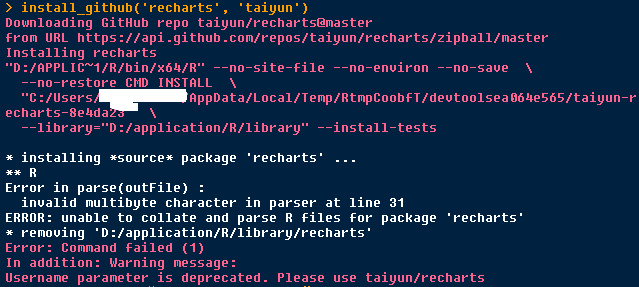
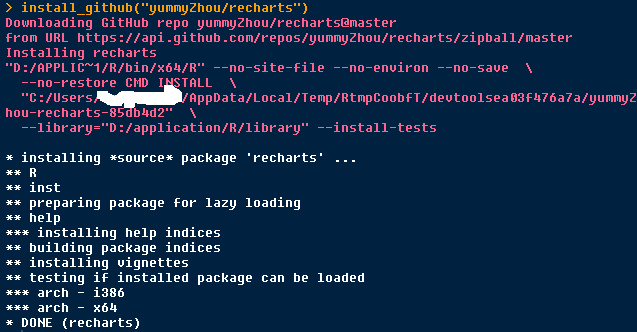
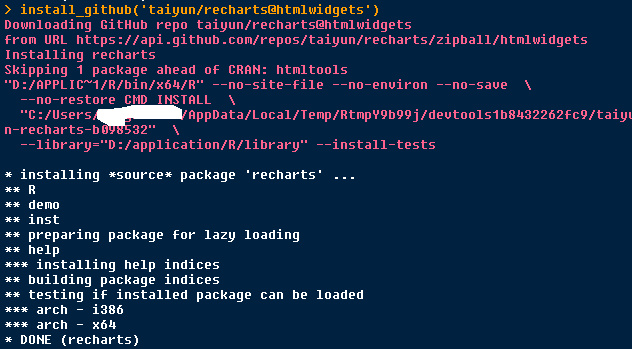

常规安装方法是：
```{r}
require(devtools)
install_github('recharts', 'taiyun')
```
但是，总是提示：有多字节字符无法解析。



后来又采用统计之都上的回答  http://cos.name/cn/topic/408544/ 

安装的包函数不全，只有echart()函数，我想用eMap()做地图啊，哭

```{r}
require(devtools)
install_github("yummyZhou/recharts")
```


成功的安装方法：
```{r}
install_github('ramnathv/htmlwidgets')
install_github('rstudio/htmltools')
install_github('taiyun/recharts@htmlwidgets')
```


貌似，前两行代码安装了两个recharts的依赖包，第三行指明了正确的recharts包的所在位置。

答案来自：http://bbs.pinggu.org/thread-3325657-1-1.html 

感谢互联网和解答者——雾锁山城！


备注：转移自新浪博客，截至2021年11月，原阅读数1390，评论0个。