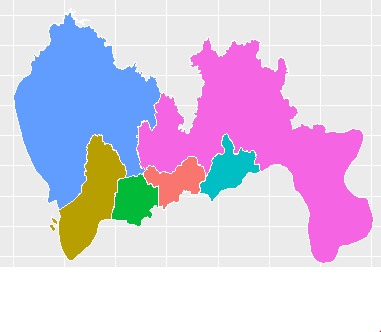

工作需要，画某市地图，百度下发现，R有几个可用的包。

+ 首先，是maps包，可以一句代码画世界地图、美国地图，不过里面没有中国地图的数据，需要配合mapdata包，不过貌似mapdata包的数据也比较老旧，细心的人就发现画出来的中国地图里面没有重庆。

+ 然后，就是高大上的ggmap包，连接google map的API,能提供丰富的最新的数据，还有什么道路图，卫星图都一个参数搞定，详细介绍请参见http://cos.name/2013/01/drawing-map-in-r-era/ ，但是我连不上google啊，只能望包兴叹。

+ 然后，我想到了百度出品的echarts，貌似里面也有地图啊。不过JavaScript咱不太懂，不过不要紧，早有大神写了recharts包，用R照样使用echarts，不过，我历尽千辛万苦成功安装recharts包后发现，包里只默认画中国地图，某省的地图的数据等貌似没存，就更别说某市的了。

+ 最后，只能使用最原始的方法了，自己画多边形，构成地图吧，不过这也需要有经纬度数据啊。

幸好，在前面的搜索中，发现地图的经纬度数据，还是有地方存储的。

比如地方1：http://www.gadm.org/country   这里存储有全国分省的数据、某省分市的数据、某市分县的数据，不过，我所需要的那个市的数据，还是太老了，老的没法用。

地方2：配套echarts使用的地图数据在线生成工具，http://ecomfe.github.io/echarts-map-tool/ ，这里的数据虽然也不是最新的（几个新区均没有划分出来），也凑合能用了。
注意：这里下载的数据是json格式，可以用RJSONIO包，很方便就转换成的R的列表格式。
还有，下载的文件是UTF-8编码，如果你用的是windows系统，还要手动用“记事本”打开，另存为ASCII编码，不然你使用RJSONIO转换时，数据中的省市区中文名称老是乱码报错，无法成功转换。

这就该画多边形了，可以用maptools包中的函数，详细可以参考http://cos.name/2009/07/drawing-china-map-using-r/ ，我这里莫名其妙的安装maptools包失败，就转用ggplot2包，终于搞定。

```{r}
#  画按区域填充颜色的地图
ggplot(df_coor, aes(x = long, y = lat, group = group, fill = region)) +
  geom_polygon(colour = "white")
```

  
还可以用每个区的人口数据等对不同的区用不同的颜色表示，如颜色越深，代表人口越多等。

每年的各个区的人口数据，还可以用谢大神的animation包，制作成动画形式，瞬间高大上了呀。呵呵。

备注：转移自新浪博客，截至2021年11月，原阅读数1133，评论0个。