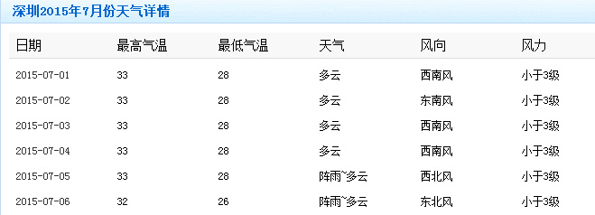
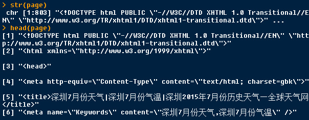
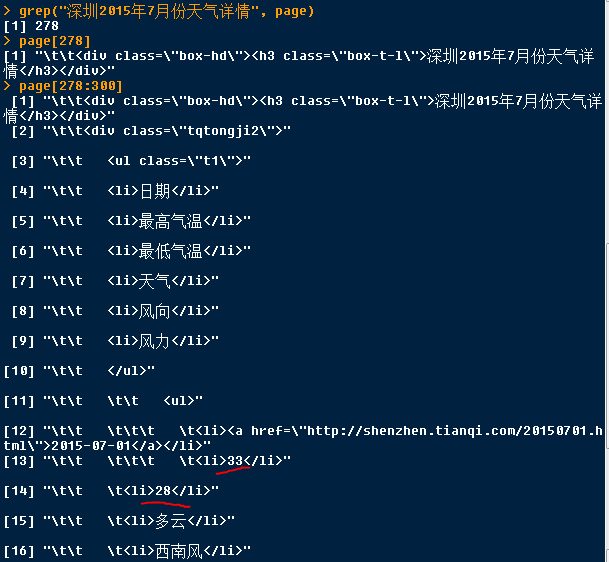
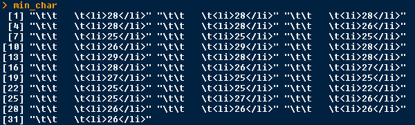
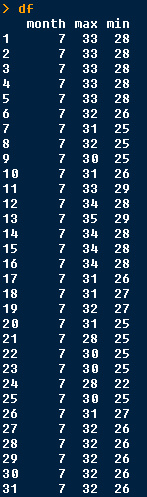

今天想找一些气温的数据，百度一下，只找到网页版的，如下图，没有提供csv格式下载的，直接粘贴到word或excel，格式非常混乱，只好一个个填写到excel，写了一会就凌乱了，非常容易看错行，抄写一个月的数据，抄完还要核对半天，担心写错了，费眼啊。

我需要2015年全年的数据，这还是试下R吧。



其实，用R还是很方便的，用函数`readLines`直接读取网址，读到的源代码直接被存储为字符串。 



 然后，找出“深圳2015年7月份天气详情”在哪行，作为定位点。找到每天的最高气温和最低气温，这是我想提取的数据。 
 
 
 
 7月1日的最高气温的数据在第290行，最低气温在第291行。
 
7月有31天。取出31个最高和最低气温，如下所示：



最后，就是用正则表达式把需要的数据匹配出来了。

其实，这里只需要拆分字符串就可以了。

最后，整理成数据框。



把上面的代码重复下，修改成6月的，6月的数据就出来了，不过，还有5个月的数据，每次修改也很麻烦，而且重复的命名也容易产生错误。

不如，把上面的代码整理成一个函数，只要修改参数是哪个月的，和那个月对应的天数就可以了。不过，前提是，每个月对应的网页结构没有变动。

R Code:
```{r}
##########################################################
### 从网页上爬取天气的数据
##########################################################

page <- readLines("http://lishi.tianqi.com/shenzhen/201507.html")
str(page)

grep("深圳2015年7月份天气详情", page)
page[278:300]

# 找出包含最高气温的行及内容
max_char <- page[seq(from = 290, by = 8, length.out = 31)]
# 提取出最高气温的数据，转换为数值型
max_value <- as.numeric(unlist(lapply(max_char, function(x) strsplit(x, ">|<")[[1]][3])))

min_char <- page[seq(from = 291, by = 8, length.out = 31)]
min_value <- as.numeric(unlist(lapply(min_char, function(x) strsplit(x, ">|<")[[1]][3])))

df <- data.frame(month = 7, max = max_value, min = min_value)

#  把上面的代码整理成一个函数
find_data <- function(x, length) {
 
  page <- readLines(paste("http://lishi.tianqi.com/shenzhen/20150", x, ".html", sep = ""))
 
  point <- grep(paste("深圳2015年", x, "月份天气详情", sep = ""), page)
   
  max_char <- page[seq(from = point + 12, by = 8, length.out = length)]
 
  max_value <- as.numeric(unlist(lapply(max_char, function(x) strsplit(x, ">|<")[[1]][3])))
 
  min_char <- page[seq(from = point + 13, by = 8, length.out = length)]
 
  min_value <- as.numeric(unlist(lapply(min_char, function(x) strsplit(x, ">|<")[[1]][3])))
 
  df <- data.frame(month = x, max = max_value, min = min_value)
 
  df
}

# 返回2015年6月的气温数据
df_6 <- find_data(x = 6, length = 30)
```

备注：转移自新浪博客，截至2021年11月，原阅读数1320，评论0个。