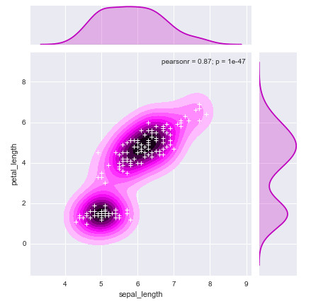
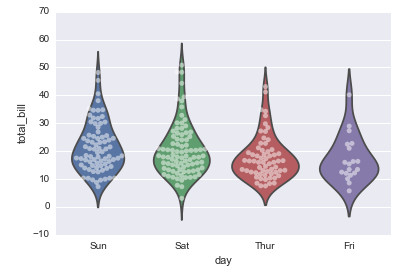

There are many visualization methods.

Some is for continuous variables, such as histogram, scatter plot, line plot.

Some is for discrete variables, such as bar, box plot, violet plot.

Some is for relationships between variables, such as linear regression, curve, etc.

For an example, let us look at below two graphs:

More detail and code, please look at  [here](https://nbviewer.org/github/yishi/Data-Visualization-In-Python/blob/master/introduction%20to%20seaborn.ipynb).

 

**Referenced:**

+ http://web.stanford.edu/~mwaskom/software/seaborn/tutorial.html 

Just record, this article was posted at linkedin, and have 183 views to November 2021. 