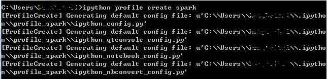
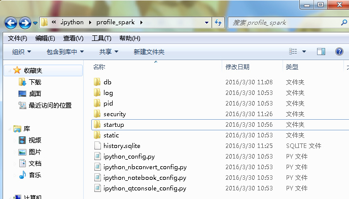
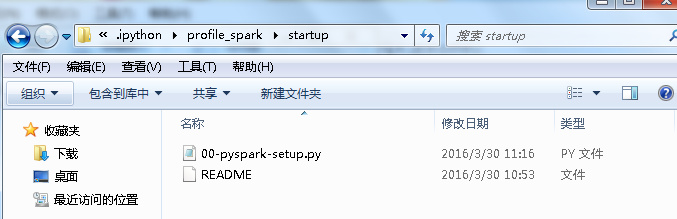
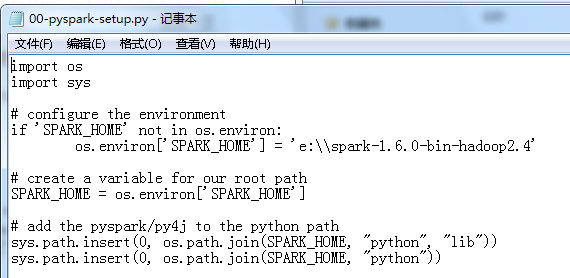
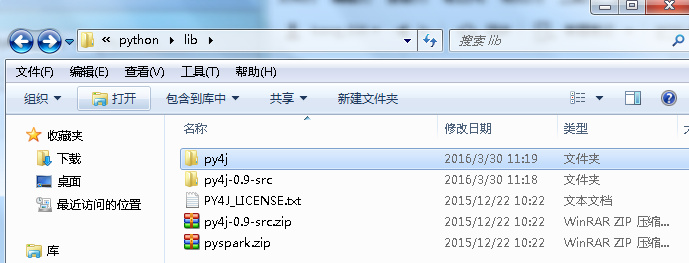
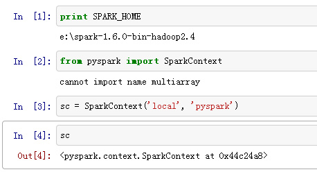

+ 第一步：在命令行模式，即cmd打开windows下面的命令行窗口

输入 ipython profile create spark

我的是默认在C盘——用户文件夹——我的名字的文件夹——.ipython文件夹——profile_spark文件夹下，创建了几个配置文件。

+ 第二步：在上面的,ipython——profile_spark文件夹下，找到startup文件夹，新建文本文件——00-pyspark-setup.py，然后添加几行代码在该文件。

这里，我的spark文件是放在E盘下面的。

还要注意一点，导入pyspark包时，会查找py4j的文件夹，我的是在py4j-0.9-src.zip中，我把该文件解压缩，放置py4j文件夹在lib文件夹下，因此，我上面最后第二行代码添加了lib文件夹的目录。

+ 第三步：在cmd调出的命令行窗口中输入`ipython notebook --profile spark`就会自动打开notebook。

+ 第四步：测试，在新建的notebook中输入

成功，开始你的大数据探索之旅吧!

备注：转移自新浪博客，截至2021年11月，原阅读数476，评论2个。
