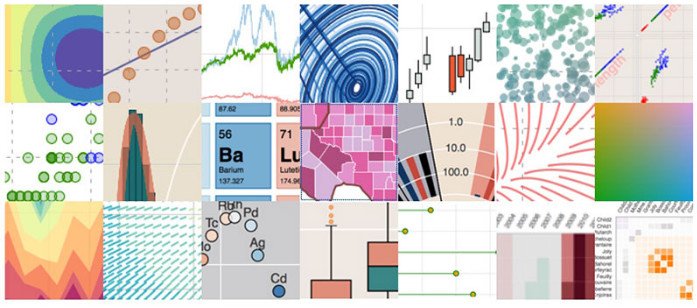

There are many visualization libraries in Python.

As an example, **matplotlib**, which is the first visualization library I known when I learn python.Just as its name mentioned, it can make the graph just like Matlib software produced.It can make all kinds of plots, but it need much more time to coding.

So, when I meet the second visualization library, **seaborn**, I was shocked by its simple code and beautiful graph.where does it come from? It still based on matplotlib, but it can let me easily build complex visualizations.

Then, I known the third visualization library, **bokeh**, not only it can tackle big data effectively, but also it has some style of D3.js, it let you explore the data by interactive with the plot.If you use seaborn when there are lots of points, you must wait a long time, and the points overlay heavily, you can only get a blur graph.

Now, when we face the big data, we need bokeh to help us do some visualization work.

More details, please click [here](https://nbviewer.org/github/yishi/Data-Visualization-In-Python/blob/master/Introduction_of_bokeh.ipynb).

Welcome your advice and suggestion!

Just record, this article was posted at linkedin, and have 166 views to November 2021.