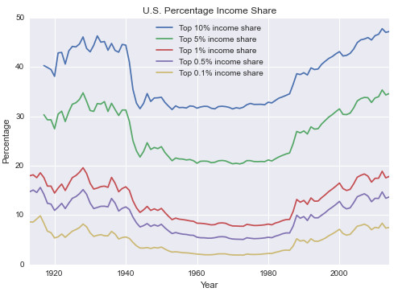

Today, I want to show you how to do data analysis using real data by pandas.

This process is from the book of practical data science cookbook.

In that book, it use the package numpy and matplotlib to do some data transformation and visualization. 

The code is much long and difficult to understand.

So, I rewrite the code use pandas which is also a package in Python.

The codes and figures are all in [here](http://nbviewer.jupyter.org/github/yishi/Data-Analysis-Series-in-Python/blob/master/Data_Analysis_Series_V.ipynb).

Such as this graph:

**Referenced:**

+ Practical Data Science Cookbook

Welcome your advice and suggestion!

Just record, this article was posted at linkedin, and have 22 views to November 2021.