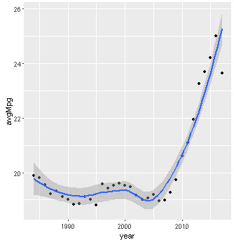
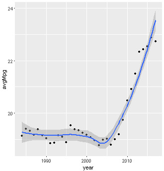
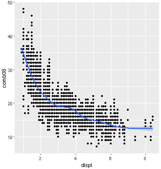
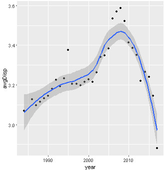
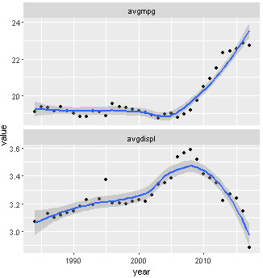
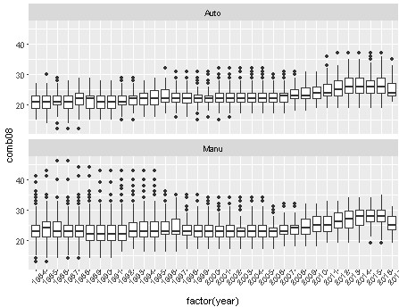
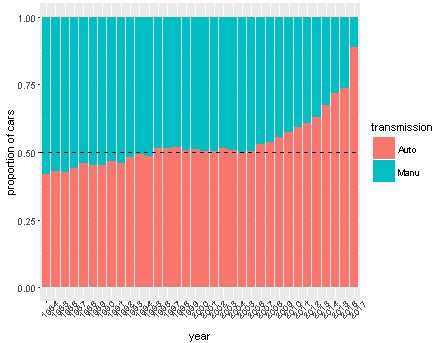
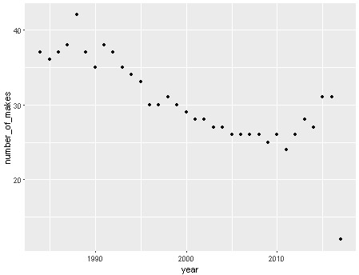
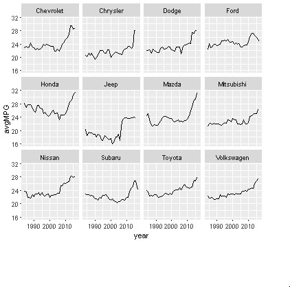

Here, I will show you how to do data analysis using real data by R and by Python.

I will give out the figure made by R, then the graph by Python.

The data is come from U.S. Department of Energy, which is also an example from the chapter 2 and 7 of the book of Practical Data Science Cookbook.

Let's start by looking at whether there is an overall trend of how miles per gallon (mpg) changes over time on average.

Based on this visualization, one might conclude that there has been a tremendous increase in the fuel economy of cars sold in the last few years.

However, this plot might be misleading as hybrid cars with excellent mileage have recently become more popular.

Let's look at just gasoline cars, even though there are not many non-gasoline powered cars, and redraw the preceding plot.

There is still a marked rise in the average miles per gallon even after eliminating hybrids.

The next question that we can ask is whether there have been fewer cars with large engines built more recently ?

If this is true, it could explain the increase in average miles per gallon.

Fist, let's verify that larger engine cars have poorer miles per gallon. 

This scatter plot of the data offers the convincing evidence that there is a negative correlation, between engine displacement and fuel efficiency.

Now, let's see whether more small cars were made in later years.

To get a better sense, we can put both MPG and displacement by year on the same graph.

From this plot, we can see the following:

+ Engine sizes have generally increased until 2008, with a sudden increase in large cars between 2006 and 2008.
+ Since 2009, there has been a decrease in the average car size, which partially explains the increase in fuel efficiency.
+ Until 2005, there was an increase in the average car size, but the fuel efficiency remained roughly constant. This seems to indicate that engine efficiency has increased over the years.
+ The year 2006-2008 are interesting. Though the average engine size increased quite suddenly, the MPG remained roughly the same as in previous years. This seeming discrepancy might require more investigation.

Given the trend toward smaller displacement engines, let's see whether automatic or manual transmissions are more efficient for four cylinder engines, and how the efficiency have changed over time:

Next, let's look at the change in proportion of manual cars available each year:

Let's look at the frequency of makes and models of cars available in the U.S., concentrating on 4-cylinder cars.

First, let's look at the numbers of makes that have 4-cylinder cars over the time frame.

We see that there has been a decline in the number of makes available over this period, though there has been a small uptick in recent times.

Can we look at the makes that have been available until 2014?

We find there are only 12 manufactures that made four-cylinder cars during this period.

We see that most manufacturers have shown improvement over this time.

The R codes are in [here](https://github.com/yishi/my_R_code/blob/master/Practical%20data%20science%20cookbook%20chapter%202%20driving%20visual%20analysis%20with%20automobile%20data).

The codes and figures for Python are all in [here](https://nbviewer.org/github/yishi/Data-Analysis-Series-in-Python/blob/master/Data_Analysis_Series_VI.ipynb).

**Referenced:**

+ Practical Data Science Cookbook

Welcome your advice and suggestion!

Just record, this article was posted at linkedin, and have 71 views to November 2021.

