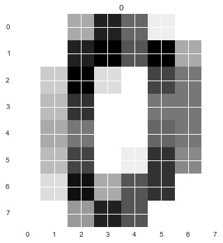
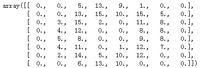
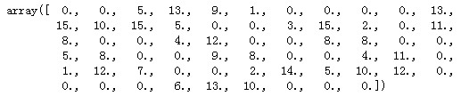
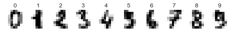

The handwritten digits data set which we used is made up of 1797 8x8 images. 

Each image is of a hand-written digit. 

Each pixel could be showed as a number.

In order to utilize an 8x8 figure like this, we'd have to first transform it into a feature vector with length 64.

Now, we transform a figure form to an array which has 64 features vector.

We could use all the classification algorithm to recognizing the handwritten digits.

Because of the shape of handwritten digits are complex, we find out the k nearest neighbors model have the best effect, and support vector machine, which kernel is polynomial, also have a good effect.

Please refer the whole python code in [here](https://nbviewer.org/github/yishi/Data-In-Action-Series-in-Python/blob/master/data_in_action_series_1.ipynb).

Welcome your advice and suggestion!

Just record, this article was posted at linkedin, and have 31 views to November 2021.