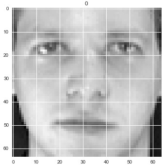
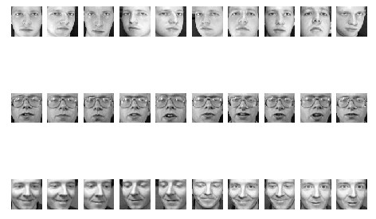

The faces dataset is made up of 400 64x64 images.

Each image is a human face.

There are 40 different people, each people has 10 images.

The models of **logistic regression** and support vector machine, which kernel is linear, are suitable for the recognition of human faces.

Please refer the whole python code in [here](https://nbviewer.org/github/yishi/Data-In-Action-Series-in-Python/blob/master/data_in_action_series_2.ipynb).

Welcome your advice and suggestion!

Just record, this article was posted at linkedin, and have 49 views to November 2021.