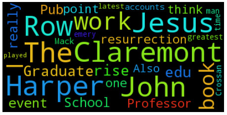

The dataset is made up of newsgroup text.

There is the word cloud of the first document which belongs to the type of soc.religion.christian.

+ There are 3 methods (such as count, tf, tf-idf) to extract features from text.
+ Different features extraction method have different effect to text classification.
+ For our example data set:
+ **the combination of count method and multinomial naive bayes** model are best;
+ the combination of tf-idf method and support vector machine which kernel is linear are better than other models.

Please refer the whole python code in [here](https://nbviewer.org/github/yishi/Data-In-Action-Series-in-Python/blob/master/data_in_action_series_4.ipynb).

Welcome your advice and suggestion!

Just record, this article was posted at linkedin, and have 48 views to November 2021.
