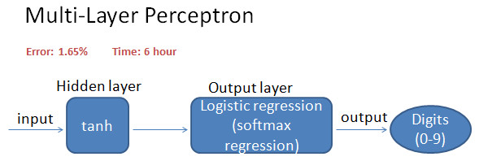

[Deep Learning Series 1: Classifying MNIST digits using Logistic Regression](https://nbviewer.org/github/yishi/Deep-Learning-Series-in-Python/blob/master/deep_learning_series_1.ipynb)

[Deep Learning Series 2: Classifying MNIST digits using Multi-Layer Perceptron](https://nbviewer.org/github/yishi/Deep-Learning-Series-in-Python/blob/master/deep_learning_series_2.ipynb)

[Deep Learning Series 3: Convolutional Neural Networks (LeNet)](https://nbviewer.org/github/yishi/Deep-Learning-Series-in-Python/blob/master/deep_learning_series_3.ipynb)

[Deep Learning Series 4: Stacked Denoising Autoencoders (SdA)](https://nbviewer.org/github/yishi/Deep-Learning-Series-in-Python/blob/master/deep_learning_series_4.ipynb)

Summary:

In my exercise, classifying MNIST digits using Logistic Regression, have best test error 7.5%, but training the model only spend 20.4 second in my laptop on CPU.

Classifying MNIST digits get best test error 1.65% by using Multi-Layer Perceptron, but training the model spend nearly six hours in the same computer on CPU.

Tiny improve in test error, need more capacity or knoweledge and time.

> No free lunch.

Using CNN to classifying MNIST digits will get test performance 0.92%.

Welcome your advice and suggestion!

Just record, this article was posted at linkedin, and have 121 views to November 2021.

