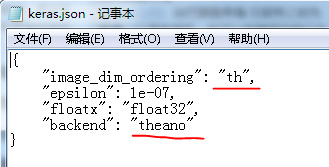
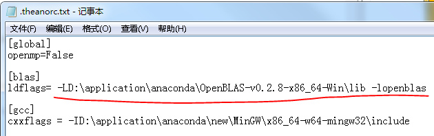

我使用的是windows系统，安装的Anaconda，使用里面的Ipython notebook，已经默认安装了numpy, 使用theano为后端，在ipython notebook中安装theano和keras都很简单。
```{python}
!pip install theano
!pip install keras
```
但是，使用keras时发现两个小问题：

1. **卷积层输出的参数维度不对，后来发现，keras 默认使用TensorFlow为后端，需要修改配置文件参数**。

keras官方文档见https://keras.io/backend/ ，你可以在你的用户目录下找到.keras文件，如C:\Users\你的用户名\.keras，该文件需要修改两个地方，如下图所示：



官方文档中仅提示，修改"backend"，还要修改"image_dim_ordering"，不然卷积层的输出参数总是不对。

2. **在使用函数model.fit时，会报错，说没有安装优化计算的包openblas**，官方文档那里有很多方法，尝试了很久发现，对我都没用，最简单有效的方法就是，安装一个，其实还是很快的，也很有效。

+ 首先，去下载一个openblas，https://sourceforge.net/projects/openblas/files/ 

+ 然后，把openblas的**libopenblas.dll**所在的文件夹加入到系统环境变量Path里。
如，我的在D:\application\anaconda\OpenBLAS-v0.2.8-x86_64-Win\lib这个文件夹下，就把这个路径添加到环境变量中。

+ 最后，在配置文件.theanorc.txt里配置下，该配置文件在C:\Users\你的用户名，如果没有，就新建一个，如下所示：



可以使用keras构建深度学习模型了！

****

**2017年4月重装keras记录**

主要遇到两个问题：
+  import theano 后，警告没有安装g++。
按照提示的安装一个软件后，import theano，直接报错，泪啊

+ 运行keras的示例代码，报错，没有blas加速包，各种失败，不知道上次怎么成功的，在.theanorc.text中设置optimizer = None，不加速，真的是相当相当慢，那个示例5万张图片，200个循环，10分钟貌似才训练了400张图片。

在重复安装、尝试、卸载，纠结了几天，要放弃了，终于看到了一个靠谱的文章，http://blog.csdn.net/qq_30490125/article/details/49704159 ，才知道估计我上次下载的anaconda老版本，自带MinGw， 即自动安装了g++。anaconda中也是自带blas加速的，因为numpy是依赖blas的，不过有时blas会没安装成功，numpy仍然可以安装，就是没用blas加速。

1. **安装anaconda，然后验证blas是否安装成功**。
```{python}
import numpy
id(numpy.dot) == id(numpy.core.multiarray.dot)
```
如果返回false，恭喜你，已经安装了blas，如果是true，没安装blas，用的是python的实现，没有加速。

简单处理：重装。

我使用最新版的Anaconda2-4.3.1-Windows-x86_64安装，验证失败，我又下了个老版的Anaconda-2.2.0-Windows-x86_64安装，验证成功。

2. 安装mingw

听说anaconda 2.之前的版本是内置了mingw的（如果anaconda安装目录下有MinGW的目录）。

我这里没内置，还是要装，我按照上面博客介绍的安装的，前几次也安装过，总是失败，这次上天眷顾，运气回升，安装成功，不过看着后面的一堆设置path，我也是醉了，一会设置系统变量中的path，一会设置用户变量中的path，以前的种种失败，估计就是因为以前看到的资料中没说清楚，我随便选一个设置的，还是上面博客中说的清楚啊，下面复制上面博客的，备份下。

好多网上的教程都说自己去下载，然后手动安装。这个我不想谈（都是泪） 

**安装方法：** 

2.1 打开CMD（注意是windows命令提示符，并不是进入到python环境下，否则会提示语法错误，因为conda命令就是在windows下面执行的。）； 

2.2 输入conda install mingw libpython，然后回车，会出现安装进度，稍等片刻即可安装完毕。此时就有C:\Anaconda\MinGw目录了。 

2.3 然后你只需要在你的系统环境变量里面的path中加入 C:\Anaconda\MinGW\bin;C:\Anaconda\MinGW\x86_64-w64-mingw32\lib即可。 
可在windows命令行中输入g++ -v来查看是否安装成功： 

3. **环境配置** 

3.1 编辑用户变量中的path变量，在后边追加C:\Anaconda;C:\Anaconda\Scripts; 不要漏掉分号，此处需要根据自己的安装目录填写。 

3.2 在系统变量中新建变量PYTHONPATH，变量值为C:\Anaconda\Lib\site-packages\theano; ，此处就是指明安装的theano的目录是哪，这里的theano我们会在后面安装，正常安装的默认路径就是这个。 
3.3 打开cmd，会看到窗口里边有个路径，我的是C:\Users\FYB>，根据自己的路径，找到对应的目录，在该目录下新建一个文本文档.theanorc.txt （注意有两个“.”），编辑它，写入以下内容： 
> [global] 

> openmp=False 

> [blas] 

> ldflags= 

> [gcc] 

> cxxflags=-I*C:\Anaconda\MinGW* 

其中斜体字部分是你安装的Anaconda的路径，一定不要弄错。否则找不到MinGw。

据说是要重启一下的，然而我懒，所以并没有。

4. **安装theano** 

不需要手动下载zip等压缩包，直接用命令安装最简单。 

4.1 打开CMD，方法和安装MinGw一样，不要进入python。 

4.2 输入pip install theano，回车后就是赏心悦目的下载进度条，这个很小，所以安装的比较快。 

4.3 在cmd中，输入python 进入到python环境下，然后先输入import theano回车，需要等一段时间。

然后什么也没有输出，没有报错。 

接下来不需要theano.test(),因为没有配置cuda，所以肯定会报错。 

不过这个时候，你可以去这个网址http://deeplearning.net/software/theano/tutorial/adding.html 
如果到这里你都没有问题的话，这里的第一个小程序是肯定能跑起来的。

备份完毕。

建议详细参考原博文 http://blog.csdn.net/qq_30490125/article/details/49704159

原博文还有gpu的设置，我没有gpu啊，等有了再参考。

十分感谢原博文的博主！

**参考：**
+ http://blog.csdn.net/qq_30490125/article/details/49704159  

备注：转移自新浪博客，截至2021年11月，原阅读数1393，评论0个。