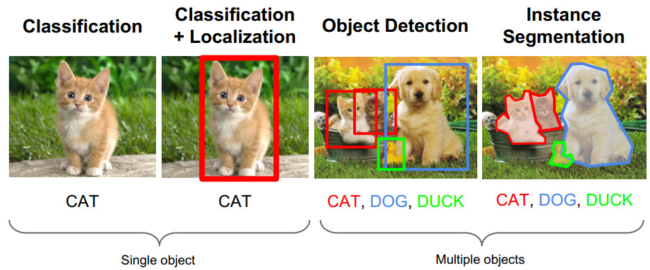
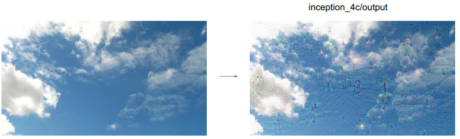
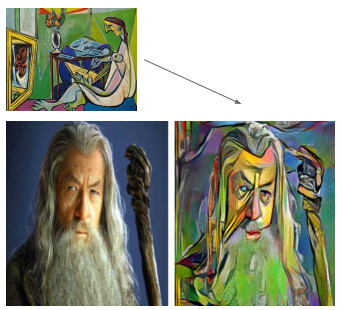
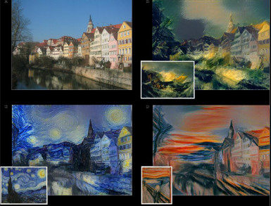
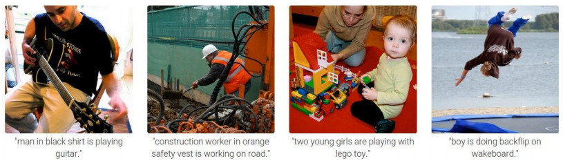
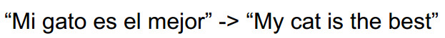
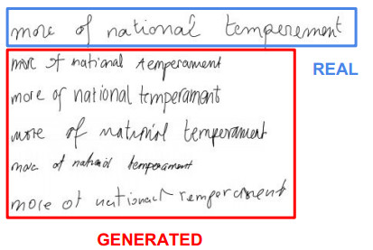
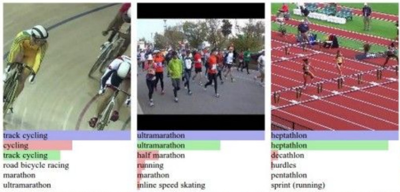

[Deep Learning Series 1: Classifying MNIST digits using Logistic Regression](https://nbviewer.org/github/yishi/Deep-Learning-Series-in-Python/blob/master/deep_learning_series_1.ipynb)

[Deep Learning Series 2: Classifying MNIST digits using Multi-Layer Perceptron](https://nbviewer.org/github/yishi/Deep-Learning-Series-in-Python/blob/master/deep_learning_series_2.ipynb)

[Deep Learning Series 3: Convolutional Neural Networks (LeNet)](https://nbviewer.org/github/yishi/Deep-Learning-Series-in-Python/blob/master/deep_learning_series_3.ipynb)

[Deep Learning Series 4: Stacked Denoising Autoencoders (SdA)](https://nbviewer.org/github/yishi/Deep-Learning-Series-in-Python/blob/master/deep_learning_series_4.ipynb)

[Deep Learning Series 5: Understand Backpropagation and Gradient Descent](http://nbviewer.jupyter.org/github/yishi/Deep-Learning-Series-in-Python/blob/master/deep_learning_series_5.ipynb)

[Deep Learning Series 6: Classify hand-written digits by keras](http://nbviewer.jupyter.org/github/yishi/Deep-Learning-Series-in-Python/blob/master/deep_learning_series_6.ipynb)

In above article from 1 to 4, I use the package Theano to do some code, article 5 use the package numpy to do example code, article 6 use the package **keras** to make model.

Deep learning has many excited applications.

Let's look at them.

1. Computer Vision Task

Object Detection : faster R-CNN  

2. Art in Computer Vision

+ Deep Dream

In this case we simply feed the network an arbitrary image or photo and let the network analyze the picture. We then pick a layer and ask the network to enhance whatever it detected. 

This creates a feedback loop: if a cloud looks a little bit like a bird, the network will make it look more like a bird.

This in turn will make the network recognize the bird even more strongly on the next pass and so forth, until a highly detailed bird appears, seemingly out of nowhere.

This just like a scene in the movie modern time, a man whose job is to screw the screw, he worked hour by hour, day by day, someday, he is a little crazy, whatever he see, he see a screw.

https://github.com/google/deepdream 

+ Neural Style

the content of the content images + the style of the style images

https://github.com/jcjohnson/neural-style 

3. Text Mining

+ Image Captioning: Recurrent Neural Network (CNN + RNN)

+ Sentiment classification

+ Machine Translation

+ Generate sequences with RNN  

+ Video classification on frame level  

Above graphs come from [cs231n slides](http://vision.stanford.edu/teaching/cs231n/syllabus.html)  or [cs224d slides](http://cs224d.stanford.edu/syllabus.html).

Enjoy your journey about deep learning!

Welcome your advice and suggestion!

Just record, this article was posted at linkedin, and have 278 views to November 2021.

