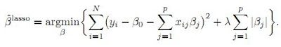
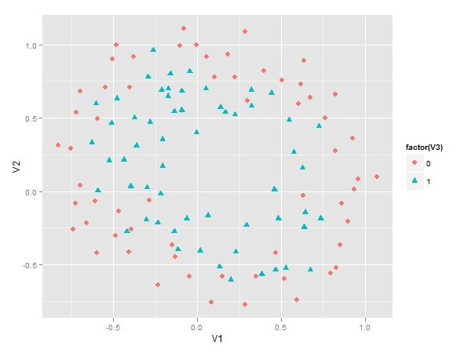
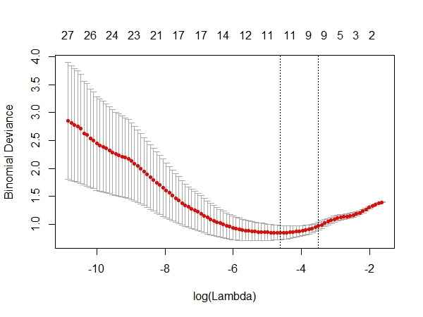
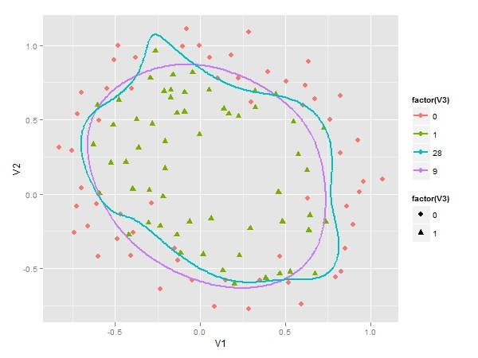

****
原文地址：[用glmnet包实施套索算法(LASSO)](http://blog.sina.com.cn/s/blog_4a0824490102v64w.html)（转载）[作者：ccpacer](http://blog.sina.com.cn/u/1242047561)
原文章：http://xccds1977.blogspot.com/2012/05/glmnetlasso.html
****


当我们使用数据训练分类器的时候，很重要的一点就是要在过度拟合与拟合不足之间达成一个平衡。

防止过度拟合的一种方法就是对模型的复杂度进行约束。模型中用到解释变量的个数是模型复杂度的一种体现。

控制解释变量个数有很多方法，例如**变量选择(feature selection)**，即用filter或wrapper方法提取解释变量的最佳子集。

或是进行**变量构造(feature construction)**，即将原始变量进行某种映射或转换，如主成分方法和因子分析。

变量选择的方法是比较“硬”的方法，变量要么进入模型，要么不进入模型，只有0-1两种选择。但也有“软”的方法，也就是Regularization类方法，例如**岭回归(Ridge Regression)和套索方法(LASSO:least absolute shrinkage and selection operator)**。

这两种方法的共同点在于，将解释变量的系数加入到Cost Function中，并对其进行最小化，本质上是对过多的参数实施了惩罚。

而两种方法的区别在于惩罚函数不同。

但这种微小的区别却使LASSO有很多优良的特质（可以同时选择和缩减参数）。

下面的公式就是在线性模型中两种方法所对应的目标函数：



公式中的lambda是重要的设置参数，它控制了惩罚的严厉程度。

如果设置得过大，那么最后的模型参数均将趋于0，形成拟合不足。

如果设置得过小，又会形成拟合过度。所以lambda的取值一般需要通过交叉检验来确定。

在R语言中可以使用**glmnet**包来实施套索算法。我们采用的数据集是Machine Learning公开课中第七课的一个算例。

先来看看这个样本数据的散点图。

下图显示有两个类别等待我们来区分。

显然其决策边界是非线性的，所以如果要用**Logistic Regression**来作分类器的话，解释变量需要是多项式形式。

但这里存在一个问题，我们应该用几阶的多项式呢？如果阶数过高，模型变量过多，会存在过度拟合，而反之阶数过少，又会存在拟合不足。所以这里我们用LASSO方法来建立Logistic回归分类器。



分析步骤如下：

+ 根据算例要求，先生成有六阶多项式的自变量，这样一共有28个自变量；
+ 用glmnet包中的cv.glmnet函数建模，该函数自带交叉检验功能；
+ 根据上面的结果绘制CV图如下，从中选择最佳lambda值。



cv.glmnet函数利用交叉检验，分别用不同的lambda值来观察模型误差。

上图横轴是lambda值的对数，纵轴是模型误差。

从上面的图可以看到，最佳的lambda取值就是在红色曲线的最低点处，对应着变量个数是11个。

它右侧的另一条虚线是在其一倍SE内的更简洁的模型（变量个数为9）。

由于这两个lambda对应的模型误差变化不大，而我们更偏好于简洁的模型，选择对应的lambda值为0.025。

在使用cv.glmnet函数选择lambda值之后，我们没有必要去运行glmnet函数，直接从结果中就可以提取最终模型（9个变量）并获得参数系数。为了利于比较我们还提取了原始模型（28个变量）的参数系数。

最后我们要在原来的散点图上画出两条决策边界，一条是根据LASSO方法得到的9变量模型，下图中紫色曲线即是它决策边界，决策边界比较平滑，具备很好的泛化能力。另一条是28个变量的原始模型。蓝色曲线即是它的决策边界，它为了拟合个别样本，显得凸凹不平。



如果你的数据变异较大，那么在做LASSO之前最好进行数据标准化处理。LASSO的进一步扩展是和岭回归相结合，形成Elastic Net方法。glmnet包也可以实施这种算法。

**参考资料：**
+ 《The Elements of Statistical Learning》
+ 《Machine Learning for Hackers》
+ http://www-stat.stanford.edu/~tibs/lasso.html
+ http://datamining.dongguk.ac.kr/ftp/temp/Regularization.pdf
+ http://ygc.name/2011/10/26/machine-learning-5-2-regularized-logistic-regression/

本文代码如下，具体可以访问：

文章中的代码：https://gist.github.com/2728866 

文章中的数据：https://github.com/merwan/ml-class/blob/master/mlclass-ex2/ex2data2.txt

```{r}
library(ggplot2)
library(glmnet)
library(reshpae)
# 读入数据
data <- read.csv('d:/ex2data2.txt',F)
# 散点图
ggplot()+
 geom_point(data=data,aes(V1,V2,colour=factor(V3),
                      shape=factor(V3)),size=3)
         
# 建立六阶多项式自变量
attach(data)
degree = 6
X = matrix(rep(1,length(V1)),ncol=1)
for (i in 1:degree) {
   for (j in 0:i) {
      X <-cbind(X, (V1^(i-j))*V2^j)
      }
   }
x<- X[,-1]
Y <- data$V3
       
# 用glmnet包建模
model <- cv.glmnet(x,Y,family="binomial",type.measure="deviance")
# 绘制CV曲线图，选择最佳lambda值
plot(model)
model$lambda.1se
# 提取最终模型
model.final <- model$glmnet.fit
# 取得简洁模型的参数系数
model.coef <- coef(modelglmnet.fit,s=modellambda.1se)
# 取得原始模型的参数系数
all.coef <- coef(modelglmnet.fit,s=max(model.finallambda))
       
# 可以用predict进行预测
# pre <-predict(model.final,newx=x,s=model$lambda.1se,type='class')
# table(Y,pre)
       
# 下面的工作全部是为了绘制决策边界
u <- seq(-1,1.2, len=200)
v <- seq(-1,1.2, len=200)
       
z28 <-z9  <- matrix(0, length(u), length(v))
       
mapFeature <- function(u,v, degree=6) {
   out <- sapply(0:degree,function(i)
               sapply(0:i, function(j)
                     u^(i-j) * v^j
                     )
               )
   out <- unlist(out)
   return(out)
}
       
for (i in 1:length(u)) {
   for (j in 1:length(v)) {
      features <- mapFeature(u[i],v[j])
      z9[i,j] <- as.numeric(features %*% model.coef)
      z28[i,j] <- as.numeric(features %*%all.coef)
   }
}
       
rownames(z9) <- rownames(z28) <- as.character(u)
colnames(z9) <- colnames(z28) <-  as.character(v)
       
z9.melted <- melt(z9)
z28.melted <- melt(z28)
z9.melted <- data.frame(z9.melted, lambda=9)
z28.melted <- data.frame(z28.melted, lambda=28)
       
zz <- rbind(z9.melted, z28.melted)
zzlambda<</span>−factor(zzlambda)
colnames(zz) <- c("u", "v", "z", "lambda")
       
p <- ggplot()+
 geom_point(data=data,aes(V1,V2,colour=factor(V3),shape=factor(V3)),size=3) +
 geom_contour(data=zz, aes(u, v, z = z,
                       group=lambda, colour=lambda),bins=1,size=1)
         
p
```


备注：转移自新浪博客，截至2021年11月，原阅读数464，评论0个。