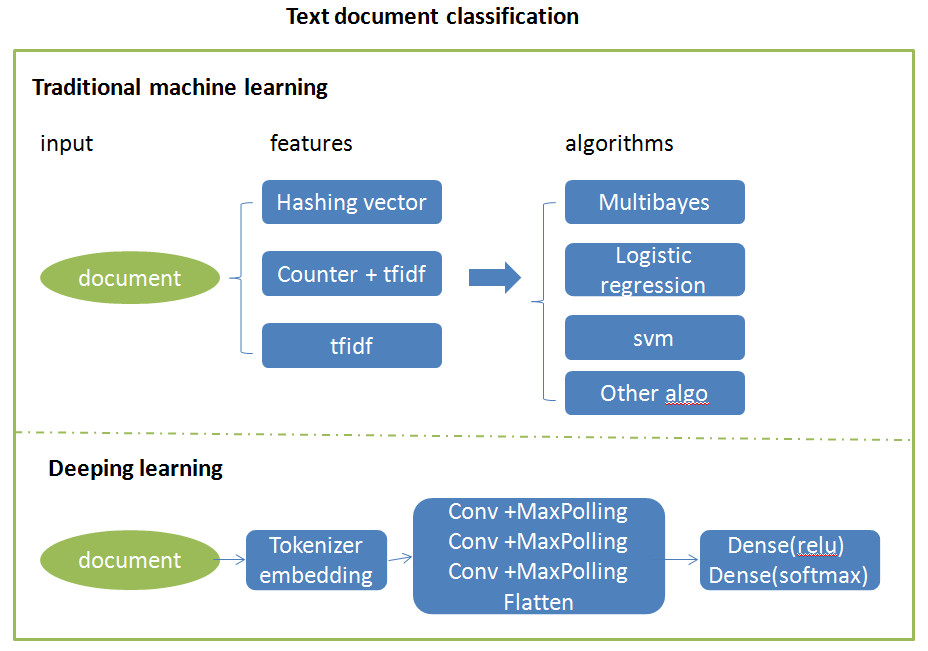

[Deep Learning Series 7: Text Document Classification Using 20 Newsgroups Dataset](https://nbviewer.org/github/yishi/Deep-Learning-Series-in-Python/blob/master/deep_learning_series_7.ipynb)

+ This data set is a collection of 18,846 messages, collected from 20 different netnews newsgroups. You can get the data from here.

+ First of all, we load the data use the function from sklearn package, then use several methods to get the features, then use kinds of traditional machine learning models to fit the data.

+ Secondly, we use deep learning algorithm in keras to train the model, because of the limited computer resources, I can not run the whole process.

**Referenced:**
+ http://blog.csdn.net/abcjennifer/article/details/23615947/
+ http://keras-cn.readthedocs.io/en/latest/blog/word_embedding/
+ http://blog.keras.io/using-pre-trained-word-embeddings-in-a-keras-model.html

Welcome your advice and suggestion!

Just record, this article was posted at linkedin, and have 372 views to November 2021.