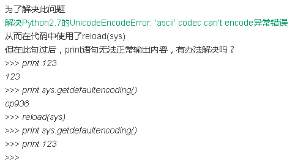
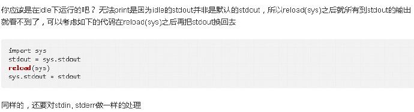

2. python 2.7 在使用reload(sys)后，再使用print语句无输出，

+ 解决方法：

我使用的是ipython notebook，在这个环境下的stdout并非是默认的stdout，

所以reload(sys)之后，所有到stdout的输出就看不到了。

因此，可以在重新加载sys包之前，把默认输出保存到一个变量，重新加载后，再赋值回去，详细见下面：

```{python}
import sys
stdout = sys.stdout
reload(sys)
sys.stdout = stdout
```
如果需要输出stdin, stderr，可以做同样的处理。

该方法参考自下面的网址：
https://segmentfault.com/q/1010000000518509 





备注：转移自新浪博客，截至2021年11月，原阅读数103，评论0个。