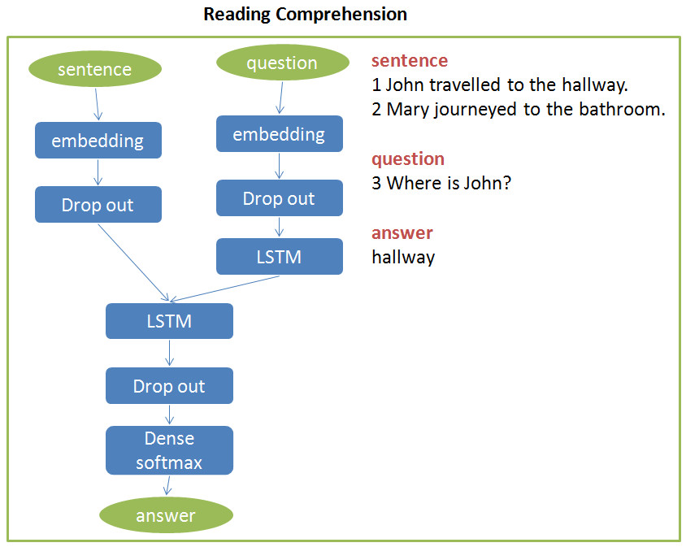

[Deep Learning Series 8: Keras Practice](https://nbviewer.org/github/yishi/Deep-Learning-Series-in-Python/blob/master/deep_learning_series_8.ipynb)

[Deep Learning Series 9: Practice about Recurrent Neural Network](https://nbviewer.org/github/yishi/Deep-Learning-Series-in-Python/blob/master/deep_learning_series_9.ipynb)

[Deep Learning Series 10: Practice about Convolution Neural Network](https://nbviewer.org/github/yishi/Deep-Learning-Series-in-Python/blob/master/deep_learning_series_10.ipynb)

Welcome your advice and suggestion!

Just record, this article was posted at linkedin, and have 32 views to November 2021.