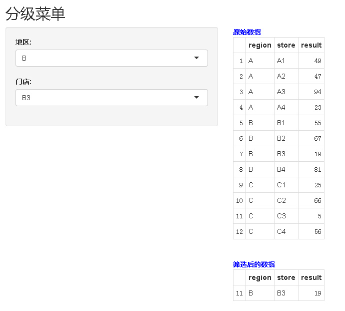

选择地区A之后，再选择A地区的门店（下拉选项中只显示A地区门店）
参考了博文：http://blog.csdn.net/xwydq/article/details/51152988 
http://shiny.rstudio.com/articles/dynamic-ui.html 

效果图如下所示：



```{r}
#######################
### level menu
### ui.R
######################

# utf-8
# http://blog.csdn.net/xwydq/article/details/51152988


library(shiny)

shinyUI(
  fluidPage(
   titlePanel(title = "分级菜单"),
   
   sidebarLayout(
     sidebarPanel(
       selectInput("region", "地区:",
                   choices = region),
       
       uiOutput("slt_store")
     ),
     
     mainPanel(
       
       div(strong("原始数据"), style = "color:blue"),
       tableOutput("df1"),
       br(),
       
       div(strong("筛选后的数据"), style = "color:blue"),
       tableOutput("df2")
     )
    )
  ))


#######################
### level menu
### server.R
######################

# utf-8
# http://blog.csdn.net/xwydq/article/details/51152988


library(shiny)

shinyServer(function(input, output, session) {
 
  # data
  df_sample <- data.frame(region=rep(LETTERS[1:3], 4),
                         store=paste(rep(LETTERS[1:3], 4), 1:4, sep=""),
                         result=sample(1:100, 12))
  region <- unique(df_sample$region)
 
 
  # 在server.R中使用renderUI
  output$slt_store <- renderUI({
   
    store_t <- sort(unique(subset(df_sample, region == input$region)$store))
   selectInput("store", "门店:", choices = store_t, selected = store_t[1])

  })
 
 
  output$df1 <- renderTable({
   arrange(df_sample, region, store)
  })
 
  output$df2 <- renderTable({
   subset(df_sample, region == input$region & store == input$store)
  })
 
})

## library(shiny)
## runApp("shiny_example/level_menu")
```

备注：转移自新浪博客，截至2021年11月，原阅读数386，评论0个。
