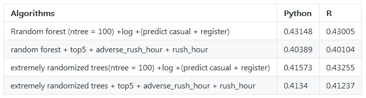

I heard of kaggle 5 years ago, but several weeks ago I just activated my kaggle account, because one of my colleague proposed to do kaggle competitions together.

Below competitions are benefical to me and enlarging my horizon, especially the process of coding and thinking and study winner's code.

I should do competitions earlier, so **delay** is actually a bad habit.

+ [Python code: Competition Series 1: Forecast use of a city bike share system](https://nbviewer.org/github/yishi/kaggle/blob/master/competition_series_1_bike.ipynb)

+ [R code: Competition Series 1: Forecast use of a city bike share system](https://github.com/yishi/kaggle/blob/master/competition_series_1_bike.R)

Data come from [kaggle](https://www.kaggle.com/c/bike-sharing-demand).

+ Firstly, I add features **year month hour** and used ensemble algorithms of extra trees regressor, the value of root mean squared logarithmic error in test is **0.47448**.

+ On top of this, I renew features with **rush_hour_working**, because the register users might go to work by bike and focus on rush hour such as 7:00 8:00 17:00 18:00 19:00; I also add feature **adverse_rush_hour** to descript the behavior of casual users who only have one peak from 9:00 to 20:00, the value of root mean squared logarithmic error in test decrease from 0.47448 to **0.44763**.

+ After I checked many messages from kaggle discuss group, many people suggested that variable 'count' 'registered' 'casual' are skewed distribution, so if we use **the log value** of those variables, the distribution will be more normal. I tried this method, the value of root mean squared logarithmic error in test by extra trees regressor decrease from 0.44763 to 0.41868, if I predict 'registered' and 'casual', then sum them up to get 'count', the value of root mean squared logarithmic error in test will be **0.41573**.

+ At the same time, random forest regressor is not well as extra trees, the best value of root mean squared logarithmic error in test is 0.43005. But after I add other features, introduced by this [ariticle](https://www.analyticsvidhya.com/blog/2015/06/solution-kaggle-competition-bike-sharing-demand/), the value of root mean squared logarithmic error in test by random forest regressor is **0.40104**.

More detail you could check the table below.

+ [R code: Competition Series 2: Walmart store sales forecasting](https://github.com/yishi/kaggle/blob/master/competition_series_2_walmart.R)

Data come from [kaggle](https://www.kaggle.com/c/walmart-recruiting-store-sales-forecasting).

This time, I study the code of the first entry, which is mainly about time series model, such as expotential smoothing or arima, but he also use the simple model such as make the data of last year as predictor, the simple model have unexpected good effect, which give me a surprise and clue about how to simulate experience of specialist into a model.

In addition, the preprocess of singular value decomposition and the postprocess about shift the sales number around Chrismas are beneficial to me.

+ [Python code: Competition Series 1: Forecast use of a city bike share system by ensemble stack method](https://nbviewer.org/github/yishi/kaggle/blob/master/competition_series_1_bike_v2.ipynb)

Recently, I find out [this article](http://bit.ly/1GQtJDS) when I search the method of ensemble. This article is great, it explain the reason why some algorithms ensemble will get better accuracy, it also refers to simple ensemble methods such as vote, weighted vote, average, weighted average, rank average, rank weighted average.

The ensemble method of stack is amazing, I try to work out stack method in python code, and in R you could install the package of caretEnsemble, then use the function caretStack to use stack method directly.

Welcome your advice and suggestion!

Just record, this article was posted at linkedin, and have 53 views to November 2021.