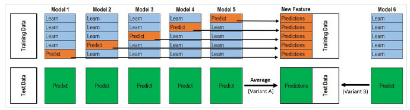
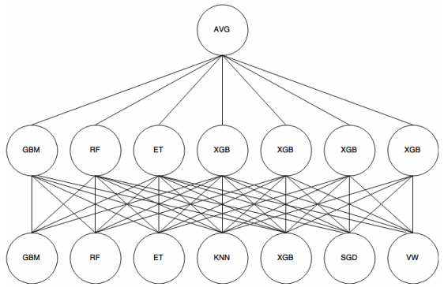
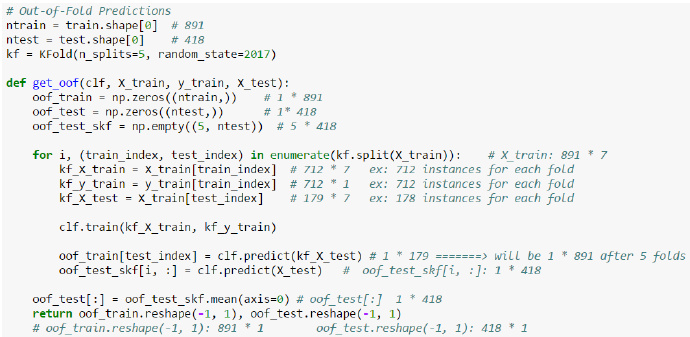

集成模型，即ensemble， 把不同的分类器组合在一起进行预测。

常见的有随机森林、装袋算法、提升算法，基本上是用分类回归树做基学习器，如500棵树组合成随机森林。

当然，也可以选择其他的算法做为基学习器，如knn，或者提升算法以随机森林作为基学习器，不过运算量太大，用普通笔记本电脑的伤不起啊，跑了两个小时，发现8G内存占满，还把C盘写满，还没运算完。

通常ensemble之后再ensemble，举个例子，就是把随机森林和提升算法的结果，再求个平均，或者再投票（即求众数，不同于求平均）。

看了经验帖发现，还有另外一种ensemble之后再ensemble的方法，叫做stack，貌似效果更好。

**先介绍下为什么要ensemble之后再ensemble，即把多种算法预测的结果再组合起来进行预测，准确度会提升？**

参考自：http://bit.ly/1GQtJDS ，需要翻墙，所以这里再记录下。

假设：我们已经训练好了3个两类别分类器，正确率均为70%。

对3个分类器的投票（类别0或1）有四种结果：

+ 三个分类器全部预测正确 

0.7 * 0.7 * 0.7 = 0.3429

+ 三个分类器有两个预测正确

0.7 * 0.7 * 0.3 + 0.7 * 0.3 * 0.7+ 0.3 * 0.7 * 0.7 = 0.4409

+ 三个分类器中只有一个预测正确，即两个预测错误

0.3 * 0.3 * 0.7 + 0.3 * 0.7 * 0.3 +0.7 * 0.3 * 0.3 = 0.189

+ 三个分类器都预测错误

0.3 * 0.3 * 0.3 = 0.027

我们能够看到，让三个正确率均为70%的分类器，投票选择类别0或者1，有约78%（0.3429 + 0.4409 = 0.7838）的正确率，正确率提升了8%，主要就在于约44%（0.4409）修正了错误。
这也是装袋算法的原理，构造很多个基分类器，让大家一起投票，选出正确的类别，结果单个分类效果都很差的分类器，最终的预测结果却很好。

**其实，正确率的提升还和投票的分类器是否相关有关。**

举例如下：真实的数列全是1

1111111100 = 80% accuracy 1111111100 = 80% accuracy 1011111100 = 70% accuracy.

组合平均后：
1111111100 = 80% accuracy

<u>高度相关的分类器，都是擅长预测数据集的同一个部分，所以，即使再组合平均，提升不大。</u>

现在我们看下高度不相关的分类器：

1111111100 = 80% accuracy 0111011101 = 70% accuracy 1000101111 = 60% accuracy

组合平均后：
1111111101 = 90% accuracy

<u>高度不相关的分类器，擅长预测数据集的不同部分，所以，组合平均，提升较大。</u>
这估计也是孟尝君广收各种门客，鸡鸣狗盗之徒，也起到了关键作用的类似道理。
产品多样化的优势。

**有时候，加权投票效果优于简单投票，即体现专家（正确率高的模型）意见的重要性。**
|Model|	Public Accuracy Score|
| ---- | ---- |
| GradientBoostingMachine|	0.65057|
|RandomForest Gini|	0.75107|
|RandomForest Entropy|	0.75222|
|ExtraTrees Entropy|	0.75524|
|ExtraTrees Gini (Best)	|0.75571|
|Voting Ensemble (Democracy)|	0.75337|
|Voting Ensemble (3*Best vs. Rest)|	0.75667|

<u>投票和平均的区别:</u>

投票是求众数，平均是求平均数，既然有加权投票，也有加权平均。平均通常可以降低过拟合。

**秩平均（rank average）**

平均的方法真多啊，一般的，加权的，现在又来个秩的，不过仔细一看，绝对实战得来的小技巧啊，指不定是将来的必杀绝技呢。

+ 假设，你有个这样的预测结果：

|Id|Prediction|
| ---- | ---- | 
| 1|0.35000056|
|2|0.35000002|
|3|0.35000098|
|4|0.35000111|

看到差异没？重点在最后两位数字。

另外一个需要平均的预测结果：

|Id|Prediction|
| ---- | ---- | 
| 1|0.57|
|2|0.04|
|3|0.96|
|4|0.99|

由于第一个预测结果的差异太小，需要用放大镜看啊，这两个平均后效果不明显。

怎么办呢？

求第一个预测结果中预测值的秩，求第二个预测结果中预测值的秩，然后求这些秩的平均值。

|Id|Rank|Prediction|
| ---- | ---- | ---- |
|1|1|0.35000056 |
2|0|0.35000002|
3|2|0.35000098 |
4|3|0.35000111|

再把平均后的秩进行标准化到0与1之间，你得到了一个均衡的分布。
|Id|Prediction|
| ---- | ---- | 
| 1|0.33|
|2|0.0|
3|0.66|
4|1.0|

+ 另外一个例子

|Model |	Public|	Private|
| ---- | ---- | ---- |
|Vowpal Wabbit A|	0.60764|	0.59962|
Vowpal Wabbit B|	0.60737|	0.59957|
|Vowpal Wabbit C|	0.60757	|0.59954|
|GLMNet	|0.60433|	0.59665|
|Average Bag|	0.60795|	0.60031|
|Rank average Bag	|0.61027|	0.60187|

看来秩平均是kaggle中的必备技巧啊。

和上面的加权平均组合起来，就是加权秩平均，呵呵。

汇总下

|id|	method1_label|	method2_label|	method3_label|	投票|	平均|	秩平均|	几何平均|
| ---- | ---- | ---- |---- | ---- | ---- |---- | ---- | 
|1|	1	|2|	2|	2|	1.67|	0.25|	1.59|
|2	|0	|0	|0	|0	|0	|0	|0|
|3|	9|	6|	9|	9|	8|	1|	7.86|
|4|	9|	2|	2|	2|	4.3|	0.5|	3.3|
|5	|3	|3	|3	|3	|3	|0.75|	3|

**stacked**

参考：
+ http://blog.csdn.net/wtq1993/article/details/51418958 
+ https://zhuanlan.zhihu.com/p/26890738 

整个过程很像 Cross Validation。

对于每一轮的 5-fold，Model 1都要**做满5次**的训练和预测。

首先将训练数据分为5份，接下来一共5个迭代，每次迭代时，将4份数据作为Training Set对每个 Base Model 进行训练，然后在剩下一份 Hold-out Set上进行预测。**同时也要将其在测试数据上的预测保存下来。**

这样，每个 Base Model在每次迭代时会对训练数据的其中1份做出预测，对测试数据的全部做出预测。5个迭代都完成以后我们就获得了一个训练数据行数 x Base Model数量的矩阵，这个矩阵接下来就作为第二层的Model的训练数据。当第二层的Model训练完以后，将之前保存的 Base Model 对测试数据的预测（**因为每个 Base Model被训练了5次，对测试数据的全体做了5次预测，所以对这5次求一个平均值，从而得到一个形状与第二层训练数据相同的矩阵**）拿出来让它进行预测，就得到最后的输出。

<u>Titanic 栗子：</u>

Train Data有890行。(请对应图中的上层部分）

每1次的fold，都会生成 713行小train， 178行小test。我们用Model 1来训练713行的小train，然后预测178行小test。预测的结果是长度为178的预测值。

这样的动作走5次！ 长度为178 的预测值X5=890预测值，刚好和Train data长度吻合。这个890预测值是Model 1产生的，我们先存着，因为，一会让它将是第二层模型的训练来源。

**重点**：这一步产生的预测值我们可以转成 890X 1（890行，1列），记作 P1(大写P)

接着说Test Data有418行。(请对应图中的下层部分，对对对，绿绿的那些框框）

每1次的fold，713行小train训练出来的Model 1要去预测我们全部的Test Data（全部！因为Test Data没有加入5-fold，所以每次都是全部！）。此时，Model 1的预测结果是长度为418的预测值。

这样的动作走5次！我们可以得到一个 5 X 418 的预测值矩阵。然后我们根据行来就平均值，最后得到一个 1 X 418 的平均预测值。

**重点**：这一步产生的预测值我们可以转成 418 X 1 （418行，1列），记作 p1 (小写p)

走到这里，你的第一层的Model 1完成了它的使命。

第一层还会有其他Model的，比如Model 2，同样的走一遍， 我们有可以得到 890 X 1 (P2) 和 418 X 1 (p2) 列预测值。

这样吧，假设你第一层有3个模型，这样你就会得到：

来自5-fold的预测值矩阵 890 X 3，（P1，P2， P3） 和 来自Test Data预测值矩阵 418 X 3， （p1, p2, p3）。

*****
到第二层了..................

来自5-fold的预测值矩阵 890 X 3 作为你的Train Data，训练第二层的模型

来自Test Data预测值矩阵 418 X 3 就是你的Test Data，用训练好的模型来预测他们吧。

**stack算法实施**

在R中可以直接调用`caretEnsemble`包中的`caretStack`函数
 
python中貌似可以自己写

备注：转移自新浪博客，截至2021年11月，原阅读数270，评论0个。  