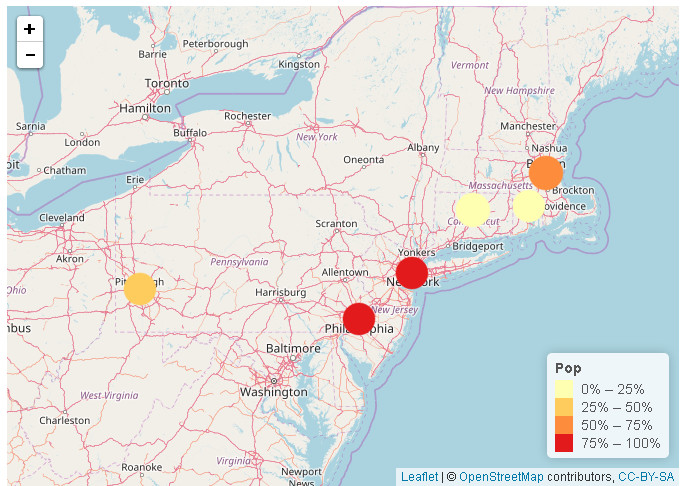
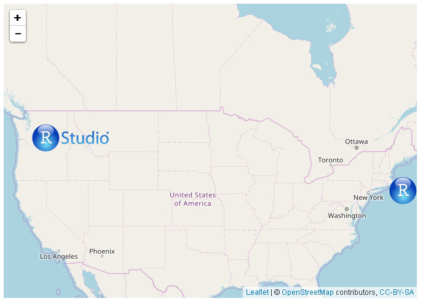
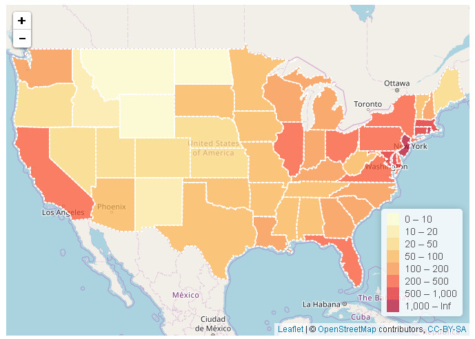

I used maps package in R in 2016 to make a geographical map and color the regions according to variable values, and then make an animation. For more details see [here](https://www.linkedin.com/pulse/data-visualization-series-i-creating-map-r-beibei-kong).

Today, I want to introduce you to leaflet package in R to make interactive map. For more details see [here](http://rpubs.com/kong_026/Data_Visualization_Series_IV).

We could make maps as below:

If you want to make interactive maps like above pictures, please click [here](http://rpubs.com/kong_026/Data_Visualization_Series_IV).

Welcome your advice and suggestion!

Just record, this article was posted at linkedin, and have 20 views to November 2021.