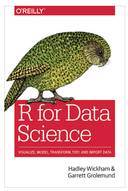

You could look this book on the website for free, a link is here http://r4ds.had.co.nz/index.html.

This book introduces some famous packages in R.

+ In chapter 3, the book introduce ggplot2, a great package of data visualization, you could also refer the book of R Graphics Cookbook - Winston Chang(2012.12), you can find it here http://www.cookbook-r.com/Graphs/ .

+ In chapter 5, explain the package of dplyr, about data transformation. It also is a excellent tool to generate new variables when you are doing feature engineer.

+ In chapter 12, the package of tidyr introduces some functions to tidy data, such as gather(), spread(), which is similar to melt() cast() in reshape2 package, and separate() and unit().  

+ In chapter 13, relational data not only explain common functions in dplyr package, such as inner_join, left_join, right_join and full_join, but also import two new join methods, such as semi_join and anti_join, which is amazing!  

+ In chapter 14, introduce the package of stringr, the functions in stringr all start with str_.  

This book also introduces other interesting things, wish you enjoy this book.

Welcome your advice and suggestion!

Just record, this article was posted at linkedin, and have 17 views to November 2021.